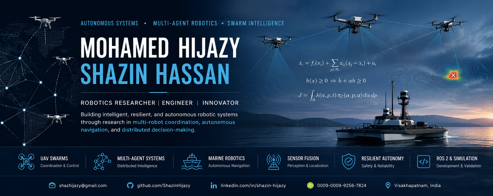

  

# Mohamed Hijazy Shazin Hassan

## Robotics Researcher | Autonomous Systems | Multi-Agent Robotics

Hello, and welcome to my GitHub.

I recently graduated with a Bachelor of Technology in Computer Science and Engineering from Andhra University, India, graduating with a CGPA of **8.80/10**. My research interests lie at the intersection of autonomous systems, swarm robotics, distributed decision-making, and intelligent robotic autonomy.

Over the past few years, my work has gradually evolved from learning robotic software frameworks to designing and evaluating decentralized coordination strategies for autonomous robots operating in uncertain and communication-constrained environments. I enjoy combining mathematical modelling, simulation, and software implementation to study how groups of autonomous systems can coordinate, adapt, and continue operating when conditions become challenging.

Most of my current work focuses on UAV swarms, autonomous marine robotics, distributed robotic systems, and resilient multi-agent coordination.

---

## Research Interests

* Autonomous Systems

* Swarm Robotics

* Multi-Agent Robotics

* UAV Swarm Coordination

* Autonomous Marine Robotics

* Distributed Coordination

* Autonomous Navigation

* Sensor Fusion

* Uncertainty-Aware Robotics

* Resilient Robotic Systems

* ROS 2 Based Robotics

* Simulation-Driven Validation

---

## Current Research

### Fault-Tolerant Decentralized Coordination Framework for UAV Swarms

Bachelor's thesis exploring decentralized UAV swarm coordination using ROS 2, PX4 Autopilot, MAVSDK, Gazebo, and Software-in-the-Loop validation. The work investigates adaptive leader election and autonomous failover for resilient swarm operation.

---

### ADMOS

Adaptive Dual-Mode Operational Swarm for Resilient Asset Defense under Communication Jamming.

This work studies communication-aware UAV swarm coordination using distributed estimation, hybrid supervisory control, and safety-aware autonomous coordination under degraded communication conditions.

---

### Role-Partitioned Swarm Intelligence

A distributed swarm coordination framework inspired by functional role specialization, where autonomous agents cooperate as Defender, Midfielder, and Forward units to improve mission resilience in contested environments.

---

### Autonomous Marine Robotics

Research on autonomous navigation for an Autonomous Surface Vehicle using ROS 2, GNSS, IMU, LiDAR, Nav2, SLAM Toolbox, and sensor fusion during my research internship at IIT Kharagpur.

---

### Autonomous Underwater Robotics

Lightweight arbitration framework for real-time decision-making in autonomous underwater robots operating under uncertainty and limited computational resources.

---

## Featured Repositories

* Fault-Tolerant Decentralized UAV Swarm Framework

* Adaptive Mobile Barrier Coverage

* ADMOS

* Role-Partitioned Swarm Intelligence

* Autonomous Marine Robotics

* Arbitration Layer for Autonomous Underwater Robots

---

## Technical Skills

### Robotics

* ROS 2

* PX4 Autopilot

* MAVSDK

* Gazebo

* Nav2

* SLAM Toolbox

### Programming

* Python

* C++

* Java

* MATLAB

### Artificial Intelligence

* Machine Learning

* Sensor Fusion

* Extended Kalman Filtering

* Multi-Agent Coordination

* Optimization

### Tools

* Git

* GitHub

* Linux

* Docker

* OpenCV

---

## Current Focus

I am currently interested in research involving:

* Distributed robotic intelligence

* Autonomous navigation

* Multi-robot coordination

* Swarm autonomy

* Communication-aware robotics

* Marine robotic systems

* Autonomous decision-making under uncertainty

---

## Selected Research

* A Fault-Tolerant Decentralized Coordination Framework for UAV Swarms using Relative Suitability Elective Consensus and SITL Validation

* ADMOS: Adaptive Dual-Mode Operational Swarm for Resilient Asset Defense under Communication Jamming

* Role-Partitioned Swarm Intelligence for Resilient UAV Coordination in Contested Electromagnetic Environments

* Arbitration Layer for Decision-Making in Autonomous Underwater Robots

---

## Connect

📧 Email: **[shazhijazy@gmail.com](mailto:shazhijazy@gmail.com)**

🔗 LinkedIn: https://www.linkedin.com/in/shazin-hijazy/

💻 GitHub: https://github.com/ShazinHijazy

📚 ResearchGate: https://www.researchgate.net/profile/Mohamed-Hijazy-Hassan

🆔 ORCID: https://orcid.org/0009-0009-9256-7824

---

> *I enjoy building autonomous robotic systems that combine sound mathematical foundations with practical implementation. My long-term research interests center on creating resilient, decentralized robotic systems capable of operating reliably in dynamic and uncertain environments.*

