

  

---

## Navigation

Click on the relevant section below to navigate directly to it.

### Profile

### Research

### Robotics and Projects

### Academic and Publications

### Skills

### Network and Outreach

### Perspective

# About Me

I am a Computer Science and Engineering graduate from Andhra University, India, working at the intersection of robotics, autonomous systems, artificial intelligence, multi-agent coordination, and resilient robotic autonomy.

My research is guided by a fundamental question:

> **How can autonomous robotic systems perceive, decide, coordinate, adapt, and continue operating reliably when the real world is uncertain, dynamic, communication-constrained, or partially degraded?**

My work has evolved from robotic software development, computer vision, and autonomous navigation toward research in decentralized coordination, swarm intelligence, fault-tolerant autonomy, uncertainty-aware decision-making, and reliable robotic systems.

Across aerial, marine, underwater, and agricultural robotics, I am interested in a common problem:

> **How do we build autonomous systems that remain useful when their environment, communication, sensing, or individual agents cannot be assumed to be reliable?**

This has led me toward decentralized and distributed approaches where robotic systems can make decisions locally, coordinate with other agents, adapt to changing conditions, and tolerate partial failures rather than relying entirely on centralized control.

My broader goal is to contribute to reliable distributed autonomous systems that can move beyond controlled environments and operate meaningfully in the complexity of the real world.

---

<h1>Research Identity</h1>

  <strong>AUTONOMOUS SYSTEMS &amp; MULTI-AGENT ROBOTICS</strong>

<table align="center" width="100%" cellpadding="12" cellspacing="0">

<!-- HEADERS -->

<tr>

<td align="center" valign="middle" width="33%">
<strong>COORDINATION</strong>
</td>

<td align="center" valign="middle" width="33%">
<strong>RELIABLE AUTONOMY</strong>
</td>

<td align="center" valign="middle" width="33%">
<strong>PERCEPTION &amp; VALIDATION</strong>
</td>

</tr>

<!-- ROW 01 -->

<tr>

<td align="center" valign="middle">
Multi-Agent Systems
</td>

<td align="center" valign="middle">
Resilient Autonomous Systems
</td>

<td align="center" valign="middle">
Sensor Fusion
</td>

</tr>

<!-- ROW 02 -->

<tr>

<td align="center" valign="middle">
Swarm Robotics
</td>

<td align="center" valign="middle">
Fault-Tolerant Robotics
</td>

<td align="center" valign="middle">
Robot Perception
</td>

</tr>

<!-- ROW 03 -->

<tr>

<td align="center" valign="middle">
Decentralized Coordination
</td>

<td align="center" valign="middle">
Uncertainty-Aware Decision-Making
</td>

<td align="center" valign="middle">
Autonomous Navigation
</td>

</tr>

<!-- ROW 04 -->

<tr>

<td align="center" valign="middle">
Distributed Robotic Intelligence
</td>

<td align="center" valign="middle">
Intelligent Robotic Decision-Making
</td>

<td align="center" valign="middle">
Simulation-Driven Validation
</td>

</tr>

<!-- ROW 05 -->

<tr>

<td align="center" valign="middle">
Communication-Aware Autonomy
</td>

<td align="center" valign="middle">
Reliable Autonomous Systems
</td>

<td align="center" valign="middle">
Experimental Evaluation
</td>

</tr>

</table>

 

<strong>ROBOTIC PLATFORMS &amp; APPLICATIONS</strong>

<table align="center" width="100%" cellpadding="12" cellspacing="0">

<!-- PLATFORM HEADERS -->

<tr>

<td align="center" valign="middle" width="25%">
<strong>AERIAL</strong>
</td>

<td align="center" valign="middle" width="25%">
<strong>MARINE</strong>
</td>

<td align="center" valign="middle" width="25%">
<strong>AGRICULTURAL</strong>
</td>

<td align="center" valign="middle" width="25%">
<strong>MANIPULATION</strong>
</td>

</tr>

<!-- PLATFORM ROW 01 -->

<tr>

<td align="center" valign="middle">
UAV Swarms
</td>

<td align="center" valign="middle">
Autonomous Surface Vehicles
</td>

<td align="center" valign="middle">
Agricultural Robotics
</td>

<td align="center" valign="middle">
Generalizable Robot Manipulation
</td>

</tr>

<!-- PLATFORM ROW 02 -->

<tr>

<td align="center" valign="middle">
Autonomous Aerial Vehicles
</td>

<td align="center" valign="middle">
Autonomous Underwater Vehicles
</td>

<td align="center" valign="middle">
Precision Agriculture
</td>

<td align="center" valign="middle">
Adaptive Robotic Systems
</td>

</tr>

<!-- PLATFORM ROW 03 -->

<tr>

<td align="center" valign="middle">
Distributed Aerial Robotics
</td>

<td align="center" valign="middle">
Marine Robotics
</td>

<td align="center" valign="middle">
Autonomous Agricultural Systems
</td>

<td align="center" valign="middle">
Robot Learning
</td>

</tr>

</table>

 

---

# My Research in One Picture

# Areas of Research

  

---

<h1>Research Philosophy</h1>

I do not view autonomy simply as the ability of a robot to complete a predefined task.
For me, meaningful autonomy also requires understanding what happens when the assumptions
behind that task begin to fail.

<table align="center" width="100%" cellpadding="14" cellspacing="0">

<tr>

<td align="center" valign="middle" width="50%">
<strong>COMMUNICATION &amp; COORDINATION</strong>
</td>

<td align="center" valign="middle" width="50%">
<strong>SYSTEM &amp; ENVIRONMENTAL UNCERTAINTY</strong>
</td>

</tr>

<tr>

<td align="center" valign="middle">
Communication becomes unreliable
</td>

<td align="center" valign="middle">
Sensors become uncertain
</td>

</tr>

<tr>

<td align="center" valign="middle">
Multiple agents disagree
</td>

<td align="center" valign="middle">
Environmental conditions change
</td>

</tr>

<tr>

<td align="center" valign="middle">
An individual agent fails
</td>

<td align="center" valign="middle">
Localization becomes degraded
</td>

</tr>

<tr>

<td align="center" valign="middle">
Coordination becomes constrained
</td>

<td align="center" valign="middle">
Energy availability becomes limited
</td>

</tr>

<tr>

<td align="center" valign="middle">
Decisions must be made with imperfect information
</td>

<td align="center" valign="middle">
Learned models encounter unfamiliar conditions
</td>

</tr>

</table>

These challenges have led my research toward autonomous systems that can make decisions under imperfect information, coordinate despite communication constraints, adapt to changing conditions, and continue operating when individual components or agents become unreliable.

My long-term goal is to contribute to reliable distributed autonomous systems that can move beyond controlled demonstrations toward dependable operation in real environments.

---

## Research Timeline

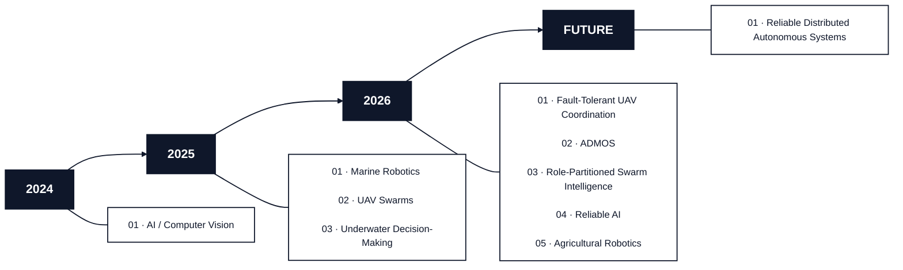
```mermaid
flowchart LR

A["2024"] --> B["2025"] --> C["2026"] --> D["FUTURE"]

A1["01 · AI / Computer Vision"]

B1["01 · Marine Robotics <br> 
02 · UAV Swarms <br> 
03 · Underwater Decision-Making"]

C1["01 · Fault-Tolerant UAV Coordination<br>
02 · ADMOS<br> 
03 · Role-Partitioned Swarm Intelligence<br> 
04 · Reliable AI<br> 
05 · Agricultural Robotics"]

D1["01 · Reliable Distributed Autonomous Systems"]

A --- A1
B --- B1
C --- C1
D --- D1

classDef year fill:#0F172A,stroke:#0F172A,color:#FFFFFF,stroke-width:2px,font-size:18px,font-weight:bold;
classDef research fill:#FFFFFF,stroke:#0F172A,color:#0F172A,stroke-width:1.5px,font-size:14px;

class A,B,C,D year;
class A1,B1,C1,D1 research;

linkStyle default stroke:#0F172A,stroke-width:1.5px;
```

---

# Research Portfolio

# 01. Fault-Tolerant Decentralized UAV Swarm Coordination

## Bachelor's Thesis

**A Fault-Tolerant Decentralized Coordination Framework for UAV Swarms using Relative Suitability Elective Consensus and SITL Validation**

  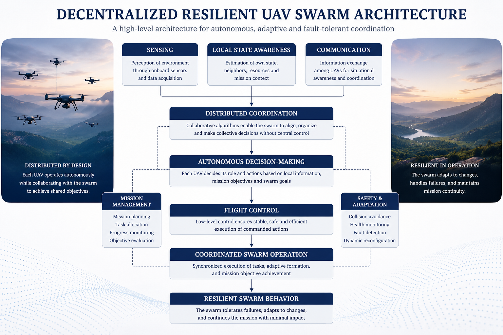

My bachelor's thesis investigates decentralized coordination, adaptive leadership, and fault tolerance in UAV swarms.

The framework uses a Relative Suitability Value (RSV) based leader-election mechanism in which individual UAVs continuously evaluate operational conditions including:

- Residual energy
- Neighbour connectivity
- Formation positioning
- Operational suitability

Rather than relying on a permanently assigned leader or centralized command structure, the swarm can collectively determine a suitable coordinator and autonomously recover when the current leader becomes unavailable.

### Technical Stack

#### Robotics & Autonomy

#### Simulation & Communication

#### Programming

### Research Problems

- Decentralized leader election
- Autonomous failover
- Node failure resilience
- Communication-aware coordination
- Distributed decision-making
- Swarm resilience
- Multi-agent autonomy
- Formation maintenance
- Mission continuity

### Validation

The framework was evaluated through Software-in-the-Loop (SITL) simulation using a multi-drone swarm in Gazebo. The documented validation included a 15-drone swarm, with the system maintaining a real-time factor of 1.0 at approximately 48% CPU load.

The validation also recorded:

<table align="center" width="80%">
  <tr>
    <th align="center">Metric</th>
    <th align="center">Result</th>
  </tr>
  <tr>
    <td align="center"><strong>Swarm Size</strong></td>
    <td align="center">15 UAVs</td>
  </tr>
  <tr>
    <td align="center"><strong>Collision Safety Violations</strong></td>
    <td align="center">0</td>
  </tr>
  <tr>
    <td align="center"><strong>Minimum Inter-Agent Distance</strong></td>
    <td align="center">6.031 m</td>
  </tr>
  <tr>
    <td align="center"><strong>Leader Failure Detection</strong></td>
    <td align="center">3.0 s</td>
  </tr>
  <tr>
    <td align="center"><strong>Leadership Recovery</strong></td>
    <td align="center">0.45 s</td>
  </tr>
  <tr>
    <td align="center"><strong>Simulation Real-Time Factor</strong></td>
    <td align="center">1.0</td>
  </tr>
</table>

The documented failure-recovery experiment demonstrated autonomous leadership transfer from SYS 4 to SYS 8, with mission continuity maintained during active flight states.

### Research Contribution

The central contribution of the thesis is a fully decentralized leadership-election and failover framework in which UAVs evaluate their relative suitability and collectively determine the next coordinator rather than depending on a fixed centralized authority. The implementation uses ROS 2 DDS for peer-to-peer communication and integrates the high-level coordination logic with PX4 and MAVSDK within the SITL environment.

### Research Direction

The thesis established the foundation for my continuing interest in fault-tolerant distributed robotic systems, particularly autonomous systems that can coordinate, adapt, and maintain mission continuity when individual agents or communication links become unreliable.

 

---

# 02. ADMOS

## Adaptive Dual-Mode Operational Swarm for Resilient Asset Defense under Communication Jamming

  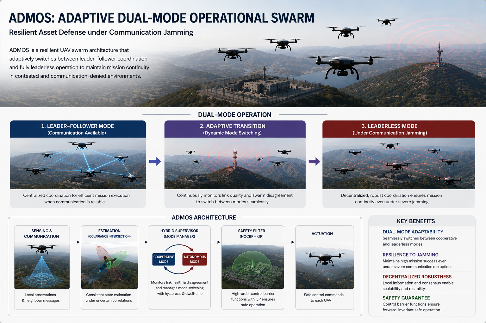

ADMOS investigates how cooperative UAV swarms can continue operating when communication between agents becomes degraded or unavailable.

The research addresses a fundamental limitation of communication-dependent swarm coordination: when inter-agent communication deteriorates, shared situational awareness can become inconsistent and centralized or consensus-based coordination can degrade abruptly. The manuscript therefore explores an architecture designed around graceful degradation rather than complete dependence on continuous communication. 

### Architecture

ADMOS combines three complementary components:

<table align="center" width="90%">
  <tr>
    <th align="center">Component</th>
    <th align="center">Purpose</th>
  </tr>
  <tr>
    <td align="center"><strong>Covariance Intersection</strong></td>
    <td align="center">Consistent distributed state estimation when information-source correlations are unknown</td>
  </tr>
  <tr>
    <td align="center"><strong>Dual-Mode Supervisor</strong></td>
    <td align="center">Transitions agents between cooperative and autonomous operation using hysteresis and minimum dwell time</td>
  </tr>
  <tr>
    <td align="center"><strong>HOCBF Safety Filter</strong></td>
    <td align="center">Maintains safety constraints through a quadratic-program-based control filter</td>
  </tr>
</table>

The three components operate as a coordinated pipeline in which local sensing and received neighbour information feed the Covariance Intersection estimator; the resulting covariance measure drives the mode supervisor; and the selected control action is passed through the HOCBF safety filter before actuation.

### Distributed State Estimation

**Covariance Intersection (CI)** is used to maintain consistent state estimates when correlations between information sources are unknown, including correlations introduced through reused neighbour information.

### Dual-Mode Operation

Agents operate in two modes:

- **Cooperative mode**
- **Autonomous mode**

A hybrid supervisor manages transitions between the modes using hysteresis and minimum dwell time, reducing unnecessary switching and preventing mode chattering.

### Safety-Critical Control

A Higher-Order Control Barrier Function (HOCBF) based safety filter is integrated into the architecture and formulated as a quadratic program (QP) operating at 10 Hz. The filter is designed to maintain forward invariance of the defined safe set under the stated assumptions.

### Technical Stack

### Research Objective

Rather than assuming that communication will always remain available, ADMOS investigates a more resilient principle:

When coordination becomes unreliable, autonomous agents should degrade gracefully rather than fail catastrophically.

The manuscript establishes an input-to-state stability result with respect to estimation error under the stated assumptions and explicitly identifies the conditions under which the guarantee no longer applies.

### Simulation and Evaluation

The architecture was evaluated using a high-fidelity quadrotor simulator across 80 Monte Carlo trials per scenario, with randomized initial conditions and intruder strategies. The evaluation considered both healthy communication and complete communication jamming.

<table align="center" width="85%">
  <tr>
    <th align="center">Condition</th>
    <th align="center">ADMOS</th>
    <th align="center">Consensus Baseline</th>
  </tr>
  <tr>
    <td align="center"><strong>Healthy Links</strong></td>
    <td align="center"><strong>92.5%</strong></td>
    <td align="center">78.4%</td>
  </tr>
  <tr>
    <td align="center"><strong>Full Jamming</strong></td>
    <td align="center"><strong>84.0%</strong></td>
    <td align="center">42.0%</td>
  </tr>
  <tr>
    <td align="center"><strong>Safety Violations</strong></td>
    <td align="center"><strong>0</strong></td>
    <td align="center">—</td>
  </tr>
</table>

The reported results show improved asset-protection performance under both healthy and fully jammed communication conditions, while the evaluation recorded zero safety violations. An ablation study further examined the contribution of the individual architectural components.

### Research Contribution

ADMOS explores a resilient swarm-control architecture in which estimation, coordination mode, and safety are adapted to communication quality rather than treating communication availability as a fixed assumption.

The work also identifies the boundary between the current simulation-based guarantees and future validation requirements, including hardware-in-the-loop testing, outdoor flight validation, real radio-jamming experiments, larger-scale decentralized computation, and learning-augmented components.

### Research Direction

ADMOS extends my research direction from fault-tolerant decentralized coordination toward communication-resilient multi-agent autonomy, with particular interest in how autonomous systems can maintain useful behaviour when shared information becomes incomplete, delayed, or unavailable.

 

  <strong>READ HERE</strong>

  <a href="https://www.researchsquare.com/article/rs-9957095/v1">
    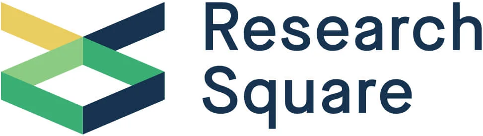
  </a>

  <strong>DOI</strong>

  

---

# 03. Role-Partitioned Swarm Intelligence

## Resilient UAV Coordination in Contested Electromagnetic Environments

  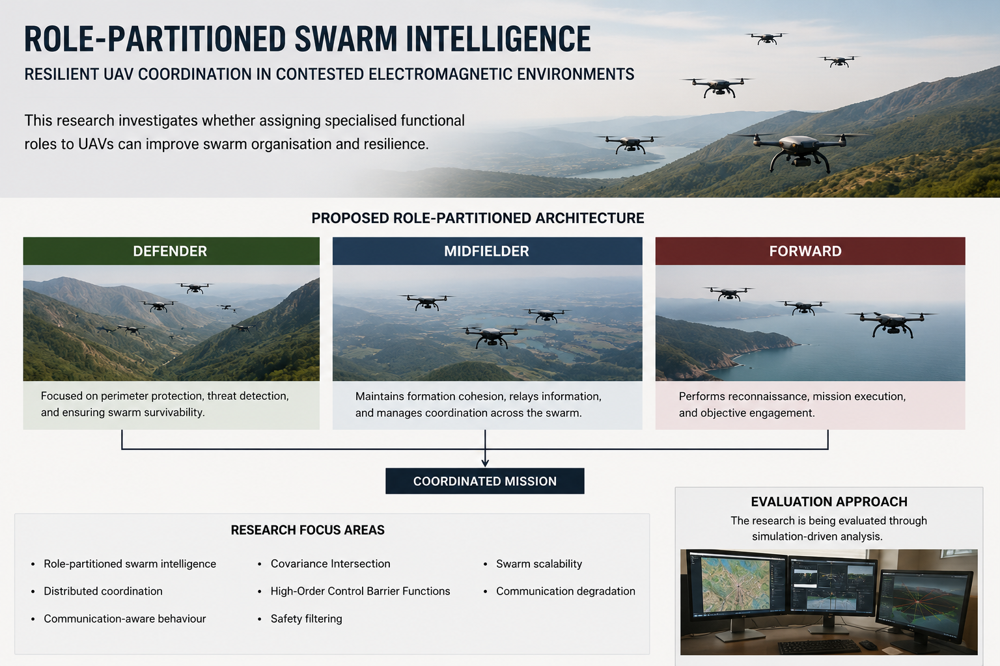

This research investigates whether **functional specialisation within UAV swarms** can improve coordination, scalability, and resilience in communication-contested environments.

The work explores a role-partitioned swarm architecture in which UAVs are organised into specialised operational groups rather than relying entirely on homogeneous swarm behaviour.

### Research Focus

- **Role-Partitioned Swarm Intelligence**
- **Distributed Multi-Agent Coordination**
- **Communication-Resilient Autonomy**
- **Swarm Scalability**
- **Safety-Critical Coordination**
- **Simulation-Based Validation**

The work is being evaluated through Software-in-the-Loop (SITL) simulation and comparative analysis.

### Conceptual Organisation

<table align="center" width="90%">
  <tr>
    <th align="center">Operational Group</th>
    <th align="center">High-Level Function</th>
  </tr>
  <tr>
    <td align="center"><strong>Defender</strong></td>
    <td align="center">Asset protection and defensive coordination</td>
  </tr>
  <tr>
    <td align="center"><strong>Midfielder</strong></td>
    <td align="center">Interception, support, and information bridging</td>
  </tr>
  <tr>
    <td align="center"><strong>Forward</strong></td>
    <td align="center">Forward engagement and mission projection</td>
  </tr>
</table>

The role structure is inspired by layered team organisation, with specialised operational responsibilities distributed across the swarm.

### Research Areas

<table align="center" width="90%">
  <tr>
    <th align="center">Focus</th>
    <th align="center">Research Direction</th>
  </tr>
  <tr>
    <td align="center"><strong>Swarm Organisation</strong></td>
    <td align="center">Functional specialisation within multi-agent systems</td>
  </tr>
  <tr>
    <td align="center"><strong>Coordination</strong></td>
    <td align="center">Distributed coordination across specialised agents</td>
  </tr>
  <tr>
    <td align="center"><strong>Resilience</strong></td>
    <td align="center">Maintaining useful operation under communication degradation</td>
  </tr>
  <tr>
    <td align="center"><strong>Scalability</strong></td>
    <td align="center">Studying coordination behaviour as swarm size increases</td>
  </tr>
  <tr>
    <td align="center"><strong>Safety</strong></td>
    <td align="center">Safety-aware autonomous swarm operation</td>
  </tr>
</table>

### Technical Domains

Details are available through the research abstract, for additional information regarding the work, please get in touch.

  

  

    
  

---

# 04. Autonomous Marine Robotics

## Autonomous Surface Vehicle Catamaran

  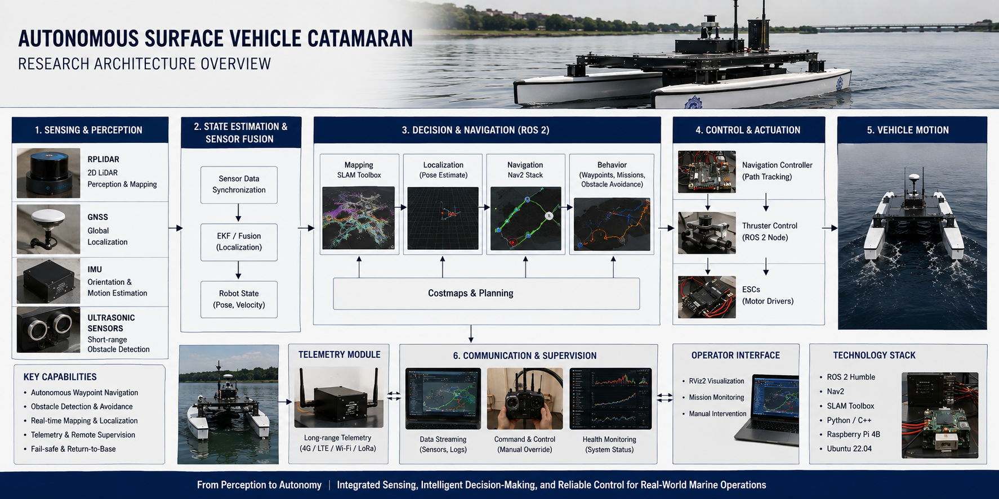

During my research internship at the **Indian Institute of Technology Kharagpur**, I worked on an **Autonomous Surface Vehicle (ASV) based on a catamaran platform**.

The project brought together **marine sensing, localization, sensor fusion, perception, mapping, navigation, control, telemetry, and safety** within a modular **ROS 2** based robotic architecture.

### Technology Stack

<h3>Platform</h3>

<table align="center" width="80%">
  <tr>
    <th align="center">Component</th>
    <th align="center">Role</th>
  </tr>
  <tr>
    <td align="center"><strong>Raspberry Pi 4B</strong></td>
    <td align="center">Onboard computation</td>
  </tr>
  <tr>
    <td align="center"><strong>RPLIDAR</strong></td>
    <td align="center">2D perception and mapping</td>
  </tr>
  <tr>
    <td align="center"><strong>GNSS</strong></td>
    <td align="center">Global localization</td>
  </tr>
  <tr>
    <td align="center"><strong>IMU</strong></td>
    <td align="center">Orientation and motion estimation</td>
  </tr>
  <tr>
    <td align="center"><strong>Ultrasonic Sensors</strong></td>
    <td align="center">Short-range obstacle detection</td>
  </tr>
  <tr>
    <td align="center"><strong>Blue Robotics T100 Thrusters</strong></td>
    <td align="center">Propulsion and maneuvering</td>
  </tr>
  <tr>
    <td align="center"><strong>ESCs</strong></td>
    <td align="center">Thruster actuation</td>
  </tr>
  <tr>
    <td align="center"><strong>Telemetry System</strong></td>
    <td align="center">Remote communication and monitoring</td>
  </tr>
</table>

### Software

<table align="center" width="80%">
  <tr>
    <th align="center">Layer</th>
    <th align="center">Technologies</th>
  </tr>
  <tr>
    <td align="center"><strong>Operating System</strong></td>
    <td align="center">Ubuntu 22.04</td>
  </tr>
  <tr>
    <td align="center"><strong>Robotics Middleware</strong></td>
    <td align="center">ROS 2 Humble</td>
  </tr>
  <tr>
    <td align="center"><strong>Navigation</strong></td>
    <td align="center">Nav2</td>
  </tr>
  <tr>
    <td align="center"><strong>Mapping</strong></td>
    <td align="center">SLAM Toolbox</td>
  </tr>
  <tr>
    <td align="center"><strong>Localization</strong></td>
    <td align="center">GNSS + IMU</td>
  </tr>
  <tr>
    <td align="center"><strong>Visualization</strong></td>
    <td align="center">RViz2</td>
  </tr>
  <tr>
    <td align="center"><strong>Control</strong></td>
    <td align="center">ROS 2 Thruster Control</td>
  </tr>
  <tr>
    <td align="center"><strong>Simulation</strong></td>
    <td align="center">2D / 3D Simulation</td>
  </tr>
  <tr>
    <td align="center"><strong>Communication</strong></td>
    <td align="center">Telemetry</td>
  </tr>
</table>

### Research and Engineering Areas

- Autonomous waypoint navigation
- Localization and state estimation
- Sensor fusion
- Mapping and perception
- Obstacle detection and avoidance
- Navigation planning
- Thruster control
- Telemetry and remote intervention
- Fail-safe operation
- ROS 2 hardware-software integration
- Simulation-driven development
- Autonomous marine systems

### From Simulation to Deployment

The project involved an iterative transition between **simulation, hardware integration, testing, and controlled field deployment**, bringing together sensing, localization, navigation, control, telemetry, and safety within a real robotic platform.

The experience strengthened my interest in moving **autonomous systems from controlled simulation environments toward reliable operation in real-world conditions**.

 

---

# 05. Autonomous Underwater Robotics

## Arbitration Layer for Decision-Making in Autonomous Underwater Robots

  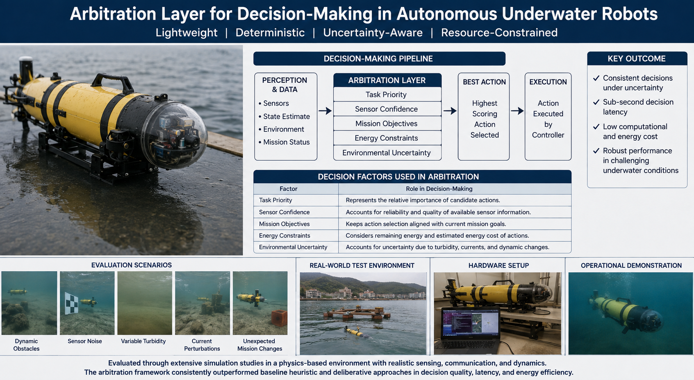

This research investigates lightweight decision-making for autonomous underwater robots operating under uncertainty and resource constraints.

The work proposes a lightweight, modular arbitration layer that separates real-time action selection from computationally intensive planning. Candidate actions are evaluated using multiple operational factors so that the system can respond to changing mission and environmental conditions without relying on a single fixed decision pathway.

### Decision Factors

<table align="center" width="90%">
  <tr>
    <th align="center">Factor</th>
    <th align="center">Role in Decision-Making</th>
  </tr>
  <tr>
    <td align="center"><strong>Task Priority</strong></td>
    <td align="center">Represents the relative importance of candidate actions</td>
  </tr>
  <tr>
    <td align="center"><strong>Sensor Reliability</strong></td>
    <td align="center">Accounts for confidence in available sensory information</td>
  </tr>
  <tr>
    <td align="center"><strong>Mission Objectives</strong></td>
    <td align="center">Keeps action selection aligned with current mission requirements</td>
  </tr>
  <tr>
    <td align="center"><strong>Energy Cost</strong></td>
    <td align="center">Considers resource limitations during action selection</td>
  </tr>
  <tr>
    <td align="center"><strong>Environmental Uncertainty</strong></td>
    <td align="center">Accounts for changing and partially uncertain operating conditions</td>
  </tr>
</table>

### Research Focus

### Evaluation

The manuscript evaluates the arbitration approach under challenging underwater operating conditions including dynamic obstacles, sensor noise, variable turbidity, current-flow perturbations, and unexpected mission changes.

The reported evaluation focuses on:

- Decision consistency
- Action-selection latency
- Energy consumption
- Robustness under environmental perturbations
- Comparison with conventional heuristic approaches
- Comparison with more computationally intensive deliberative architectures

The reported results indicate high decision consistency, sub-second decision latency, and low energy consumption, supporting the suitability of the approach for resource-constrained autonomous underwater platforms.

### Application Direction

The framework is positioned toward practical underwater applications including:

- Environmental monitoring
- Underwater structure inspection
- Marine exploration
- Resource-constrained autonomous operation

The manuscript also identifies future extensions toward multi-robot coordination, adaptive sensor fusion, learning-based arbitration, multi-objective decision-making, and longer-duration mission validation.

### Conference & Publication

The work was presented at the 8th International Conference on Ship and Offshore Technology (ICSOT 2025) and accepted for publication in the Springer conference proceedings.

 

  <strong>READ HERE</strong>

  

  <strong>DOI</strong>

  

---

# 06. Agricultural Robotics

## Autonomous Ground Vehicle for Precision Pruning and Intelligent Orchard Operations

  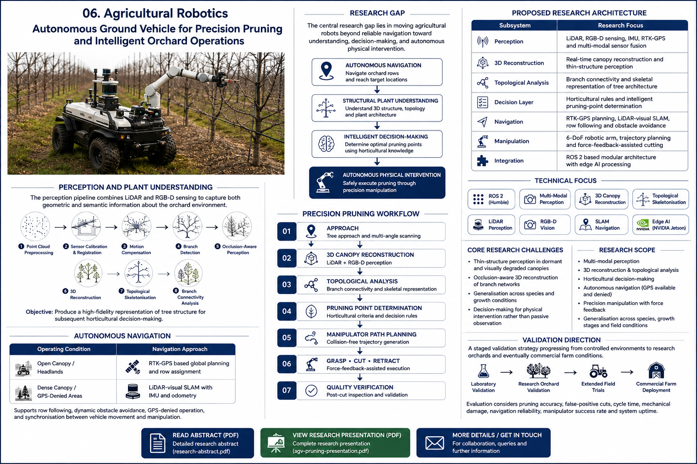

This research explores the development of an Autonomous Ground Vehicle (AGV) for precision pruning, addressing a fundamental challenge in agricultural robotics: moving beyond reliable navigation toward autonomous physical intervention.

While an agricultural robot may be capable of navigating orchard rows, precision pruning requires the system to understand the three-dimensional structure of the plant, identify suitable intervention points, plan a safe manipulation trajectory, and execute the intervention while accounting for uncertainty and changing environmental conditions.

The proposed research therefore integrates multi-modal perception, real-time 3D canopy reconstruction, topological analysis, horticultural decision-making, autonomous navigation, and precision manipulation.

### Research Gap

The central research gap lies in moving agricultural robots beyond reliable navigation toward understanding, decision-making, and autonomous physical intervention.

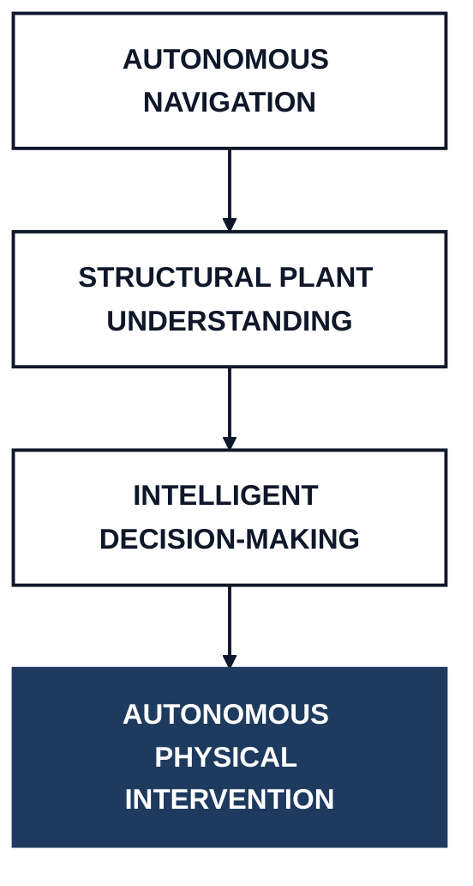
```mermaid
flowchart TD

    A["AUTONOMOUS NAVIGATION"]
    B["STRUCTURAL PLANT UNDERSTANDING"]
    C["INTELLIGENT DECISION-MAKING"]
    D["AUTONOMOUS PHYSICAL INTERVENTION"]

    A --> B
    B --> C
    C --> D

    classDef stage fill:#FFFFFF,stroke:#0F172A,color:#0F172A,stroke-width:2px,font-size:17px,font-weight:700;
    classDef final fill:#1E3A5F,stroke:#1E3A5F,color:#FFFFFF,stroke-width:2px,font-size:17px,font-weight:700;

    class A,B,C stage;
    class D final;

    linkStyle default stroke:#0F172A,stroke-width:2px;
```

Conventional agricultural automation has made significant progress in navigation, spraying, monitoring, and harvesting. However, precision pruning remains substantially more difficult because the robot must reason about the structural topology of the plant rather than simply detecting a target object.

### Proposed Research Architecture

<table align="center" width="90%">
  <tr>
    <th align="center">Subsystem</th>
    <th align="center">Research Focus</th>
  </tr>
  <tr>
    <td align="center"><strong>Perception</strong></td>
    <td align="center">LiDAR, RGB-D sensing, IMU, RTK-GPS and multi-modal sensor fusion</td>
  </tr>
  <tr>
    <td align="center"><strong>3D Reconstruction</strong></td>
    <td align="center">Real-time canopy reconstruction and thin-structure perception</td>
  </tr>
  <tr>
    <td align="center"><strong>Topological Analysis</strong></td>
    <td align="center">Branch connectivity and skeletal representation of tree architecture</td>
  </tr>
  <tr>
    <td align="center"><strong>Decision Layer</strong></td>
    <td align="center">Horticultural rules and intelligent pruning-point determination</td>
  </tr>
  <tr>
    <td align="center"><strong>Navigation</strong></td>
    <td align="center">RTK-GPS planning, LiDAR-visual SLAM, row following and obstacle avoidance</td>
  </tr>
  <tr>
    <td align="center"><strong>Manipulation</strong></td>
    <td align="center">6-DoF robotic arm, trajectory planning and force-feedback-assisted cutting</td>
  </tr>
  <tr>
    <td align="center"><strong>Integration</strong></td>
    <td align="center">ROS 2 based modular architecture with edge AI processing</td>
  </tr>
</table>

The proposed architecture is organised around four major functional subsystems: **perception, cognition, navigation, and manipulation**, connected through a modular ROS 2 middleware layer.

### Technical Focus

### Perception and Plant Understanding

The perception pipeline combines LiDAR and RGB-D sensing to capture both geometric and semantic information about the orchard environment.

The proposed processing pipeline consists of:

- Point cloud preprocessing
- Sensor calibration and registration
- Motion compensation
- Branch detection
- Occlusion-aware perception
- 3D reconstruction
- Topological skeletonisation
- Branch connectivity analysis

The objective is to produce a high-fidelity representation of tree structure suitable for subsequent horticultural decision-making.

### Autonomous Navigation

The proposed AGV uses a dual-mode navigation strategy:

<table align="center" width="85%">
  <tr>
    <th align="center">Operating Condition</th>
    <th align="center">Navigation Approach</th>
  </tr>
  <tr>
    <td align="center"><strong>Open Canopy / Headlands</strong></td>
    <td align="center">RTK-GPS based global planning and row assignment</td>
  </tr>
  <tr>
    <td align="center"><strong>Dense Canopy / GPS-Denied Areas</strong></td>
    <td align="center">LiDAR-visual SLAM with IMU and odometry</td>
  </tr>
</table>

The navigation layer is intended to support row following, dynamic obstacle avoidance, GPS-denied operation, and synchronisation between vehicle movement and manipulation.

### Precision Pruning Workflow

The proposed end-to-end workflow is:

```mermaid
flowchart TD

    A["01<br/><br/> APPROACH <br/><br/>
    <small>Tree approach and <br/> multi-angle scanning</small>"]

    B["02<br/><br/> 3D CANOPY RECONSTRUCTION <br/><br/>
    <small> LiDAR + RGB-D <br/> perception</small>"]

    C["03<br/><br/> TOPOLOGICAL ANALYSIS <br/><br/> 
    <small> Branch connectivity <br/> and skeletal representation</small>"]

    D["04<br/><br/> PRUNING POINT DETERMINATION<br/><br/> 
    <small> Horticultural criteria <br/> and decision rules</small>"]

    E["05<br/><br/> MANIPULATOR PATH PLANNING<br/><br/> 
    <small> Collision-free <br/> trajectory generation</small>"]

    F["06<br/><br/> GRASP • CUT • RETRACT<br/><br/> 
    <small> Force-feedback-assisted <br/> execution</small>"]

    G["07<br/><br/> QUALITY VERIFICATION <br/><br/> 
    <small> Post-cut inspection <br/> and validation</small>"]

    A --> B
    B --> C
    C --> D
    D --> E
    E --> F
    F --> G

    classDef stage fill:#FFFFFF,stroke:#0F172A,color:#0F172A,stroke-width:2px,font-size:15px,font-weight:700;
    classDef start fill:#0F172A,stroke:#0F172A,color:#FFFFFF,stroke-width:2px,font-size:15px,font-weight:700;
    classDef decision fill:#FFFFFF,stroke:#1E3A5F,color:#0F172A,stroke-width:2px,font-size:15px,font-weight:700;
    classDef execute fill:#FFFFFF,stroke:#0F172A,color:#0F172A,stroke-width:2.5px,font-size:15px,font-weight:700;
    classDef finish fill:#1E3A5F,stroke:#1E3A5F,color:#FFFFFF,stroke-width:2px,font-size:15px,font-weight:700;

    class A start;
    class B,C stage;
    class D decision;
    class E,F execute;
    class G finish;

    linkStyle default stroke:#0F172A,stroke-width:2px;
```

Further details are available through the research abstract and presentation, For additional information regarding the research, please get in touch.

 

  

 
  

---

# 07. Reliable AI and Calibration under Distribution Shift

## Embedding-Level Calibration under Distribution Shift in Visual Recognition

A research direction focused on the reliability of confidence estimates produced by visual recognition systems when deployment data differs from the training distribution.

The work investigates a fundamental limitation of conventional score-level calibration. When distribution shift causes samples from different classes to occupy the same predicted-score region, the score can lose information that remains available in the underlying representation. In such cases, recalibrating the score alone cannot recover the missing information.

The research therefore moves the calibration problem from the predicted score toward the embedding representation.

## Core Research Question

> **How can a visual recognition system maintain reliable confidence when deployment data differs from its training distribution?**

## Research Framework

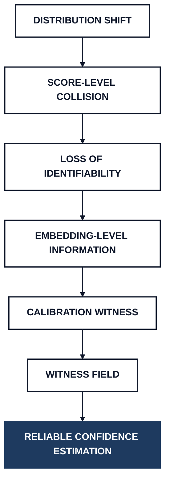
```mermaid
flowchart TD

    A["DISTRIBUTION SHIFT"]
    B["SCORE-LEVEL COLLISION"]
    C["LOSS OF IDENTIFIABILITY"]
    D["EMBEDDING-LEVEL INFORMATION"]
    E["CALIBRATION WITNESS"]
    F["WITNESS FIELD"]
    G["RELIABLE CONFIDENCE ESTIMATION"]

    A --> B
    B --> C
    C --> D
    D --> E
    E --> F
    F --> G

    classDef stage fill:#FFFFFF,stroke:#0F172A,color:#0F172A,stroke-width:2px,font-size:16px,font-weight:700;
    classDef final fill:#1E3A5F,stroke:#1E3A5F,color:#FFFFFF,stroke-width:2px,font-size:16px,font-weight:700;

    class A,B,C,D,E,F stage;
    class G final;

    linkStyle default stroke:#0F172A,stroke-width:2px;
```

## Research Areas

## Key Concepts

- Calibration Witness
- Embedding-Level Calibration
- Distribution Shift
- Score-Level Non-Identifiability
- Score Fibre Collision
- Witness Field
- Propagation Algebra
- Epistemic Uncertainty
- Representation Shift
- Calibration Reliability

## Theoretical Contributions

The research formalises a Twin Construction showing that two deployment distributions can be indistinguishable to a score-measurable calibrator while requiring different calibrated outputs.

The Calibration Witness characterises the calibration deficit created by collapsed score fibres at the embedding level.

The Witness Identity establishes a direct relationship between the calibration deficit of score-measurable calibration and the Calibration Witness.

The Witness Field provides a constructive approach for estimating the relevant conditional structure using labelled training data and unlabelled deployment data without requiring deployment labels.

The research further introduces a Propagation Algebra to describe how layer-wise epistemic uncertainty accumulates through a neural network and converges toward the terminal Calibration Witness.

## Recoverability and Failure Boundary

The framework distinguishes between two important cases:

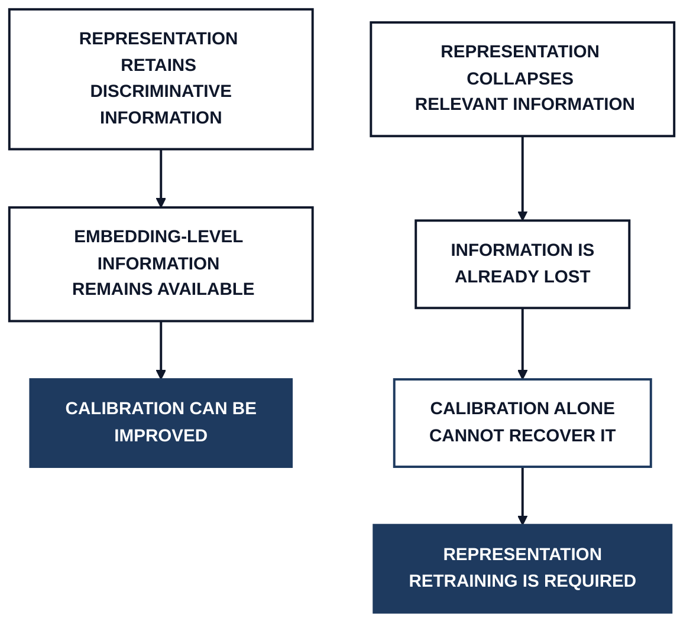
```mermaid
flowchart TD

    A["REPRESENTATION RETAINS <br/> DISCRIMINATIVE INFORMATION"]
    B["EMBEDDING-LEVEL INFORMATION <br/> REMAINS AVAILABLE"]
    C["CALIBRATION CAN BE <br/> IMPROVED"]

    D["REPRESENTATION COLLAPSES <br/> RELEVANT INFORMATION"]
    E["INFORMATION IS <br/> ALREADY LOST"]
    F["CALIBRATION ALONE <br/> CANNOT RECOVER IT"]
    G["REPRESENTATION <br/> RETRAINING IS REQUIRED"]

    A --> B
    B --> C

    D --> E
    E --> F
    F --> G

    classDef positive fill:#FFFFFF,stroke:#0F172A,color:#0F172A,stroke-width:2px,font-size:15px,font-weight:700;
    classDef boundary fill:#FFFFFF,stroke:#1E3A5F,color:#0F172A,stroke-width:2px,font-size:15px,font-weight:700;
    classDef final fill:#1E3A5F,stroke:#1E3A5F,color:#FFFFFF,stroke-width:2px,font-size:15px,font-weight:700;

    class A,B,D,E positive;
    class F boundary;
    class C,G final;

    linkStyle default stroke:#0F172A,stroke-width:2px;
```

This establishes an important boundary between calibration failure and representation failure.

## Empirical Validation

The research has been evaluated across a broad range of visual recognition settings and multiple backbone architectures.

### Visual Recognition Benchmarks

### Backbone Architectures

### Validation Scale

A large-scale field deployment involving approximately two million cattle images from two hundred thousand individuals was also used to examine the behaviour of the framework at operational scale.

The synthetic validation reproduced the theoretically predicted quantities within approximately ±3%, while the benchmark experiments showed score-level calibrators reaching the predicted structural floor and the Witness Field achieving the reported parametric calibration behaviour.

## Research Validation Pipeline

```mermaid
flowchart LR

    A["THEORETICAL <br/> ANALYSIS"]
    B["SYNTHETIC <br/> VALIDATION"]
    C["11 VISUAL <br/> BENCHMARKS"]
    D["10 BACKBONE <br/> ARCHITECTURES"]
    E["FIELD-SCALE <br/> DEPLOYMENT"]
    F["RELIABILITY <br/> ASSESSMENT"]

    A --> B
    B --> C
    C --> D
    D --> E
    E --> F

    classDef stage fill:#FFFFFF,stroke:#0F172A,color:#0F172A,stroke-width:2px,font-size:15px,font-weight:700;
    classDef final fill:#1E3A5F,stroke:#1E3A5F,color:#FFFFFF,stroke-width:2px,font-size:15px,font-weight:700;

    class A,B,C,D,E stage;
    class F final;

    linkStyle default stroke:#0F172A,stroke-width:2px;
```

## Relevance to Reliable Autonomous Systems

The work connects with my broader interest in trustworthy autonomy and reliable AI.

Autonomous systems increasingly depend on visual perception models to make decisions in environments that differ from controlled training conditions. In such settings, prediction accuracy alone is insufficient. A perception system must also provide confidence estimates that remain meaningful when conditions change.

> **Not only whether an AI system is correct, but whether its confidence can still be trusted when the environment changes.**

This perspective is relevant to applications including:

- Autonomous robotics
- UAV perception
- Marine and surface robotics
- Multi-agent systems
- Computer vision
- Biometrics
- Medical imaging
- Industrial inspection
- Safety-critical autonomous systems

## Research Evolution

The work evolved through two manuscript versions.

### Version 1 — The Calibration Witness and Its Propagation Algebra

The first version developed the theoretical foundations around the Calibration Witness, score-level impossibility, Witness Field, and Propagation Algebra.

### Version 2 — Embedding-Level Calibration under Distribution Shift in Visual Recognition

The second version refined the central framing around embedding-level calibration and reliability under distribution shift, while expanding the empirical evaluation and practical interpretation.

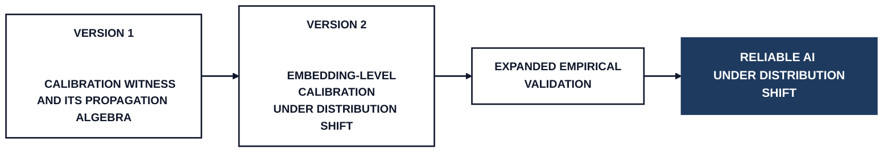
```mermaid
flowchart LR

    A["VERSION 1<br/><br/>
    CALIBRATION WITNESS<br/>AND ITS PROPAGATION ALGEBRA"]

    B["VERSION 2<br/><br/>
    EMBEDDING-LEVEL CALIBRATION<br/>UNDER DISTRIBUTION SHIFT"]

    C["EXPANDED EMPIRICAL <br/> VALIDATION"]

    D["RELIABLE AI <br/> UNDER DISTRIBUTION SHIFT"]

    A --> B
    B --> C
    C --> D

    classDef version fill:#FFFFFF,stroke:#0F172A,color:#0F172A,stroke-width:2px,font-size:15px,font-weight:700;
    classDef final fill:#1E3A5F,stroke:#1E3A5F,color:#FFFFFF,stroke-width:2px,font-weight:700;

    class A,B,C version;
    class D final;

    linkStyle default stroke:#0F172A,stroke-width:2px;
```   

## Broader Research Direction

This work forms part of my broader research interest in:

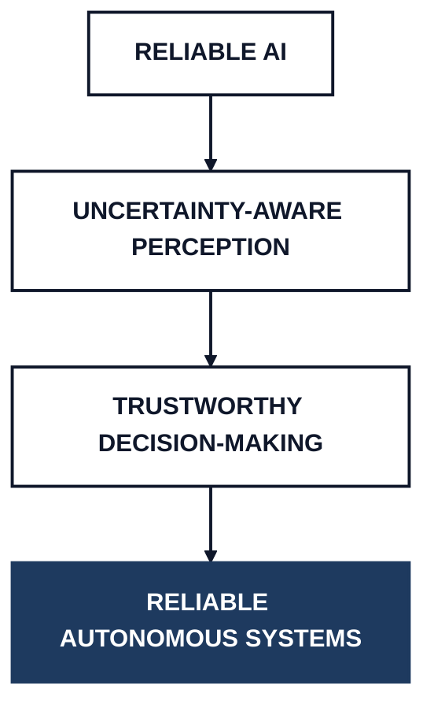
```mermaid
flowchart TD

    A["RELIABLE AI"]
    B["UNCERTAINTY-AWARE PERCEPTION"]
    C["TRUSTWORTHY DECISION-MAKING"]
    D["RELIABLE AUTONOMOUS SYSTEMS"]

    A --> B
    B --> C
    C --> D

    classDef stage fill:#FFFFFF,stroke:#0F172A,color:#0F172A,stroke-width:2px,font-size:16px,font-weight:700;
    classDef final fill:#1E3A5F,stroke:#1E3A5F,color:#FFFFFF,stroke-width:2px,font-size:16px,font-weight:700;

    class A,B,C stage;
    class D final;

    linkStyle default stroke:#0F172A,stroke-width:2px;
```

The broader objective is to develop autonomous systems that are not only capable of making intelligent decisions, but are also able to recognise the limits of their own predictions when operating under uncertainty and distribution shift.

  
 

Two manuscript versions document the evolution of this research direction. Research Square and DOI links are provided below for direct access. 

 

  

 
  <strong>READ VERSION 1</strong> 

  

 
 

 
  <strong>READ VERSION 2</strong>

 

---

# 08. Few-Shot Language-Agnostic Keyword Spotting

## Echo Fuse — A Few-Shot Language-Agnostic Keyword Spotting System

Echo Fuse is an applied machine learning system for **language-agnostic keyword spotting in audio**, designed to identify target keywords from speech while reducing the amount of keyword-specific training data required.

The project combines speech feature extraction, convolutional representation learning, temporal modelling, and keyword classification into an audio recognition pipeline.

The work originated in the context of **Smart India Hackathon 2024** and expanded my experience into speech AI, few-shot learning, representation learning, and audio-based machine intelligence.

## Research and Technical Focus

## System Architecture

The system processes speech through a sequence of feature extraction, convolutional representation learning, temporal modelling, and keyword classification.

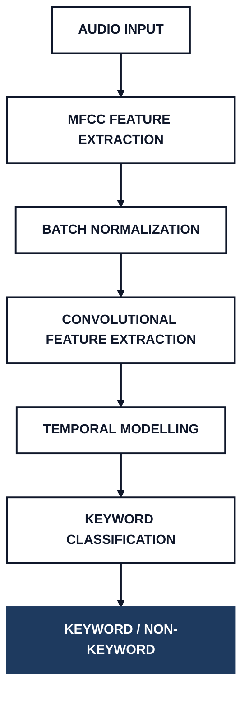
```mermaid
flowchart TD

    A["AUDIO INPUT"]
    B["MFCC FEATURE EXTRACTION"]
    C["BATCH NORMALIZATION"]
    D["CONVOLUTIONAL FEATURE EXTRACTION"]
    E["TEMPORAL MODELLING"]
    F["KEYWORD CLASSIFICATION"]
    G["KEYWORD / NON-KEYWORD"]

    A --> B
    B --> C
    C --> D
    D --> E
    E --> F
    F --> G

    classDef stage fill:#FFFFFF,stroke:#0F172A,color:#0F172A,stroke-width:2px,font-size:15px,font-weight:700;
    classDef final fill:#1E3A5F,stroke:#1E3A5F,color:#FFFFFF,stroke-width:2px,font-size:15px,font-weight:700;

    class A,B,C,D,E,F stage;
    class G final;

    linkStyle default stroke:#0F172A,stroke-width:2px;
```
## Audio Representation

The speech processing pipeline uses MFCC features as the primary representation.

      

The audio representation captures short-term spectral characteristics of speech before being passed into the neural network for feature extraction and temporal modelling.

## Model Architecture

The implemented architecture combines convolutional feature extraction with temporal modelling.

### Convolutional Feature Extraction

The convolutional component progressively extracts local acoustic and phonetic patterns through three feature-extraction blocks.

### Temporal Modelling

The extracted representations are processed through two unidirectional LSTM layers for temporal sequence modelling.

### Model Architecture Overview

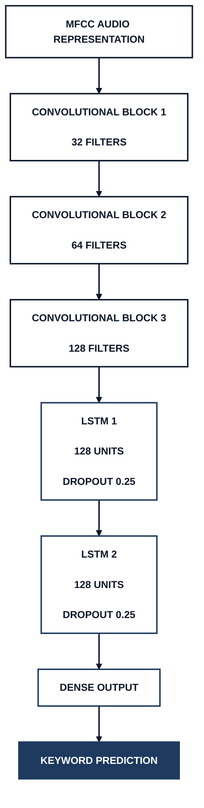
```mermaid
flowchart TD

    A["MFCC AUDIO REPRESENTATION"]

    B["CONVOLUTIONAL BLOCK 1<br/> 
    32 FILTERS"]

    C["CONVOLUTIONAL BLOCK 2<br/> 
    64 FILTERS"]

    D["CONVOLUTIONAL BLOCK 3<br/> 
    128 FILTERS"]

    E["LSTM 1<br/>
    128 UNITS<br/>
    DROPOUT 0.25"]

    F["LSTM 2<br/>
    128 UNITS<br/> 
    DROPOUT 0.25"]

    G["DENSE OUTPUT"]

    H["KEYWORD PREDICTION"]

    A --> B
    B --> C
    C --> D
    D --> E
    E --> F
    F --> G
    G --> H

    classDef feature fill:#FFFFFF,stroke:#0F172A,color:#0F172A,stroke-width:2px,font-size:14px,font-weight:700;
    classDef temporal fill:#FFFFFF,stroke:#1E3A5F,color:#0F172A,stroke-width:2px,font-size:14px,font-weight:700;
    classDef final fill:#1E3A5F,stroke:#1E3A5F,color:#FFFFFF,stroke-width:2px,font-size:14px,font-weight:700;

    class A,B,C,D feature;
    class E,F,G temporal;
    class H final;

    linkStyle default stroke:#0F172A,stroke-width:2px;
```

## Training Configuration

    

The training configuration uses an 80/20 train-test split, a batch size of 64, and a fixed random seed of 47.

## Keyword Evaluation

The evaluated keyword classes include:

     
 
     

## Performance

The reported aggregate evaluation metrics are:

    

### Per-Keyword Performance

| Keyword | Precision | Recall | F1 Score |
|:---:|:---:|:---:|:---:|
| house | 0.9929 | 0.9640 | 0.9782 |
| right | 0.9580 | 0.9648 | 0.9614 |
| down | 0.9815 | 0.9376 | 0.9591 |
| left | 0.9380 | 0.9545 | 0.9462 |
| no | 0.9743 | 0.9627 | 0.9685 |
| five | 0.9356 | 0.9566 | 0.9460 |
| one | 0.9784 | 0.9729 | 0.9756 |
| three | 0.9587 | 0.9544 | 0.9566 |

    

## Evaluation Pipeline

```mermaid
flowchart LR

    A["AUDIO DATA"]
    B["FEATURE EXTRACTION"]
    C["MODEL TRAINING"]
    D["KEYWORD DETECTION"]
    E["CONFUSION MATRIX"]
    F["PRECISION / RECALL / F1"]

    A --> B
    B --> C
    C --> D
    D --> E
    E --> F

    classDef stage fill:#FFFFFF,stroke:#0F172A,color:#0F172A,stroke-width:2px,font-size:15px,font-weight:700;
    classDef final fill:#1E3A5F,stroke:#1E3A5F,color:#FFFFFF,stroke-width:2px,font-weight:700;

    class A,B,C,D,E stage;
    class F final;

    linkStyle default stroke:#0F172A,stroke-width:2px;
```
## Applied Research Direction

Echo Fuse represents an early stage in my transition from conventional computer vision toward representation learning for unstructured sensory data.

The project broadened my experience across speech processing, few-shot learning, audio representations, temporal modelling, and applied machine learning.

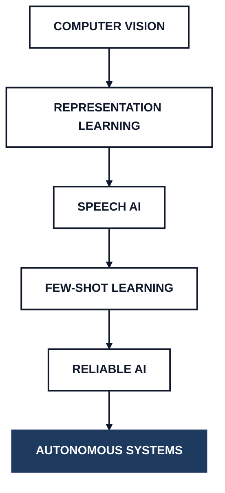
```mermaid
flowchart TD

    A["COMPUTER VISION"]
    B["REPRESENTATION LEARNING"]
    C["SPEECH AI"]
    D["FEW-SHOT LEARNING"]
    E["RELIABLE AI"]
    F["AUTONOMOUS SYSTEMS"]

    A --> B
    B --> C
    C --> D
    D --> E
    E --> F

    classDef stage fill:#FFFFFF,stroke:#0F172A,color:#0F172A,stroke-width:2px,font-size:15px,font-weight:700;
    classDef final fill:#1E3A5F,stroke:#1E3A5F,color:#FFFFFF,stroke-width:2px,font-size:15px,font-weight:700;

    class A,B,C,D,E stage;
    class F final;

    linkStyle default stroke:#0F172A,stroke-width:2px;
```

## Project Resources

 
The complete implementation, model files, evaluation scripts, and supporting resources are available in the project repository.

   

 
   

 
 

---

# 09. Computer Vision

## Deep Learning-Based Image Profiling and Similarity Detection

Development of a facial image profiling and similarity detection system designed to identify and group images based on facial similarity.

The system allows a user to provide a single image and retrieve other images containing the same individual, including both individual and group photographs.

## Research and Technical Focus

## System Architecture

The system follows a pipeline from image standardization and facial feature extraction to embedding generation, similarity analysis, clustering, and image retrieval.

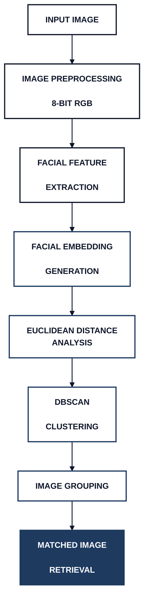
```mermaid
flowchart TD

    A["INPUT IMAGE"]
    B["IMAGE PREPROCESSING<br/>
    8-BIT RGB"]
    C["FACIAL FEATURE<br/>
    EXTRACTION"]
    D["FACIAL EMBEDDING<br/>
    GENERATION"]
    E["EUCLIDEAN DISTANCE<br/>ANALYSIS"]
    F["DBSCAN<br/>
    CLUSTERING"]
    G["IMAGE GROUPING"]
    H["MATCHED IMAGE<br/>
    RETRIEVAL"]

    A --> B
    B --> C
    C --> D
    D --> E
    E --> F
    F --> G
    G --> H

    classDef stage fill:#FFFFFF,stroke:#0F172A,color:#0F172A,stroke-width:2px,font-size:14px,font-weight:700;
    classDef process fill:#FFFFFF,stroke:#1E3A5F,color:#0F172A,stroke-width:2px,font-size:14px,font-weight:700;
    classDef final fill:#1E3A5F,stroke:#1E3A5F,color:#FFFFFF,stroke-width:2px,font-size:14px,font-weight:700;

    class A,B,C stage;
    class D,E,F,G process;
    class H final;

    linkStyle default stroke:#0F172A,stroke-width:1.5px;
```

## Image Processing

Input images are first standardized into an 8-bit RGB format to provide consistent input for downstream processing.

Facial features are then extracted using the face_recognition library. The report describes the use of facial landmarks such as the eyes, nose, and mouth, together with Euclidean-distance based feature comparison and facial embeddings.

     

## Similarity and Clustering

The generated facial embeddings are compared and grouped using DBSCAN.

DBSCAN was selected because it can identify dense groups in the embedding space without requiring the number of clusters to be specified in advance, while also allowing sparse points to be treated as noise.

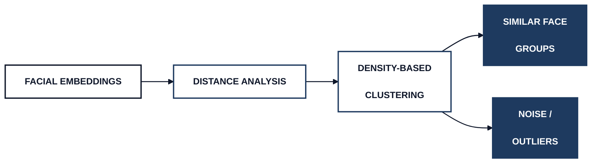
```mermaid
flowchart LR

    A["FACIAL EMBEDDINGS"]
    B["DISTANCE ANALYSIS"]
    C["DENSITY-BASED<br/>
    CLUSTERING"]
    D["SIMILAR FACE<br/>
    GROUPS"]
    E["NOISE /<br/>
    OUTLIERS"]

    A --> B
    B --> C
    C --> D
    C --> E

    classDef input fill:#FFFFFF,stroke:#0F172A,color:#0F172A,stroke-width:2px,font-size:14px,font-weight:700;
    classDef process fill:#FFFFFF,stroke:#1E3A5F,color:#0F172A,stroke-width:2px,font-size:14px,font-weight:700;
    classDef output fill:#1E3A5F,stroke:#1E3A5F,color:#FFFFFF,stroke-width:2px,font-size:14px,font-weight:700;

    class A input;
    class B,C process;
    class D,E output;

    linkStyle default stroke:#0F172A,stroke-width:1.5px;
```

## Deployment and Optimization

The system was deployed through a Streamlit interface on a DigitalOcean server to support interactive image processing.

The deployment architecture incorporated AWS Lambda for encoding tasks to reduce processing latency. The report records a 35% reduction in latency following this optimization.

     

### Deployment Configuration

     

Performance

The image profiling system reports an overall accuracy of 95.71% under normal lighting conditions, with a false-positive rate of 4.29%. It also explicitly identifies low-light conditions as a limitation affecting facial feature extraction and system performance.

   

### Reliability Consideration

The reported evaluation also records zero values for precision, recall, and F1 score and identifies possible class imbalance, metric-calculation, or thresholding issues requiring further investigation. Therefore, the 95.71% accuracy figure should be interpreted together with these evaluation limitations rather than as a complete measure of system reliability.

### Practical Constraint

A significant limitation identified during development was low-light image performance.

Reduced image clarity can affect the detection of facial landmarks and consequently influence embedding quality, similarity estimation, and clustering performance.

The report proposes future directions including improved low-light preprocessing, stronger embedding models, clustering optimisation, expanded evaluation metrics, dataset diversification, and privacy-preserving approaches.

## Research and Engineering Themes

     
 
     

## From Model to Deployment

The project gave me practical exposure to the complete path from image preprocessing and representation learning to clustering, deployment, optimisation, and evaluation.

```mermaid
flowchart LR

    A["IMAGE DATA"]
    B["PREPROCESSING"]
    C["FEATURE<br/>
    REPRESENTATION"]
    D["SIMILARITY"]
    E["CLUSTERING"]
    F["DEPLOYMENT"]
    G["EVALUATION"]

    A --> B
    B --> C
    C --> D
    D --> E
    E --> F
    F --> G

    classDef stage fill:#FFFFFF,stroke:#0F172A,color:#0F172A,stroke-width:2px,font-size:14px,font-weight:700;
    classDef final fill:#1E3A5F,stroke:#1E3A5F,color:#FFFFFF,stroke-width:2px,font-size:14px,font-weight:700;

    class A,B,C,D,E,F stage;
    class G final;

    linkStyle default stroke:#0F172A,stroke-width:1.5px;
```

## Technical Report

The technical report documents the system architecture, methodology, deployment, evaluation, limitations, and future development directions.
 
  

 

 
 

---

# 10. Generalizable Robot Manipulation

## Differentiable Neural Radiance Fields and Physics-Guided Diffusion for Generalizable Robot Manipulation

This research direction explores how robot manipulation systems can become more generalizable when operating in human-centric and unstructured environments.

The proposed framework combines differentiable scene representation, physics-guided generative modelling, differentiable simulation, and iterative policy refinement to generate physically consistent training experiences.

The central motivation is to address three recurring challenges in robot learning:

- The sim-to-real gap
- Scarcity of real-world interaction data
- Lack of physical understanding in learned policies

The proposal explores a closed-loop framework in which synthetic environments and physically consistent interactions are continuously generated and used to refine robot manipulation policies. :contentReference[oaicite:2]{index=2}

## Research and Technical Focus

## Core Research Challenges

The proposed research is motivated by three fundamental limitations in current robot learning systems.

### Sim-to-Real Gap

Policies trained in idealised simulation can experience significant performance degradation when transferred to physical robots because of differences in friction, contact dynamics, lighting, sensor noise, and other environmental factors.

### Real-World Data Scarcity

Collecting diverse and high-quality robot interaction data directly from physical systems is expensive, time-consuming, and introduces hardware wear. This limits the amount of data available for training generalizable manipulation policies.

### Lack of Physical Understanding

Learned models can demonstrate strong semantic capabilities while lacking sufficient understanding of the physical consequences of actions and object interactions.

This can result in brittle behaviour when robots encounter novel objects, tasks, or unstructured environments.

## Proposed Research Architecture

The proposed framework brings together four major components:

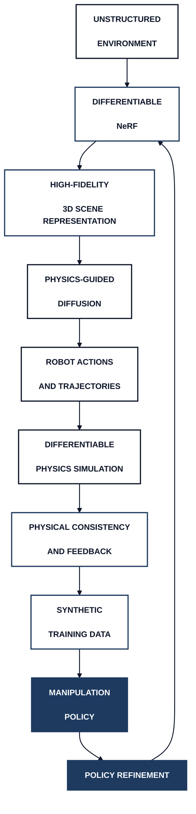
```mermaid
flowchart TD

    A["UNSTRUCTURED<br/>
    ENVIRONMENT"]

    B["DIFFERENTIABLE<br/>
    NeRF"]

    C["HIGH-FIDELITY<br/>
    3D SCENE REPRESENTATION"]

    D["PHYSICS-GUIDED<br/>
    DIFFUSION"]

    E["ROBOT ACTIONS<br/>
    AND TRAJECTORIES"]

    F["DIFFERENTIABLE<br/>
    PHYSICS SIMULATION"]

    G["PHYSICAL CONSISTENCY<br/>
    AND FEEDBACK"]

    H["SYNTHETIC<br/>
    TRAINING DATA"]

    I["MANIPULATION<br/>
    POLICY"]

    J["POLICY REFINEMENT"]

    A --> B
    B --> C
    C --> D
    D --> E
    E --> F
    F --> G
    G --> H
    H --> I
    I --> J
    J --> B

    classDef input fill:#FFFFFF,stroke:#0F172A,color:#0F172A,stroke-width:2px,font-size:14px,font-weight:700;
    classDef representation fill:#FFFFFF,stroke:#1E3A5F,color:#0F172A,stroke-width:2px,font-size:14px,font-weight:700;
    classDef process fill:#FFFFFF,stroke:#0F172A,color:#0F172A,stroke-width:2px,font-size:14px,font-weight:700;
    classDef feedback fill:#FFFFFF,stroke:#1E3A5F,color:#0F172A,stroke-width:2px,font-size:14px,font-weight:700;
    classDef final fill:#1E3A5F,stroke:#1E3A5F,color:#FFFFFF,stroke-width:2px,font-size:14px,font-weight:700;

    class A input;
    class B,C representation;
    class D,E,F process;
    class G,H feedback;
    class I,J final;

    linkStyle default stroke:#0F172A,stroke-width:1.5px;
```

## Differentiable Neural Radiance Fields

### Differentiable NeRFs are proposed as the scene and object representation layer.

The framework uses NeRFs to construct continuous 3D representations of environments and objects from 2D observations, enabling the generation of diverse and high-fidelity visual data.

The differentiable representation is important because gradients can propagate through the rendering process, allowing geometry, appearance, and physical properties to be jointly considered during optimisation.

     

### Physics-Guided Diffusion

Physics-Guided Diffusion Models are proposed to generate robot actions and interaction trajectories while incorporating physical constraints.

The framework considers manipulation behaviours such as grasping and pushing, with generated trajectories guided by feedback from a differentiable physics simulator.

     

### Differentiable Physics Simulation

The proposed framework incorporates differentiable simulation to provide physical feedback during trajectory generation.

The proposal identifies MuJoCo or Genesis as candidate simulation environments for providing physical feedback and gradients to the diffusion process.

     

## Closed-Loop Data Flywheel

A central concept of the proposal is a closed-loop synthetic data generation and policy refinement process.

Differentiable NeRFs generate realistic scenes, Physics-Guided Diffusion generates physically consistent interactions, and the resulting synthetic experiences are used to train and iteratively refine manipulation policies.

The refined policies then contribute to the generation of further training experiences, creating a continuous data-generation loop.

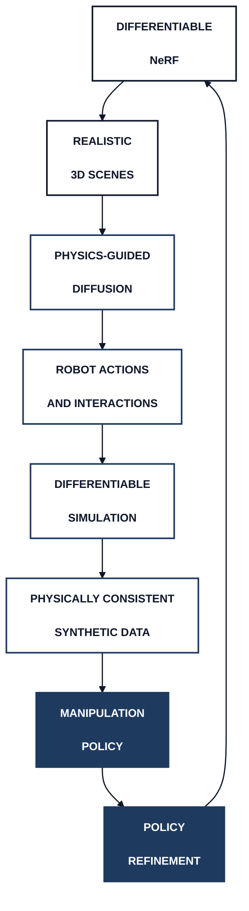
```mermaid
flowchart TD

    A["DIFFERENTIABLE<br/>
    NeRF"]

    B["REALISTIC<br/>
    3D SCENES"]

    C["PHYSICS-GUIDED<br/>
    DIFFUSION"]

    D["ROBOT ACTIONS<br/>
    AND INTERACTIONS"]

    E["DIFFERENTIABLE<br/>
    SIMULATION"]

    F["PHYSICALLY CONSISTENT<br/>
    SYNTHETIC DATA"]

    G["MANIPULATION<br/>
    POLICY"]

    H["POLICY<br/>
    REFINEMENT"]

    A --> B
    B --> C
    C --> D
    D --> E
    E --> F
    F --> G
    G --> H
    H --> A

    classDef representation fill:#FFFFFF,stroke:#0F172A,color:#0F172A,stroke-width:2px,font-size:14px,font-weight:700;
    classDef generation fill:#FFFFFF,stroke:#1E3A5F,color:#0F172A,stroke-width:2px,font-size:14px,font-weight:700;
    classDef final fill:#1E3A5F,stroke:#1E3A5F,color:#FFFFFF,stroke-width:2px,font-size:14px,font-weight:700;

    class A,B representation;
    class C,D,E,F generation;
    class G,H final;

    linkStyle default stroke:#0F172A,stroke-width:1.5px;
```

### From Synthetic Experience to Generalizable Manipulation

The proposed research aims to move beyond simply increasing the quantity of training data.

The objective is to generate training experiences that are simultaneously:

     

The proposed data-generation process is intended to reduce dependence on costly physical interaction data while improving the ability of manipulation policies to operate on unseen objects, novel tasks, and varied environmental conditions.

## Research Objectives

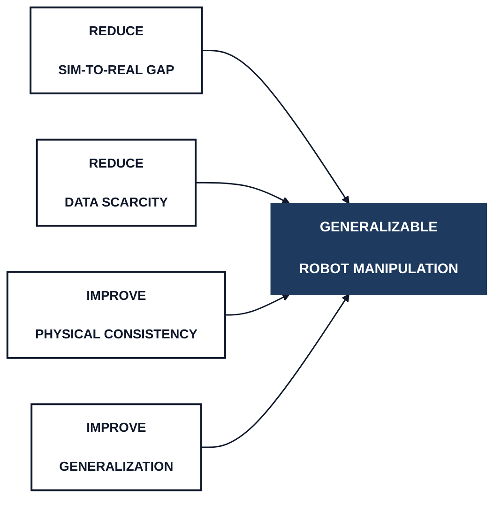
```mermaid
flowchart LR

    A["REDUCE<br/>
    SIM-TO-REAL GAP"]

    B["REDUCE<br/>
    DATA SCARCITY"]

    C["IMPROVE<br/>
    PHYSICAL CONSISTENCY"]

    D["IMPROVE<br/>
    GENERALIZATION"]

    E["GENERALIZABLE<br/>
    ROBOT MANIPULATION"]

    A --> E
    B --> E
    C --> E
    D --> E

    classDef objective fill:#FFFFFF,stroke:#0F172A,color:#0F172A,stroke-width:2px,font-size:14px,font-weight:700;
    classDef final fill:#1E3A5F,stroke:#1E3A5F,color:#FFFFFF,stroke-width:2px,font-size:15px,font-weight:700;

    class A,B,C,D objective;
    class E final;

    linkStyle default stroke:#0F172A,stroke-width:1.5px;
```
## Research Direction

This work represents a research direction toward generalizable physical intelligence, where robots are expected to learn not only visual and semantic representations, but also the physical consequences of their actions.

The broader objective is to develop manipulation systems capable of adapting to:

Unseen objects
Novel tasks
Unstructured environments
Changing physical conditions
Human-centric settings

The proposal positions the framework as a pathway toward autonomous systems that can interact with the physical world more reliably and safely.

### Expected Contributions

The proposal identifies four primary contribution areas:

     

The proposed framework is intended to combine photorealistic scene generation with physical consistency, reduce dependence on real-world interaction data, improve policy generalization, and incorporate physical reasoning into the generative learning process.

### Research Status

This work is currently presented as a proposed research framework.

The uploaded document describes the architecture, motivation, methodology, and expected contributions, but does not report completed experimental results or measured performance.

    

Broader Research Connection

This research direction connects naturally with my broader interest in reliable and generalizable autonomous systems.

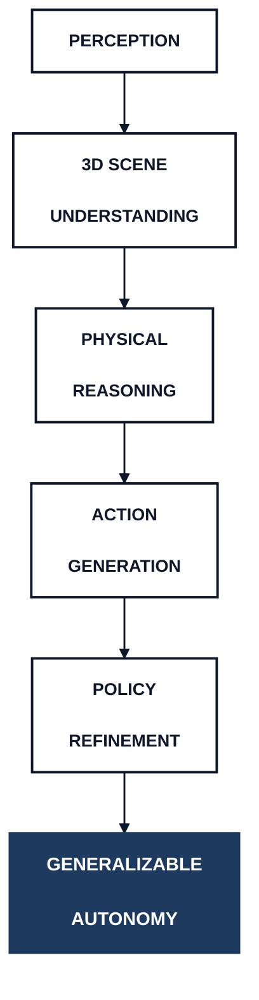
```mermaid
flowchart TD

    A["PERCEPTION"]

    B["3D SCENE<br/>
    UNDERSTANDING"]

    C["PHYSICAL<br/>
    REASONING"]

    D["ACTION<br/>
    GENERATION"]

    E["POLICY<br/>
    REFINEMENT"]

    F["GENERALIZABLE<br/>
    AUTONOMY"]

    A --> B
    B --> C
    C --> D
    D --> E
    E --> F

    classDef stage fill:#FFFFFF,stroke:#0F172A,color:#0F172A,stroke-width:2px,font-size:14px,font-weight:700;
    classDef final fill:#1E3A5F,stroke:#1E3A5F,color:#FFFFFF,stroke-width:2px,font-size:15px,font-weight:700;

    class A,B,C,D,E stage;
    class F final;

    linkStyle default stroke:#0F172A,stroke-width:1.5px;
```

The longer-term research direction is toward robotic systems that can perceive unfamiliar environments, reason about physical interactions, generate appropriate actions, and refine their behaviour through increasingly realistic and physically grounded experiences.

### Research Proposal

  The proposal describes the research motivation, framework, methodology, expected contributions, and broader direction toward generalizable robot manipulation. 

 
 

  

 
 

---

# Research Themes

  <strong>My research portfolio can be grouped into the following interconnected themes.</strong>

<table align="center">
  <thead>
    <tr>
      <th align="center">Research Theme</th>
      <th align="center">Areas</th>
    </tr>
  </thead>
  <tbody>
    <tr>
      <td align="center">Autonomous Systems</td>
      <td align="center">UAVs, USVs, UUVs, AGVs</td>
    </tr>
    <tr>
      <td align="center">Multi-Agent Robotics</td>
      <td align="center">Swarms, distributed coordination</td>
    </tr>
    <tr>
      <td align="center">Resilient Autonomy</td>
      <td align="center">Fault tolerance, graceful degradation</td>
    </tr>
    <tr>
      <td align="center">Decision-Making</td>
      <td align="center">Arbitration, distributed decisions</td>
    </tr>
    <tr>
      <td align="center">Navigation</td>
      <td align="center">Localization, mapping, path planning</td>
    </tr>
    <tr>
      <td align="center">Perception</td>
      <td align="center">LiDAR, vision, sensor fusion</td>
    </tr>
    <tr>
      <td align="center">Reliable AI</td>
      <td align="center">Calibration, distribution shift</td>
    </tr>
    <tr>
      <td align="center">Machine Learning</td>
      <td align="center">Deep learning, few-shot learning</td>
    </tr>
    <tr>
      <td align="center">Robot Learning</td>
      <td align="center">Simulation, synthetic data, manipulation</td>
    </tr>
    <tr>
      <td align="center">Agricultural Robotics</td>
      <td align="center">Precision pruning, intelligent orchards</td>
    </tr>
    <tr>
      <td align="center">Marine Robotics</td>
      <td align="center">Surface and underwater autonomy</td>
    </tr>
    <tr>
      <td align="center">Simulation</td>
      <td align="center">Gazebo, SITL, physics-based validation</td>
    </tr>
  </tbody>
</table>

---

# Research Lifecycle

I am interested in the complete research lifecycle:

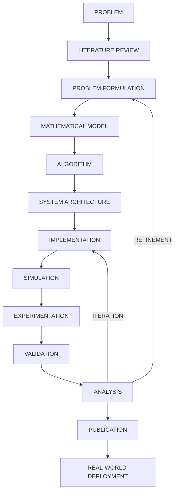
```mermaid
flowchart TD
    A["PROBLEM"] --> B["LITERATURE REVIEW"]
    B --> C["PROBLEM FORMULATION"]
    C --> D["MATHEMATICAL MODEL"]
    D --> E["ALGORITHM"]
    E --> F["SYSTEM ARCHITECTURE"]
    F --> G["IMPLEMENTATION"]
    G --> H["SIMULATION"]
    H --> I["EXPERIMENTATION"]
    I --> J["VALIDATION"]
    J --> K["ANALYSIS"]
    K -->|REFINEMENT| C
    K -->|ITERATION| G
    K --> L["PUBLICATION"]
    L --> M["REAL-WORLD DEPLOYMENT"]
```
    
My goal is to progressively connect theoretical research with practical robotic systems.

---

# Publications and Research Outputs

## Conference / Published Research

### Arbitration Layer for Decision-Making in Autonomous Underwater Robots

**Mohamed Hijazy Shazin Hassan, Neeraj S. M., Giri Rajasekhar Gunnu**

Presented at:

**8th International Conference on Ship and Offshore Technology (ICSOT 2025)**

Accepted for publication in Springer conference proceedings.

Research area:

`Autonomous Underwater Robotics · Decision-Making · Marine Robotics · Uncertainty-Aware Autonomy`

---

# Manuscripts and Ongoing Research

### ADMOS

**Adaptive Dual-Mode Operational Swarm for Resilient Asset Defense under Communication Jamming**

Research areas:

`UAV Swarms · Resilient Coordination · Communication-Aware Autonomy · Multi-Agent Control`

---

### Role-Partitioned Swarm Intelligence

**Role-Partitioned Swarm Intelligence for Resilient UAV Coordination in Contested Electromagnetic Environments**

Research areas:

`Swarm Intelligence · Distributed Coordination · Role Partitioning · Resilient Robotics`

---

### Embedding-Level Calibration

**Embedding Level Calibration under Distribution Shift in Visual Recognition**

Research areas:

`Reliable AI · Calibration · Distribution Shift · Computer Vision`

---

### The Calibration Witness and Its Propagation Algebra

Research areas:

`Machine Learning Theory · Calibration · Representation Learning · Reliable AI`

---

# Research Publication Status

| Work | Type | Status |
|:---:|:---:|:---:|
| Arbitration Layer for Decision-Making in Autonomous Underwater Robots | Conference Research | Presented / Accepted for Springer Proceedings |
| ADMOS | Research Manuscript | Ongoing / Pre-Print |
| Role-Partitioned Swarm Intelligence | Research Manuscript | Ongoing / Manuscript |
| Embedding-Level Calibration under Distribution Shift | Research Manuscript | Ongoing / Pre-Print |
| The Calibration Witness and Its Propagation Algebra | Research Work | Research Output / Pre-Print |
| FSLAKWS | Research Project / Manuscript | Research Work |
| Autonomous Catamaran | Robotics Project | Completed Project Work |
| UAV Swarm Coordination Thesis | Bachelor's Thesis | Completed |
| Precision Pruning AGV | Research Direction | Ongoing Research |
| Generalizable Robot Manipulation | Research Proposal | Ongoing Research |

---

# Technical Skills

### Robotics, Autonomy & Simulation

**Frameworks & Tools**

  
  
  
  
  
  
  
  
  

**Capabilities**

  
  
  

---

### Programming & Systems

  
  
  
  
  
  
  

---

### Artificial Intelligence & Machine Learning

  
  
  
  
  
  
  
  
  
  
  
  

---

### Development & Engineering Tools

**Development & Infrastructure**

  
  
  
  
  

**Data, Computer Vision & Machine Learning**

  
  
  
  

**Applications & Data Infrastructure**

  
  

---

# Robotic Platforms & Systems

My practical work spans aerial, marine, and ground robotic systems, with a common focus on autonomous operation, perception, navigation, coordination, and distributed autonomy.

```mermaid
flowchart TD

    A["ROBOTIC SYSTEMS"]

    A --> B["AERIAL"]
    A --> C["MARINE"]
    A --> D["GROUND"]

    B --> B1["UAVs"]
    B --> B2["UAV SWARMS"]
    B --> B3["PX4 / ROS 2"]

    C --> C1["USVs"]
    C --> C2["AUTONOMOUS CATAMARAN"]
    C --> C3["ROS 2 / NAV2"]

    D --> D1["AGVs"]
    D --> D2["AGRICULTURAL ROBOTICS"]
    D --> D3["PRECISION PRUNING"]

    B3 --> E["DISTRIBUTED AUTONOMY"]
    C3 --> E
    D3 --> E

    classDef root fill:#0F172A,stroke:#0F172A,color:#FFFFFF,stroke-width:2px,font-size:20px,font-weight:700;
    classDef domain fill:#FFFFFF,stroke:#0F172A,color:#0F172A,stroke-width:2px,font-size:18px,font-weight:700;
    classDef platform fill:#FFFFFF,stroke:#0F172A,color:#0F172A,stroke-width:1.5px,font-size:15px,font-weight:600;
    classDef autonomy fill:#0F172A,stroke:#0F172A,color:#FFFFFF,stroke-width:2px,font-size:18px,font-weight:700;

    class A root;
    class B,C,D domain;
    class B1,B2,B3,C1,C2,C3,D1,D2,D3 platform;
    class E autonomy;

    linkStyle default stroke:#0F172A,stroke-width:1.5px;
```

---

# Selected Technical Projects

## Autonomous Catamaran

ROS 2 based autonomous surface vehicle platform integrating:

* GNSS
* IMU
* LiDAR
* Ultrasonic sensors
* Telemetry
* Thrusters
* Navigation
* Localization
* Obstacle avoidance

### Project Resources

 
The complete implementation, model files, evaluation scripts, and supporting resources are available in the project repository.

   

 
   

 
 

---

## N-SWARM

Decentralized autonomous drone swarm framework exploring:

* Multi-UAV coordination
* Autonomous asset protection
* Distributed decision-making
* Swarm behaviour

### Project Resources

 
The complete implementation, model files, evaluation scripts, and supporting resources are available in the project repository.

   

 
   

 
 

---

## Adaptive Mobile Barrier Coverage

Research and implementation involving decentralized mobile sensor networks for adaptive probabilistic barrier coverage of time-varying stochastic target trajectories.

### Project Resources

 
The complete implementation, model files, evaluation scripts, and supporting resources are available in the project repository.

   

 
   

 
 

---

## Deep Learning Image Profiling

Facial similarity detection and image clustering using deep learning based embeddings and DBSCAN.

### Project Resources

The technical report documents the system architecture, methodology, deployment, evaluation, limitations, and future development directions.
 
  

 

 
 

---

## FSLAKWS

Few-shot language-agnostic keyword spotting for multilingual audio.

### Project Resources

 
The complete implementation, model files, evaluation scripts, and supporting resources are available in the project repository.

   

 
   

 
 

---

## From Simulation to Reality

A recurring component of my research is simulation-driven validation.

I use simulation not as an endpoint, but as a controlled environment for studying algorithms before physical deployment.

```mermaid
flowchart TD
    A["THEORY"] --> B["ALGORITHM"]
    B --> C["SOFTWARE MODEL"]
    C --> D["SIMULATION"]
    D --> E["SITL / GAZEBO"]
    E --> F["PERFORMANCE EVALUATION"]
    F --> G["HARDWARE INTEGRATION"]
    G --> H["REAL-WORLD ROBOT"]
```

This approach is particularly important for multi-agent systems where large-scale physical experimentation can be expensive and difficult to reproduce.

# Education

<table align="center">
  <tr>
    <td align="center" valign="middle" width="120">
      <a href="https://www.andhrauniversity.edu.in/" target="_blank">
        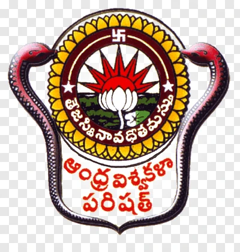
      </a>
    </td>
    <td align="center" valign="middle">
      <strong>Bachelor of Technology in Computer Science and Engineering</strong> 
      Department of Computer Science and Systems Engineering 
      <a href="https://www.andhrauniversity.edu.in/" target="_blank">
        <strong>Andhra University</strong>
      </a> 
      Visakhapatnam, India 
      <strong>2022 – 2026</strong>
    </td>
    <td align="center" valign="middle" width="130">
      <strong>CGPA</strong> 
      <strong>8.80 / 10</strong>
    </td>
  </tr>
</table>

### Research & Academic Focus

My undergraduate research developed primarily around:

`Swarm Robotics` · `Autonomous Systems` · `Multi-Agent Coordination` · `Marine Robotics` · `Autonomous Navigation` · `Intelligent Control` · `Sensor Fusion`

### Coursework

`Artificial Intelligence` · `Machine Learning` · `Embedded Systems` · `Computer Networks` · `Operating Systems` · `Cloud Computing`

---

<table align="center">
  <tr>
    <td align="center" valign="middle" width="120">
      
    </td>
    <td align="center" valign="middle">
      <strong>GCE Advanced Level – Physical Sciences</strong> 
      <strong>Subjects:</strong> · Pure Mathematics · Applied Mathematics · Physics · Chemistry 
      <a href="https://www.zahiracollege.lk/" target="_blank">
        <strong>Zahira College Colombo</strong>
      </a> 
      Colombo, Sri Lanka 
      <strong>2007 – 2020</strong>
    </td>
  </tr>
</table>

### Academic Foundation

My school education provided a foundation in mathematics and the physical sciences that later developed into an undergraduate focus on computer science, artificial intelligence, robotics, and autonomous systems.

----

# Research Experience

<table align="center">
<tr>
<td align="center" valign="middle" width="120">

</td>

<td align="center" valign="middle">
<strong>Autonomous Systems / Marine Robotics</strong> 
Research Internship · Autonomous Surface Vehicle Development 
<a href="https://www.iitkgp.ac.in/"><strong>Indian Institute of Technology Kharagpur</strong></a> 
Kharagpur, West-Bengal, India 
<strong> May 2025 – July 2025 </strong>  
</td>
</tr>
</table>

### Research Focus

`ROS 2` · `Autonomous Navigation` · `Sensor Fusion` · `Localization` · `Mapping` · `Nav2` · `SLAM` · `Gazebo`

## Independent Research

I continue to explore research problems across:

`Autonomous Systems` · `Multi-Agent Robotics` · `UAV Swarms` · `Resilient Autonomy` · `Marine Robotics` · `Agricultural Robotics` · `Reliable AI` · `Intelligent Robotic Decision-Making`

## Research Workflow

  <strong>FROM RESEARCH QUESTION TO PUBLISHED WORK</strong>

<table align="center">
  <tr>
    <td align="center"><strong>01</strong></td>
    <td><strong>Literature Review</strong></td>
    <td>Identify existing work, gaps, and research opportunities.</td>
  </tr>
  <tr>
    <td align="center"><strong>02</strong></td>
    <td><strong>Problem Formulation</strong></td>
    <td>Define the research problem and its scope.</td>
  </tr>
  <tr>
    <td align="center"><strong>03</strong></td>
    <td><strong>Mathematical Modelling</strong></td>
    <td>Develop the mathematical representation of the problem.</td>
  </tr>
  <tr>
    <td align="center"><strong>04</strong></td>
    <td><strong>Algorithm Design</strong></td>
    <td>Develop the proposed computational approach.</td>
  </tr>
  <tr>
    <td align="center"><strong>05</strong></td>
    <td><strong>Simulation</strong></td>
    <td>Study system behaviour in a controlled environment.</td>
  </tr>
  <tr>
    <td align="center"><strong>06</strong></td>
    <td><strong>Software Implementation</strong></td>
    <td>Translate the research method into an executable system.</td>
  </tr>
  <tr>
    <td align="center"><strong>07</strong></td>
    <td><strong>Experimental Validation</strong></td>
    <td>Evaluate performance through experiments and validation.</td>
  </tr>
  <tr>
    <td align="center"><strong>08</strong></td>
    <td><strong>Technical Writing</strong></td>
    <td>Document methodology, results, analysis, and findings.</td>
  </tr>
  <tr>
    <td align="center"><strong>09</strong></td>
    <td><strong>Research Publication</strong></td>
    <td>Communicate the research through scholarly publication.</td>
  </tr>
</table>

# Research Direction

My research interests are centered around **reliable and distributed autonomous systems**.

I am interested in how autonomous robots can **perceive, reason, coordinate, adapt, recover, and act** under uncertainty and changing operating conditions.

### Research Perspective

  <strong>PERCEIVE → REASON → COORDINATE → ADAPT → RECOVER → ACT → LEARN</strong>

### Perceive

Understand the environment through multiple sensors, observations, and learned representations.

### Reason

Evaluate uncertainty, operational constraints, mission objectives, and available resources.

### Coordinate

Enable multiple autonomous agents to collaborate through distributed decision-making.

### Adapt

Change behaviour as environmental, communication, mission, or system conditions change.

### Recover

Maintain useful operation despite partial failures, degraded sensing, or communication loss.

### Act

Translate decisions into safe and effective physical actions.

### Learn

Use data, simulation, and feedback to improve system behaviour and performance.

### Research Objective

My broader objective is to connect learning, decision-making, control, and multi-agent coordination with the reliability requirements of real-world autonomous systems.

I am particularly interested in the transition from:

  <strong>ALGORITHMS → SIMULATION → ROBOTIC SYSTEMS → REAL-WORLD DEPLOYMENT</strong>

with reliability, adaptability, and distributed autonomy considered throughout the process.

---

# Future Research Interests

My future research interests build on my work in autonomous systems, multi-agent robotics, resilient autonomy, marine robotics, and reliable AI.

I am interested in developing autonomous robotic systems that can operate, coordinate, and learn reliably in uncertain, dynamic, and partially degraded environments.

### 01 · Distributed & Multi-Agent Intelligence

`Multi-Agent Systems` · `Swarm Intelligence` · `Distributed Robotics` · `Decentralized Control`

Researching how autonomous agents can coordinate, make distributed decisions, and collectively accomplish missions without relying entirely on centralized control.

### 02 · Resilient & Reliable Autonomy

`Resilient Autonomy` · `Fault-Tolerant Robotics` · `Reliable AI` · `Safe Learning-Enabled Robotics`

Exploring how robotic systems can maintain useful and safe operation under failures, uncertainty, degraded sensing, communication loss, and changing operating conditions.

### 03 · Perception, Navigation & Decision-Making

`Robot Perception` · `Sensor Fusion` · `Autonomous Navigation` · `Physical Intelligence`

Investigating how robots can combine observations, learned representations, uncertainty, and environmental context to support reliable autonomous decisions.

### 04 · Learning & Simulation-to-Real

`Simulation-to-Real Transfer` · `Robot Learning` · `Synthetic Data` · `Physics-Based Simulation`

Studying how simulation, learning, and experimental feedback can be connected to improve the transfer of robotic algorithms from controlled environments to physical systems.

### 05 · Autonomous Robotic Systems

`Marine Robotics` · `UAV Systems` · `Agricultural Robotics` · `Human-Robot Collaboration`

Applying these research principles across different robotic platforms and real-world operating environments.

---

### Long-Term Research Direction

My long-term interest is in connecting **perception, learning, decision-making, control, and distributed coordination** to develop autonomous systems that remain **reliable, adaptable, and useful beyond controlled laboratory conditions**.

The broader progression I am interested in is:

  <strong>LEARN → DECIDE → COORDINATE → ADAPT → DEPLOY</strong>

---

# The Bigger Research Question

Across different robotic domains, my research repeatedly returns to one central problem:

> **How can autonomous systems remain useful, safe, and coordinated when their assumptions about the world stop being true?**

Autonomous systems are often developed under assumptions about:

- Reliable communication
- Accurate sensing
- Stable environments
- Known system dynamics
- Representative training data
- Successful component operation

In real-world deployment, these assumptions can fail.

For UAV swarms, this may mean communication loss or degraded coordination.

For marine robots, it may mean uncertain localization, limited sensing, or changing environmental conditions.

For agricultural robots, it may mean occluded and changing plant structures.

For learning-based systems, it may mean distribution shift, uncertainty, or unfamiliar observations.

For manipulation systems, it may mean that the physical world differs from the environment in which the system was trained.

These are different manifestations of the same underlying challenge:

## Building autonomy that remains reliable under uncertainty.

My research perspective is centered on systems that can reason about uncertainty, coordinate under constraints, adapt to changing conditions, recover from partial failures, and continue operating when assumptions break down.

This connects my interests across:

`Multi-Agent Robotics` · `Resilient Autonomy` · `Reliable AI` · `Perception` · `Decision-Making` · `Control` · `Marine Robotics` · `UAV Systems` · `Agricultural Robotics`

### The Research Goal

Ultimately, I am interested in the transition from:

  <strong>ASSUMPTION-DRIVEN AUTONOMY</strong> 
  ↓ 
  <strong>UNCERTAINTY-AWARE AUTONOMY</strong> 
  ↓ 
  <strong>ADAPTIVE & RESILIENT AUTONOMY</strong> 
  ↓ 
  <strong>RELIABLE REAL-WORLD AUTONOMY</strong>

# Research Network

Research progresses through collaboration across disciplines, institutions, and technical perspectives.

I am interested in connecting with:

`Robotics Laboratories` · `AI Research Groups` · `Universities` · `Autonomous Systems` · `Multi-Agent Systems` · `Marine Robotics` · `Agricultural Robotics` · `Machine Learning` · `Open-Source Robotics` · `Interdisciplinary Engineering Teams`

### Collaboration Across the Research Stack

```mermaid
flowchart LR
    A["THEORY"] --> B["ALGORITHMS"]
    B --> C["SIMULATION"]
    C --> D["HARDWARE"]
    D --> E["EXPERIMENTATION"]
    E --> F["REAL-WORLD<br/>VALIDATION"]

    classDef stage fill:#FFFFFF,stroke:#0F172A,color:#0F172A,stroke-width:2px;
    classDef final fill:#0F172A,stroke:#0F172A,color:#FFFFFF,stroke-width:2px;

    class A,B,C,D,E stage;
    class F final;
```
---

<h1>Beyond Engineering</h1>

Engineering and research are only part of my work.

Alongside technical research, I have been involved in
<strong>technology communication, student-led innovation, entrepreneurship, technical communities, leadership, youth development, and community building.</strong>

<table align="center" width="100%" cellpadding="18" cellspacing="0">

<!-- LOGOS -->

<tr>

<td align="center" valign="middle" width="33%">

</td>

<td align="center" valign="middle" width="33%">
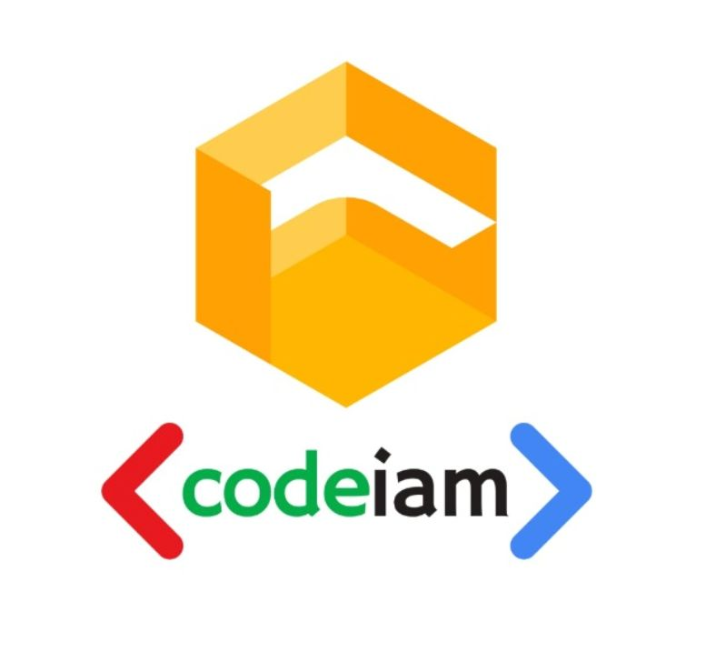
</td>

<td align="center" valign="middle" width="33%">
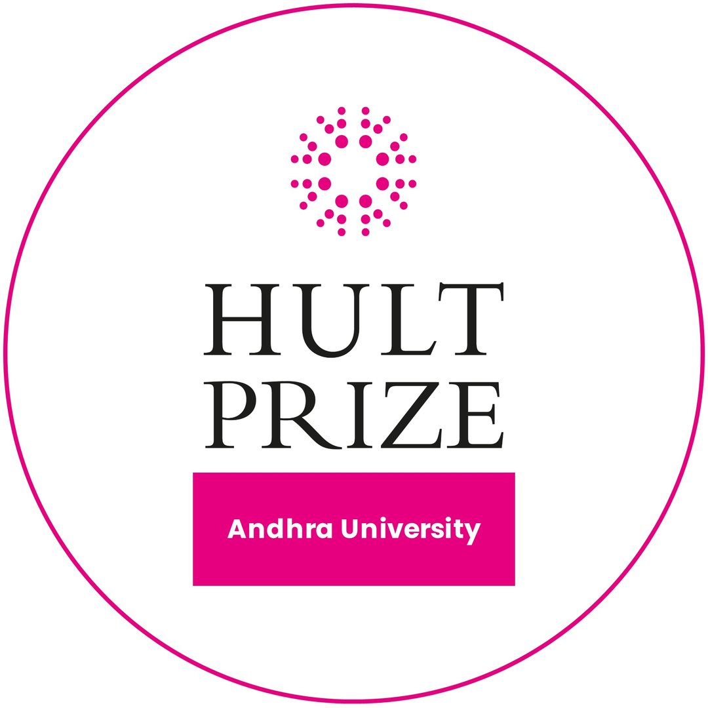
</td>

</tr>

<!-- ORGANIZATION NAMES -->

<tr>

<td align="center" valign="middle" width="33%">
<strong>CrossRoads with Shazin Hijazy</strong>
</td>

<td align="center" valign="middle" width="33%">
<strong>CodeIam</strong>
</td>

<td align="center" valign="middle" width="33%">
<strong>Hult Prize · Andhra University</strong>
</td>

</tr>

<!-- ROLES -->

<tr>

<td align="center" valign="middle" width="33%">
<strong>Founder &amp; Host</strong>
</td>

<td align="center" valign="middle" width="33%">
<strong>President</strong>
</td>

<td align="center" valign="middle" width="33%">
<strong>Deputy Campus Director</strong>
</td>

</tr>

<!-- DESCRIPTIONS -->

<tr>

<td align="center" valign="middle" width="33%">

Conversation platform for academics, entrepreneurs, 
researchers, and community leaders.

</td>

<td align="center" valign="middle" width="33%">

Student technology and innovation ecosystem 
focused on development and pre-incubation.

</td>

<td align="center" valign="middle" width="33%">

Student innovation, entrepreneurship, 
partnerships, and campus programmes.

</td>

</tr>

<!-- LINKS -->

<tr>

<td align="center" valign="middle" width="33%">
<a href="https://www.linkedin.com/company/crossroads-with-shazin-hijazy">
<strong>Explore ↗</strong>
</a>
</td>

<td align="center" valign="middle" width="33%">
<a href="https://www.linkedin.com/company/codeiam-club">
<strong>Explore ↗</strong>
</a>
</td>

<td align="center" valign="middle" width="33%">
<a href="https://www.hultprize.org/">
<strong>Explore ↗</strong>
</a>
</td>

</tr>

<!-- SECOND ROW: LOGOS -->

<tr>

<td align="center" valign="middle" width="33%">

</td>

<td align="center" valign="middle" width="33%">

</td>

<td align="center" valign="middle" width="33%">
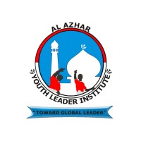
</td>

</tr>

<!-- SECOND ROW: NAMES -->

<tr>

<td align="center" valign="middle" width="33%">
<strong>GDG on Campus · AUCE</strong>
</td>

<td align="center" valign="middle" width="33%">
<strong>WOSY</strong>
</td>

<td align="center" valign="middle" width="33%">
<strong>Al Azhar Youth Leader Institute</strong>
</td>

</tr>

<!-- SECOND ROW: ROLES -->

<tr>

<td align="center" valign="middle" width="33%">
<strong>Technical Head · Flutter</strong>
</td>

<td align="center" valign="middle" width="33%">
<strong>International Secretary</strong>
</td>

<td align="center" valign="middle" width="33%">
<strong>Leadership Trainee · International Member</strong>
</td>

</tr>

<!-- SECOND ROW: DESCRIPTIONS -->

<tr>

<td align="center" valign="middle" width="33%">

Technical community activities, project development, 
and student technology initiatives.

</td>

<td align="center" valign="middle" width="33%">

International youth engagement, student representation, 
cultural exchange, and conferences.

</td>

<td align="center" valign="middle" width="33%">

Youth leadership, international engagement, 
public speaking, and social development.

</td>

</tr>

<!-- SECOND ROW: LINKS -->

<tr>

<td align="center" valign="middle" width="33%">
<a href="https://www.linkedin.com/company/gdsc-auce/">
<strong>Explore ↗</strong>
</a>
</td>

<td align="center" valign="middle" width="33%">
<a href="https://www.wosy.org/">
<strong>Explore ↗</strong>
</a>
</td>

<td align="center" valign="middle" width="33%">
<a href="http://www.al-azhar.or.id/">
<strong>Explore ↗</strong>
</a>
</td>

</tr>

<!-- THIRD ROW: LOGOS -->

<tr>

<td align="center" valign="middle" width="33%">
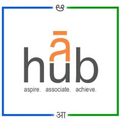
</td>

<td align="center" valign="middle" width="33%">

</td>

<td align="center" valign="middle" width="33%">

</td>

</tr>

<!-- THIRD ROW: NAMES -->

<tr>

<td align="center" valign="middle" width="33%">
<strong>a-hub</strong>
</td>

<td align="center" valign="middle" width="33%">
<strong>Caarya</strong>
</td>

<td align="center" valign="middle" width="33%">
<strong>JCI Vizag Incredibles</strong>
</td>

</tr>

<!-- THIRD ROW: ROLES -->

<tr>

<td align="center" valign="middle" width="33%">
<strong>Innovation &amp; Entrepreneurship</strong>
</td>

<td align="center" valign="middle" width="33%">
<strong>Startup Research &amp; Outreach Intern</strong>
</td>

<td align="center" valign="middle" width="33%">
<strong>Local Organization President</strong>
</td>

</tr>

<!-- THIRD ROW: DESCRIPTIONS -->

<tr>

<td align="center" valign="middle" width="33%">

Student innovation, startup programmes, ideation, 
and entrepreneurship activities.

</td>

<td align="center" valign="middle" width="33%">

Startup research, founder interviews, ecosystem analysis, 
and student opportunities.

</td>

<td align="center" valign="middle" width="33%">

Leadership, entrepreneurship, community initiatives, 
partnerships, and youth development.

</td>

</tr>

<!-- THIRD ROW: LINKS -->

<tr>

<td align="center" valign="middle" width="33%">
<a href="https://www.a-hub.co/">
<strong>Explore ↗</strong>
</a>
</td>

<td align="center" valign="middle" width="33%">
<a href="https://caarya.in/">
<strong>Explore ↗</strong>
</a>
</td>

<td align="center" valign="middle" width="33%">
<a href="https://jci.cc/">
<strong>Explore ↗</strong>
</a>
</td>

</tr>

</table>

 

<strong>COMMUNICATION · INNOVATION · LEADERSHIP · COMMUNITY</strong>

These experiences have shaped how I approach technical work: not only by developing systems and ideas, but also by communicating them clearly, connecting people across disciplines, building communities, and creating opportunities for collaboration.

# The Drone Swarm

  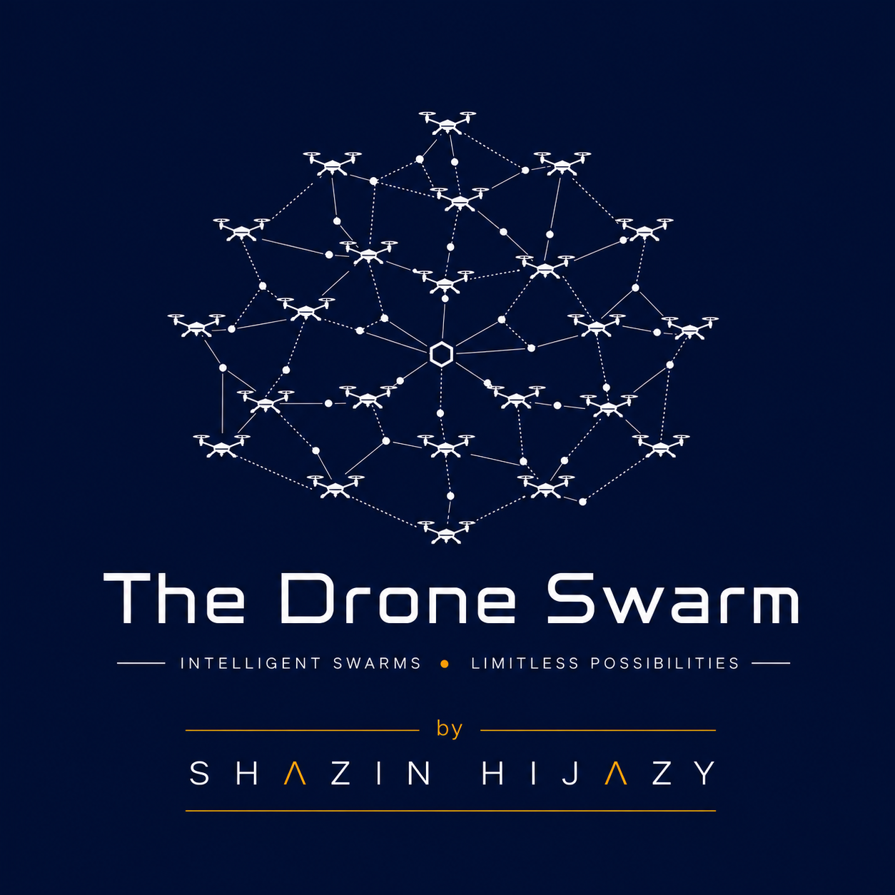

  <strong>An Independent Research Collaboration Initiative in Robotics & Intelligent Autonomous Systems</strong>

  <a href="https://www.linkedin.com/company/drones-swarm">
    <strong>Explore The Drone Swarm ↗</strong>
  </a>

The Drone Swarm is an independent research collaboration initiative established to connect researchers, engineers, students, and technical contributors
working on robotics and intelligent autonomous systems.

The initiative grew from my own research journey in swarm robotics and autonomous systems, and from the belief that meaningful research increasingly emerges through collaboration across institutions, disciplines, and geographical boundaries.

Rather than functioning as a conventional organization, The Drone Swarm is intended as a collaborative research space for exploring ideas, developing research concepts, building experimental systems, and connecting people who share an interest in advancing autonomous systems.

## Research Scope

The initiative is centered around research areas including:

`Swarm Robotics` · `Multi-Agent Systems` · `Autonomous Systems` · `Distributed Intelligence` · `Robotic Perception` · `Sensor Fusion` · `Autonomous Navigation` · `Marine Robotics` · `UAV Systems` · `Reliable AI` · `Resilient Autonomy` · `Human-Robot Collaboration`

---

## How Collaboration Works

```mermaid
flowchart TD

A["RESEARCH QUESTIONS"] --> B["IDEAS & DISCUSSION"]
B --> C["COLLABORATIVE RESEARCH"]
C --> D["ALGORITHMS & SYSTEM DESIGN"]
D --> E["SIMULATION & EXPERIMENTATION"]
E --> F["PROTOTYPE VALIDATION"]
F --> G["RESEARCH OUTPUT"]

G --> H["OPEN TECHNICAL KNOWLEDGE"]

classDef core fill:#FFFFFF,stroke:#0F172A,stroke-width:2px,color:#0F172A,font-weight:bold;
classDef research fill:#E5E7EB,stroke:#0F172A,stroke-width:2px,color:#0F172A,font-weight:bold;
classDef output fill:#0F172A,stroke:#0F172A,stroke-width:2px,color:#FFFFFF,font-weight:bold;

class A,B core;
class C,D,E,F research;
class G,H output;

linkStyle default stroke:#0F172A,stroke-width:2px;
```

---

<h1>Open Source · Research · Reproducibility</h1>

I use GitHub not only as a code repository, but as a working space for
<strong>research, experimentation, simulation, and reproducible technical development.</strong>

My repositories document different stages of my research process, from
<strong>algorithm development and simulation</strong> to
<strong>robotics software, experimental validation, documentation, and research prototypes.</strong>

<strong>RESEARCH · IMPLEMENTATION · SIMULATION · EXPERIMENTATION · DOCUMENTATION · REPRODUCIBILITY</strong>

<h2>Selected Research Repositories</h2>

<table align="center" width="100%" cellpadding="12" cellspacing="0">

<!-- ===================================================== -->
<!-- ROW 01 : GITHUB LOGOS -->
<!-- ===================================================== -->

<tr width="100%">

<td width="33.33%" height="85" align="center" valign="middle">

</td>

<td width="33.33%" height="85" align="center" valign="middle">

</td>

<td width="33.33%" height="85" align="center" valign="middle">

</td>

</tr>

<!-- ===================================================== -->
<!-- ROW 02 : TITLES -->
<!-- ===================================================== -->

<tr width="100%">

<td width="33.33%" height="55" align="center" valign="middle">

<strong>Autonomous Catamaran</strong>

</td>

<td width="33.33%" height="55" align="center" valign="middle">

<strong>Adaptive Mobile Barrier Coverage</strong>

</td>

<td width="33.33%" height="55" align="center" valign="middle">

<strong>RASID-SH Architecture</strong>

</td>

</tr>

<!-- ===================================================== -->
<!-- ROW 03 : RESEARCH AREAS -->
<!-- ===================================================== -->

<tr width="100%">

<td width="33.33%" height="55" align="center" valign="middle">

<strong>Marine Robotics · ROS 2 · Navigation</strong>

</td>

<td width="33.33%" height="55" align="center" valign="middle">

<strong>Distributed Robotics · Probabilistic Coverage</strong>

</td>

<td width="33.33%" height="55" align="center" valign="middle">

<strong>Multi-Agent Systems · Swarm Simulation</strong>

</td>

</tr>

<!-- ===================================================== -->
<!-- ROW 04 : DESCRIPTIONS -->
<!-- ===================================================== -->

<tr width="100%">

<td width="33.33%" height="115" align="center" valign="middle">

Autonomous Surface Vehicle development involving sensing, 
navigation, SLAM, telemetry, simulation, and system integration.

</td>

<td width="33.33%" height="115" align="center" valign="middle">

Decentralized mobile-sensor barrier coverage for stochastic 
target trajectories with reproducible numerical evaluation.

</td>

<td width="33.33%" height="115" align="center" valign="middle">

Multi-agent swarm simulation exploring decentralized 
leader election, reputation, communication quality, and visualization.

</td>

</tr>

<!-- ===================================================== -->
<!-- ROW 05 : REPOSITORY LINKS -->
<!-- ===================================================== -->

<tr width="100%">

<td width="33.33%" height="55" align="center" valign="middle">

<a href="https://github.com/ShazinHijazy/Autonomous-Catamaran-IIT-KGP">
<strong>Repository ↗</strong>
</a>

</td>

<td width="33.33%" height="55" align="center" valign="middle">

<a href="https://github.com/ShazinHijazy/adaptive-mobile-barrier-coverage">
<strong>Repository ↗</strong>
</a>

</td>

<td width="33.33%" height="55" align="center" valign="middle">

<a href="https://github.com/ShazinHijazy/RASID-SH-architecture">
<strong>Repository ↗</strong>
</a>

</td>

</tr>

<!-- ===================================================== -->
<!-- ROW 06 : GITHUB LOGOS -->
<!-- ===================================================== -->

<tr width="100%">

<td width="33.33%" height="85" align="center" valign="middle">

</td>

<td width="33.33%" height="85" align="center" valign="middle">

</td>

<td width="33.33%" height="85" align="center" valign="middle">

</td>

</tr>

<!-- ===================================================== -->
<!-- ROW 07 : TITLES -->
<!-- ===================================================== -->

<tr width="100%">

<td width="33.33%" height="55" align="center" valign="middle">

<strong>SIH Drone</strong>

</td>

<td width="33.33%" height="55" align="center" valign="middle">

<strong>Final-Year Research</strong>

</td>

<td width="33.33%" height="55" align="center" valign="middle">

<strong>More Research &amp; Robotics</strong>

</td>

</tr>

<!-- ===================================================== -->
<!-- ROW 08 : RESEARCH AREAS -->
<!-- ===================================================== -->

<tr width="100%">

<td width="33.33%" height="55" align="center" valign="middle">

<strong>UAV Swarms · Distributed Coordination</strong>

</td>

<td width="33.33%" height="55" align="center" valign="middle">

<strong>UAV Swarms · Resilient Autonomy</strong>

</td>

<td width="33.33%" height="55" align="center" valign="middle">

<strong>Projects · Experiments · Prototypes</strong>

</td>

</tr>

<!-- ===================================================== -->
<!-- ROW 09 : DESCRIPTIONS -->
<!-- ===================================================== -->

<tr width="100%">

<td width="33.33%" height="115" align="center" valign="middle">

Drone-swarm simulation studying decentralized coordination, 
communication degradation, stochastic scenarios, and swarm behaviour.

</td>

<td width="33.33%" height="115" align="center" valign="middle">

Research implementation supporting undergraduate work on 
fault-tolerant decentralized coordination for UAV swarms.

</td>

<td width="33.33%" height="115" align="center" valign="middle">

Additional work covering autonomous robotics, maritime technology, 
software experiments, research prototypes, and technical projects.

</td>

</tr>

<!-- ===================================================== -->
<!-- ROW 10 : REPOSITORY LINKS -->
<!-- ===================================================== -->

<tr width="100%">

<td width="33.33%" height="55" align="center" valign="middle">

<a href="https://github.com/ShazinHijazy/sihdrone">
<strong>Repository ↗</strong>
</a>

</td>

<td width="33.33%" height="55" align="center" valign="middle">

<a href="https://github.com/ShazinHijazy/final-year-project">
<strong>Repository ↗</strong>
</a>

</td>

<td width="33.33%" height="55" align="center" valign="middle">

<a href="https://github.com/ShazinHijazy?tab=repositories">
<strong>View All ↗</strong>
</a>

</td>

</tr>

</table>

 

<h2>Research Reproducibility</h2>

<strong>CODE · SIMULATION · EXPERIMENTS · DOCUMENTATION · RESULTS</strong>

Where possible, I aim to make my research implementations understandable, reproducible, and useful beyond the original experiment.

<a href="https://github.com/ShazinHijazy">
<strong>Explore My GitHub ↗</strong>
</a>

---

# Mentors and Research Guides

The development of my academic and research work has been shaped by mentors who have guided me across different stages of engineering, robotics, research, and professional development.

 

<table width="100%" cellspacing="10" cellpadding="6">

<!-- ========================================================== -->
<!-- ROW 01 : PHOTOS -->
<!-- ========================================================== -->

<tr width="100%">

<td width="50%" height="150" align="center" valign="middle">

</td>

<td width="50%" height="150" align="center" valign="middle">

</td>

</tr>

<!-- ========================================================== -->
<!-- ROW 02 : NAMES -->
<!-- ========================================================== -->

<tr width="100%">

<td width="50%" height="55" align="center" valign="middle">

### Prof. Shashi Mogalla

</td>

<td width="50%" height="55" align="center" valign="middle">

### Prof. Kuda Nageswara Rao

</td>

</tr>

<!-- ========================================================== -->
<!-- ROW 03 : INSTITUTION LOGOS -->
<!-- ========================================================== -->

<tr width="100%">

<td width="50%" height="80" align="center" valign="middle">

</td>

<td width="50%" height="80" align="center" valign="middle">

</td>

</tr>

<!-- ========================================================== -->
<!-- ROW 04 : DESIGNATION -->
<!-- ========================================================== -->

<tr width="100%">

<td width="50%" height="85" align="center" valign="middle">

**Principal,**  
**Andhra University College of Engineering**

</td>

<td width="50%" height="85" align="center" valign="middle">

**Chairman, Board of Studies,**  
**Department of Computer Science & Systems Engineering, AUCE**

</td>

</tr>

<!-- ========================================================== -->
<!-- ROW 05 : RELATIONSHIP -->
<!-- ========================================================== -->

<tr width="100%">

<td width="50%" height="60" align="center" valign="middle">

**Research Guide**  
</em>***Generalizable Robot Manipulation (PGDM)***</em>

</td>

<td width="50%" height="60" align="center" valign="middle">

**Project Guide** 
</em>***B.Tech Final Year***</em>

</td>

</tr>

<!-- ========================================================== -->
<!-- ROW 06 : GOOGLE SCHOLAR -->
<!-- ========================================================== -->

<tr width="100%">

<td width="50%" height="55" align="center" valign="middle">

</td>

<td width="50%" height="55" align="center" valign="middle">

</td>

</tr>

<!-- ========================================================== -->
<!-- ROW 07 : REQUEST REFERENCE -->
<!-- ========================================================== -->

<tr width="100%">

<td width="50%" height="55" align="center" valign="middle">

</td>

<td width="50%" height="55" align="center" valign="middle">

</td>

</tr>

<!-- ========================================================== -->
<!-- ROW 08 : PHOTOS -->
<!-- ========================================================== -->

<tr width="100%">

<td width="50%" height="150" align="center" valign="middle">

</td>

<td width="50%" height="150" align="center" valign="middle">

</td>

</tr>

<!-- ========================================================== -->
<!-- ROW 09 : NAMES -->
<!-- ========================================================== -->

<tr width="100%">

<td width="50%" height="55" align="center" valign="middle">

### Dr. Giri Raja Sekhar Gunnu

</td>

<td width="50%" height="55" align="center" valign="middle">

### Dr. Kondeti Lakshmi Vasudev

</td>

</tr>

<!-- ========================================================== -->
<!-- ROW 10 : INSTITUTION LOGOS -->
<!-- ========================================================== -->

<tr width="100%">

<td width="50%" height="80" align="center" valign="middle">

</td>

<td width="50%" height="80" align="center" valign="middle">

</td>

</tr>

<!-- ========================================================== -->
<!-- ROW 11 : DESIGNATION -->
<!-- ========================================================== -->

<tr width="100%">

<td width="50%" height="85" align="center" valign="middle">

**Professor of Practice,**  
**Department of Marine Engineering, Andhra University**

</td>

<td width="50%" height="85" align="center" valign="middle">

**Assistant Professor Grade-I,**  
**Ocean Engineering and Naval Architecture, IIT Kharagpur**

</td>

</tr>

<!-- ========================================================== -->
<!-- ROW 12 : RELATIONSHIP -->
<!-- ========================================================== -->

<tr width="100%">

<td width="50%" height="60" align="center" valign="middle">

**Research & Technical Guide** 
</em>***ADMOS · Arbitration***</em>

</td>

<td width="50%" height="60" align="center" valign="middle">

**Internship Guide** 
</em>***Autonomous Catamaran***</em>

</td>

</tr>

<!-- ========================================================== -->
<!-- ROW 13 : GOOGLE SCHOLAR -->
<!-- ========================================================== -->

<tr width="100%">

<td width="50%" height="55" align="center" valign="middle">

</td>

<td width="50%" height="55" align="center" valign="middle">

</td>

</tr>

<!-- ========================================================== -->
<!-- ROW 14 : REQUEST REFERENCE -->
<!-- ========================================================== -->

<tr width="100%">

<td width="50%" height="55" align="center" valign="middle">

</td>

<td width="50%" height="55" align="center" valign="middle">

</td>

</tr>

</table>

## Mentorship Across My Research Journey

 

<!-- ========================================================== -->
<!-- RESEARCH THEMES : OUTSIDE TABLE -->
<!-- ========================================================== -->

 

```mermaid
flowchart TB

    A["B.TECH THESIS <br/>
    UAV SWARMS"]
    B["RESEARCH DEVELOPMENT <br/>
    AI + ROBOTICS"]
    C["APPLIED RESEARCH <br/>
    MARINE + AI/ML"]
    D["MARINE ROBOTICS <br/>
    AUTONOMOUS CATAMARAN"]

    A1["PROF. KUDA <br/> NAGESWARA RAO"]
    B1["PROF. SHASHI <br/> MOGALLA"]
    C1["DR. GIRI RAJA <br/> SEKHAR GUNNU"]
    D1["DR. KONDETI <br/> LAKSHMI VASUDEV"]

    A --> B
    B --> C
    C --> D

    A -.-> A1
    B -.-> B1
    C -.-> C1
    D -.-> D1

    classDef stage fill:#FFFFFF,stroke:#0F172A,color:#0F172A,stroke-width:2px,font-size:14px,font-weight:700;
    classDef mentor fill:#FFFFFF,stroke:#1E3A5F,color:#0F172A,stroke-width:1.5px,font-size:13px,font-weight:600;

    class A,B,C,D stage;
    class A1,B1,C1,D1 mentor;

    linkStyle default stroke:#0F172A,stroke-width:1.5px;
```    
---

<h1>Research Profiles</h1>

My scholarly work and research presence can be explored through the following academic platforms.

<table align="center" width="100%" cellpadding="18" cellspacing="0">

<tr>

<td align="center" valign="middle" width="25%">

</td>

<td align="center" valign="middle" width="25%">

</td>

<td align="center" valign="middle" width="25%">

</td>

<td align="center" valign="middle" width="25%">

</td>

</tr>

<tr>

<td align="center" valign="middle">
<strong>ORCID</strong>
</td>

<td align="center" valign="middle">
<strong>Google Scholar</strong>
</td>

<td align="center" valign="middle">
<strong>ResearchGate</strong>
</td>

<td align="center" valign="middle">
<strong>Academia.edu</strong>
</td>

</tr>

<tr>

<td align="center" valign="middle">
Researcher Identifier
</td>

<td align="center" valign="middle">
Publications &amp; Citations
</td>

<td align="center" valign="middle">
Research Network
</td>

<td align="center" valign="middle">
Research &amp; Publications
</td>

</tr>

<tr>

<td align="center" valign="middle">

Persistent identifier connecting my 
research work and scholarly record.

</td>

<td align="center" valign="middle">

Academic publications, citation information, 
and scholarly research output.

</td>

<td align="center" valign="middle">

Research publications, manuscripts, projects, 
and connections with the research community.

</td>

<td align="center" valign="middle">

Selected papers, manuscripts, research uploads, 
and academic work.

</td>

</tr>

<tr>

<td align="center" valign="middle">
<a href="https://orcid.org/0009-0009-9256-7824">
<strong>View Profile ↗</strong>
</a>
</td>

<td align="center" valign="middle">
<a href="https://scholar.google.com/citations?user=gjZ9LDQAAAAJ&amp;hl=en">
<strong>View Profile ↗</strong>
</a>
</td>

<td align="center" valign="middle">
<a href="https://www.researchgate.net/profile/Mohamed-Hijazy-Hassan">
<strong>View Profile ↗</strong>
</a>
</td>

<td align="center" valign="middle">
<a href="https://andhrauniversity.academia.edu/MohamedHijazyShazinHassan">
<strong>View Profile ↗</strong>
</a>
</td>

</tr>

</table>

 

---

<h1>Connect</h1>

<strong>Mohamed Hijazy Shazin Hassan</strong>

<strong>AUTONOMOUS SYSTEMS · MULTI-AGENT ROBOTICS · SWARM INTELLIGENCE · RESILIENT AUTONOMY · MARINE ROBOTICS  · AGRICULTURAL ROBOTICS · RELIABLE AI</strong>

I am always interested in connecting with researchers, engineers, academics,
entrepreneurs, and technology communities working on challenging problems in
autonomous systems and intelligent robotics.

 

<table align="center" width="100%" cellpadding="18" cellspacing="0">

<!-- LOGOS -->

<tr>

<td align="center" valign="middle" width="33%">

</td>

<td align="center" valign="middle" width="33%">

</td>

<td align="center" valign="middle" width="33%">

</td>

</tr>

<!-- NAMES -->

<tr>

<td align="center" valign="middle">
<strong>LinkedIn</strong>
</td>

<td align="center" valign="middle">
<strong>Email</strong>
</td>

<td align="center" valign="middle">
<strong>GitHub</strong>
</td>

</tr>

<!-- ROLES -->

<tr>

<td align="center" valign="middle">
<strong>Professional Network</strong>
</td>

<td align="center" valign="middle">
<strong>Direct Contact</strong>
</td>

<td align="center" valign="middle">
<strong>Open Source · Research</strong>
</td>

</tr>

<!-- DESCRIPTIONS -->

<tr>

<td align="center" valign="middle">

Connect with me professionally, explore my background,
and follow my work across engineering, robotics, and research.

</td>

<td align="center" valign="middle">

For research collaboration, academic opportunities,
technical discussions, partnerships, and professional enquiries.

</td>

<td align="center" valign="middle">

Explore my research implementations, robotics projects,
simulation environments, experiments, and open-source work.

</td>

</tr>

<!-- LINKS -->

<tr>

<td align="center" valign="middle">

<a href="https://www.linkedin.com/in/shazin-hijazy/">
<strong>View Profile ↗</strong>
</a>

</td>

<td align="center" valign="middle">

<a href="mailto:shazhijazy@gmail.com">
<strong>Send an Email ↗</strong>
</a>

</td>

<td align="center" valign="middle">

<a href="https://github.com/ShazinHijazy">
<strong>Explore GitHub ↗</strong>
</a>

</td>

</tr>

</table>

 

If you are working on research related to
<strong>autonomous systems, multi-agent robotics, swarm intelligence,
resilient autonomy, marine robotics, agricultural robotics, or reliable AI</strong>,
I would be happy to connect and explore opportunities for collaboration.

<h1>Research Motto</h1>

<strong>
"Building autonomous systems that can operate when the real world does not behave as expected."
</strong>

 

<strong>Let's build, research, and learn together.</strong>

----

© Mohamed Hijazy Shazin Hassan · Robotics · Autonomous Systems · Artificial Intelligence · Multi-Agent Robotics

