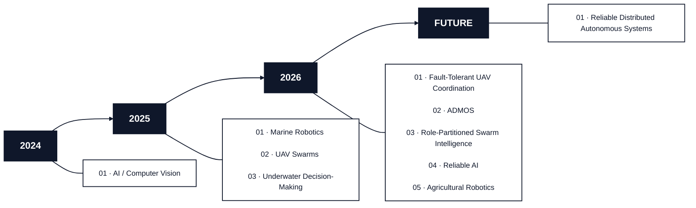
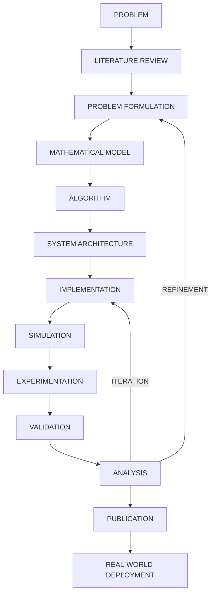
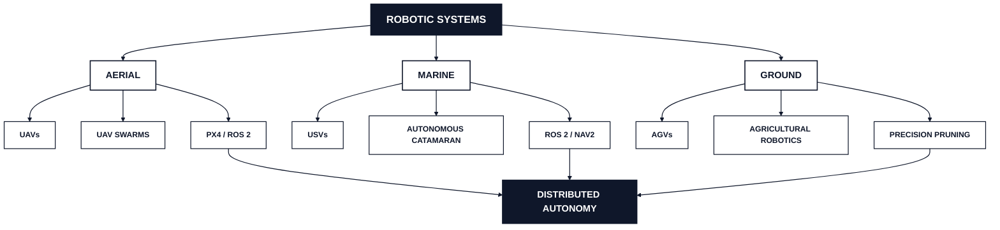
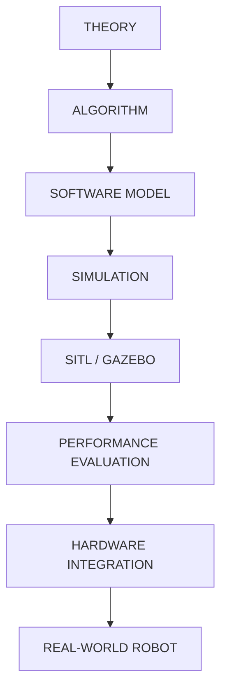
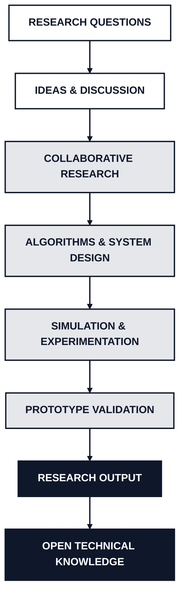

  

---

# About Me

I am a Computer Science and Engineering graduate from Andhra University, India, working at the intersection of robotics, autonomous systems, artificial intelligence, multi-agent coordination, and resilient robotic autonomy.

My research is guided by a fundamental question:

> **How can autonomous robotic systems perceive, decide, coordinate, adapt, and continue operating reliably when the real world is uncertain, dynamic, communication-constrained, or partially degraded?**

My work has evolved from robotic software development, computer vision, and autonomous navigation toward research in decentralized coordination, swarm intelligence, fault-tolerant autonomy, uncertainty-aware decision-making, and reliable robotic systems.

Across aerial, marine, underwater, and agricultural robotics, I am interested in a common problem:

> **How do we build autonomous systems that remain useful when their environment, communication, sensing, or individual agents cannot be assumed to be reliable?**

This has led me toward decentralized and distributed approaches where robotic systems can make decisions locally, coordinate with other agents, adapt to changing conditions, and tolerate partial failures rather than relying entirely on centralized control.

My broader goal is to contribute to reliable distributed autonomous systems that can move beyond controlled environments and operate meaningfully in the complexity of the real world.

---

<h1>Research Identity</h1>

  <strong>AUTONOMOUS SYSTEMS &amp; MULTI-AGENT ROBOTICS</strong>

<table align="center" width="100%" cellpadding="12" cellspacing="0">

<!-- HEADERS -->

<tr>

<td align="center" valign="middle" width="33%">
<strong>COORDINATION</strong>
</td>

<td align="center" valign="middle" width="33%">
<strong>RELIABLE AUTONOMY</strong>
</td>

<td align="center" valign="middle" width="33%">
<strong>PERCEPTION &amp; VALIDATION</strong>
</td>

</tr>

<!-- ROW 01 -->

<tr>

<td align="center" valign="middle">
Multi-Agent Systems
</td>

<td align="center" valign="middle">
Resilient Autonomous Systems
</td>

<td align="center" valign="middle">
Sensor Fusion
</td>

</tr>

<!-- ROW 02 -->

<tr>

<td align="center" valign="middle">
Swarm Robotics
</td>

<td align="center" valign="middle">
Fault-Tolerant Robotics
</td>

<td align="center" valign="middle">
Robot Perception
</td>

</tr>

<!-- ROW 03 -->

<tr>

<td align="center" valign="middle">
Decentralized Coordination
</td>

<td align="center" valign="middle">
Uncertainty-Aware Decision-Making
</td>

<td align="center" valign="middle">
Autonomous Navigation
</td>

</tr>

<!-- ROW 04 -->

<tr>

<td align="center" valign="middle">
Distributed Robotic Intelligence
</td>

<td align="center" valign="middle">
Intelligent Robotic Decision-Making
</td>

<td align="center" valign="middle">
Simulation-Driven Validation
</td>

</tr>

<!-- ROW 05 -->

<tr>

<td align="center" valign="middle">
Communication-Aware Autonomy
</td>

<td align="center" valign="middle">
Reliable Autonomous Systems
</td>

<td align="center" valign="middle">
Experimental Evaluation
</td>

</tr>

</table>

 

<strong>ROBOTIC PLATFORMS &amp; APPLICATIONS</strong>

<table align="center" width="100%" cellpadding="12" cellspacing="0">

<!-- PLATFORM HEADERS -->

<tr>

<td align="center" valign="middle" width="25%">
<strong>AERIAL</strong>
</td>

<td align="center" valign="middle" width="25%">
<strong>MARINE</strong>
</td>

<td align="center" valign="middle" width="25%">
<strong>AGRICULTURAL</strong>
</td>

<td align="center" valign="middle" width="25%">
<strong>MANIPULATION</strong>
</td>

</tr>

<!-- PLATFORM ROW 01 -->

<tr>

<td align="center" valign="middle">
UAV Swarms
</td>

<td align="center" valign="middle">
Autonomous Surface Vehicles
</td>

<td align="center" valign="middle">
Agricultural Robotics
</td>

<td align="center" valign="middle">
Generalizable Robot Manipulation
</td>

</tr>

<!-- PLATFORM ROW 02 -->

<tr>

<td align="center" valign="middle">
Autonomous Aerial Vehicles
</td>

<td align="center" valign="middle">
Autonomous Underwater Vehicles
</td>

<td align="center" valign="middle">
Precision Agriculture
</td>

<td align="center" valign="middle">
Adaptive Robotic Systems
</td>

</tr>

<!-- PLATFORM ROW 03 -->

<tr>

<td align="center" valign="middle">
Distributed Aerial Robotics
</td>

<td align="center" valign="middle">
Marine Robotics
</td>

<td align="center" valign="middle">
Autonomous Agricultural Systems
</td>

<td align="center" valign="middle">
Robot Learning
</td>

</tr>

</table>

 

---

# My Research in One Picture

# Areas of Research

  

---

<h1>Research Philosophy</h1>

I do not view autonomy simply as the ability of a robot to complete a predefined task.
For me, meaningful autonomy also requires understanding what happens when the assumptions
behind that task begin to fail.

<table align="center" width="100%" cellpadding="14" cellspacing="0">

<tr>

<td align="center" valign="middle" width="50%">
<strong>COMMUNICATION &amp; COORDINATION</strong>
</td>

<td align="center" valign="middle" width="50%">
<strong>SYSTEM &amp; ENVIRONMENTAL UNCERTAINTY</strong>
</td>

</tr>

<tr>

<td align="center" valign="middle">
Communication becomes unreliable
</td>

<td align="center" valign="middle">
Sensors become uncertain
</td>

</tr>

<tr>

<td align="center" valign="middle">
Multiple agents disagree
</td>

<td align="center" valign="middle">
Environmental conditions change
</td>

</tr>

<tr>

<td align="center" valign="middle">
An individual agent fails
</td>

<td align="center" valign="middle">
Localization becomes degraded
</td>

</tr>

<tr>

<td align="center" valign="middle">
Coordination becomes constrained
</td>

<td align="center" valign="middle">
Energy availability becomes limited
</td>

</tr>

<tr>

<td align="center" valign="middle">
Decisions must be made with imperfect information
</td>

<td align="center" valign="middle">
Learned models encounter unfamiliar conditions
</td>

</tr>

</table>

These challenges have led my research toward autonomous systems that can make decisions under imperfect information, coordinate despite communication constraints, adapt to changing conditions, and continue operating when individual components or agents become unreliable.

My long-term goal is to contribute to reliable distributed autonomous systems that can move beyond controlled demonstrations toward dependable operation in real environments.

---

## Research Timeline

```mermaid
flowchart LR

A["2024"] --> B["2025"] --> C["2026"] --> D["FUTURE"]

A1["01 · AI / Computer Vision"]

B1["01 · Marine Robotics <br> 
02 · UAV Swarms <br> 
03 · Underwater Decision-Making"]

C1["01 · Fault-Tolerant UAV Coordination<br>
02 · ADMOS<br> 
03 · Role-Partitioned Swarm Intelligence<br> 
04 · Reliable AI<br> 
05 · Agricultural Robotics"]

D1["01 · Reliable Distributed Autonomous Systems"]

A --- A1
B --- B1
C --- C1
D --- D1

classDef year fill:#0F172A,stroke:#0F172A,color:#FFFFFF,stroke-width:2px,font-size:18px,font-weight:bold;
classDef research fill:#FFFFFF,stroke:#0F172A,color:#0F172A,stroke-width:1.5px,font-size:14px;

class A,B,C,D year;
class A1,B1,C1,D1 research;

linkStyle default stroke:#0F172A,stroke-width:1.5px;
```

---

# Research Portfolio

## 01. Fault-Tolerant Decentralized UAV Swarm Coordination

### Bachelor's Thesis

**A Fault-Tolerant Decentralized Coordination Framework for UAV Swarms using Relative Suitability Elective Consensus and SITL Validation**

  

My bachelor's thesis investigates decentralized coordination and autonomous leadership in UAV swarms.

The framework explores a Relative Suitability Value (RSV) based leader-election mechanism in which individual UAVs evaluate local operational conditions such as:

* Residual energy
* Neighbour connectivity
* Formation positioning
* Operational suitability

The objective is to enable the swarm to dynamically determine a suitable leader while reducing dependence on a centralized command structure.

### Technical Stack

**Robotics & Autonomy**

**Simulation & Communication**

-37474F?style=flat-square)

**Programming**

### Research Problems

* Decentralized leader election
* Node failure
* Autonomous failover
* Communication-aware coordination
* Distributed decision-making
* Swarm resilience
* Multi-agent autonomy

The thesis represents the foundation of my current research direction in **fault-tolerant distributed robotic systems**.

---

# 02. ADMOS

## Adaptive Dual-Mode Operational Swarm for Resilient Asset Defense under Communication Jamming

&nbsp;&nbsp

  
ADMOS investigates how cooperative UAV swarms can continue operating when communication between agents becomes degraded or unavailable.

  

The research explores an adaptive architecture combining:

### Distributed State Estimation

**Covariance Intersection (CI)** is used to maintain consistent state estimation when correlations between information sources are unknown.

### Dual-Mode Operation

Agents can operate in:

* Cooperative mode
* Autonomous mode

A hybrid supervisor manages the transition between the two modes using hysteresis and minimum dwell time.

### Safety-Critical Control

A Higher-Order Control Barrier Function based safety filter is integrated into the architecture and solved as a quadratic program.

### Research Objective

Rather than assuming that communication will always remain available, ADMOS investigates a more resilient principle:

> **When coordination becomes unreliable, autonomous agents should degrade gracefully rather than fail catastrophically.**

The manuscript has been developed around simulation-based evaluation of UAV swarm resilience under communication degradation and jamming conditions.

---

# 03. Role-Partitioned Swarm Intelligence

## Resilient UAV Coordination in Contested Electromagnetic Environments

This research investigates whether assigning specialised functional roles to UAVs can improve swarm organisation and resilience.

The proposed architecture divides UAV agents into operational roles:

  

The work explores:

* Role-partitioned swarm intelligence
* Distributed coordination
* Communication-aware behaviour
* Covariance Intersection
* High-Order Control Barrier Functions
* Safety filtering
* Swarm scalability
* Communication degradation

The research is being evaluated through simulation-driven analysis.

---

# 04. Autonomous Marine Robotics

## Autonomous Surface Vehicle Catamaran

During my research internship at the **Indian Institute of Technology Kharagpur**, I worked on an **Autonomous Surface Vehicle (ASV) based on a catamaran platform**.

The project brought together **marine sensing, localization, sensor fusion, perception, mapping, navigation, control, telemetry, and safety** within a modular **ROS 2** based robotic architecture.

### Technology Stack

<h3>Platform</h3>

<table align="center" width="80%">
  <tr>
    <th align="center">Component</th>
    <th align="center">Role</th>
  </tr>
  <tr>
    <td align="center"><strong>Raspberry Pi 4B</strong></td>
    <td align="center">Onboard computation</td>
  </tr>
  <tr>
    <td align="center"><strong>RPLIDAR</strong></td>
    <td align="center">2D perception and mapping</td>
  </tr>
  <tr>
    <td align="center"><strong>GNSS</strong></td>
    <td align="center">Global localization</td>
  </tr>
  <tr>
    <td align="center"><strong>IMU</strong></td>
    <td align="center">Orientation and motion estimation</td>
  </tr>
  <tr>
    <td align="center"><strong>Ultrasonic Sensors</strong></td>
    <td align="center">Short-range obstacle detection</td>
  </tr>
  <tr>
    <td align="center"><strong>Blue Robotics T100 Thrusters</strong></td>
    <td align="center">Propulsion and maneuvering</td>
  </tr>
  <tr>
    <td align="center"><strong>ESCs</strong></td>
    <td align="center">Thruster actuation</td>
  </tr>
  <tr>
    <td align="center"><strong>Telemetry System</strong></td>
    <td align="center">Remote communication and monitoring</td>
  </tr>
</table>

### Software

<table align="center" width="80%">
  <tr>
    <th align="center">Layer</th>
    <th align="center">Technologies</th>
  </tr>
  <tr>
    <td align="center"><strong>Operating System</strong></td>
    <td align="center">Ubuntu 22.04</td>
  </tr>
  <tr>
    <td align="center"><strong>Robotics Middleware</strong></td>
    <td align="center">ROS 2 Humble</td>
  </tr>
  <tr>
    <td align="center"><strong>Navigation</strong></td>
    <td align="center">Nav2</td>
  </tr>
  <tr>
    <td align="center"><strong>Mapping</strong></td>
    <td align="center">SLAM Toolbox</td>
  </tr>
  <tr>
    <td align="center"><strong>Localization</strong></td>
    <td align="center">GNSS + IMU</td>
  </tr>
  <tr>
    <td align="center"><strong>Visualization</strong></td>
    <td align="center">RViz2</td>
  </tr>
  <tr>
    <td align="center"><strong>Control</strong></td>
    <td align="center">ROS 2 Thruster Control</td>
  </tr>
  <tr>
    <td align="center"><strong>Simulation</strong></td>
    <td align="center">2D / 3D Simulation</td>
  </tr>
  <tr>
    <td align="center"><strong>Communication</strong></td>
    <td align="center">Telemetry</td>
  </tr>
</table>

### Research and Engineering Areas

- Autonomous waypoint navigation
- Localization and state estimation
- Sensor fusion
- Mapping and perception
- Obstacle detection and avoidance
- Navigation planning
- Thruster control
- Telemetry and remote intervention
- Fail-safe operation
- ROS 2 hardware-software integration
- Simulation-driven development
- Autonomous marine systems

### From Simulation to Deployment

The project involved an iterative transition between **simulation, hardware integration, testing, and controlled field deployment**, bringing together sensing, localization, navigation, control, telemetry, and safety within a real robotic platform.

The experience strengthened my interest in moving **autonomous systems from controlled simulation environments toward reliable operation in real-world conditions**.

 

# 05. Autonomous Underwater Robotics

## Arbitration Layer for Decision-Making in Autonomous Underwater Robots

This research investigates lightweight decision-making for autonomous underwater robots operating under uncertainty and resource constraints.

The proposed arbitration layer evaluates candidate actions using multiple operational factors, including:

* Task priority
* Sensor confidence
* Mission objectives
* Energy constraints
* Environmental uncertainty

The objective is to provide a lightweight and deterministic decision layer capable of supporting real-time action selection on resource-constrained autonomous underwater platforms.

### Research Themes

* Autonomous underwater robotics
* Decision-making under uncertainty
* Resource-constrained autonomy
* Sensor confidence
* Action arbitration
* Real-time robotics
* Marine autonomy

The work was presented at the **8th International Conference on Ship and Offshore Technology (ICSOT 2025)** and accepted for publication in the Springer conference proceedings.

---

# 06. Agricultural Robotics

## Autonomous Ground Vehicle for Precision Pruning and Intelligent Orchard Operations

My agricultural robotics research explores the development of an **Autonomous Ground Vehicle (AGV) for precision pruning**.

The central research problem is different from conventional agricultural navigation.

A robot may be able to navigate an orchard reliably, but pruning requires the system to understand the structure of the plant and make an informed intervention.

The research therefore explores the integration of:

* Autonomous ground navigation
* 3D perception
* RGB-D sensing
* LiDAR
* Point cloud processing
* Plant structure understanding
* Topological representations
* Occlusion-aware perception
* Manipulation
* Force feedback
* Intelligent pruning decisions

The research investigates the gap between:

**Autonomous navigation**

and

**Autonomous physical intervention.**

A major challenge is developing perception and decision-making approaches that generalise across different tree species, growth stages, occlusions, and real-world orchard conditions.

---

# 07. Reliable AI and Calibration under Distribution Shift

## Embedding-Level Calibration under Distribution Shift in Visual Recognition

Another research direction explores the reliability of confidence estimates produced by visual recognition systems when deployment data differs from training data.

The research investigates the limitations of conventional score-level calibration under distribution shift.

The work introduces concepts including:

* Calibration Witness
* Embedding-level calibration
* Distribution shift
* Score-level non-identifiability
* Witness Field
* Propagation Algebra

The broader question is:

> **Can an AI system know when its confidence is no longer trustworthy?**

This research connects directly with my interest in trustworthy autonomy because robotic systems depend heavily on the reliability of perception models when operating outside controlled environments.

---

# 08. Calibration Witness and Propagation Algebra

## The Calibration Witness and Its Propagation Algebra

This research develops a theoretical framework for understanding calibration failure when representation-level information is lost or collapsed into indistinguishable score regions.

The work investigates:

* Calibration error
* Representation-level information
* Distribution shift
* Score-level limitations
* Embedding-level structure
* Layer-wise epistemic information
* Calibration reliability

The research has applications across areas including:

* Computer vision
* Autonomous systems
* Biometrics
* Medical imaging
* Machine learning reliability

The central motivation is closely aligned with my broader interest in **reliable AI for systems that must make decisions under uncertainty**.

---

# 09. Few-Shot Language-Agnostic Keyword Spotting

## FSLAKWS

### A Few-Shot Language Agnostic Keyword Spotting System for Audio Files

I have also worked on applied machine learning research involving multilingual speech and few-shot keyword spotting.

The work investigates a language-agnostic keyword spotting pipeline capable of operating with limited examples of newly introduced keywords.

The research combines:

* Self-supervised speech representations
* Few-shot learning
* Multilingual speech processing
* Keyword spotting
* Detection operators
* Audio embeddings
* Statistical calibration

This work originated in the context of **Smart India Hackathon 2024** and expanded my experience into speech AI and representation learning.

---

# 10. Computer Vision

## Deep Learning-Based Image Profiling and Similarity Detection

During my software project management internship, I contributed to the development of a facial image profiling and similarity detection system.

The system combined:

* Image preprocessing
* Facial feature extraction
* Facial embeddings
* Euclidean distance analysis
* DBSCAN clustering
* OpenCV
* NumPy
* Pandas
* Python

The system was designed to cluster images based on facial similarity and retrieve images containing the same individual across individual and group photographs.

The project reported **95.71% accuracy under normal lighting conditions**, while also identifying low-light performance as an important limitation.

This project gave me practical exposure to the relationship between machine learning models, data quality, preprocessing, clustering, and real-world deployment constraints.

---

# 11. Generalizable Robot Manipulation

## Differentiable Neural Radiance Fields and Physics-Guided Diffusion

I have also explored a research direction focused on **generalizable robot manipulation in human-centric and unstructured environments**.

The proposed framework combines:

* Differentiable Neural Radiance Fields
* Physics-guided diffusion models
* Differentiable simulation
* Synthetic data generation
* Robot manipulation
* Sim-to-real transfer
* Physical consistency
* Policy refinement

The central motivation is to address three recurring challenges in robot learning:

1. Sim-to-real transfer
2. Scarcity of real-world interaction data
3. Lack of physical understanding in learned policies

The proposed concept uses a closed-loop data generation and policy refinement pipeline to create physically consistent training experiences.

---

# Research Themes

  <strong>My research portfolio can be grouped into the following interconnected themes.</strong>

<table align="center">
  <thead>
    <tr>
      <th align="center">Research Theme</th>
      <th align="center">Areas</th>
    </tr>
  </thead>
  <tbody>
    <tr>
      <td align="center">Autonomous Systems</td>
      <td align="center">UAVs, USVs, UUVs, AGVs</td>
    </tr>
    <tr>
      <td align="center">Multi-Agent Robotics</td>
      <td align="center">Swarms, distributed coordination</td>
    </tr>
    <tr>
      <td align="center">Resilient Autonomy</td>
      <td align="center">Fault tolerance, graceful degradation</td>
    </tr>
    <tr>
      <td align="center">Decision-Making</td>
      <td align="center">Arbitration, distributed decisions</td>
    </tr>
    <tr>
      <td align="center">Navigation</td>
      <td align="center">Localization, mapping, path planning</td>
    </tr>
    <tr>
      <td align="center">Perception</td>
      <td align="center">LiDAR, vision, sensor fusion</td>
    </tr>
    <tr>
      <td align="center">Reliable AI</td>
      <td align="center">Calibration, distribution shift</td>
    </tr>
    <tr>
      <td align="center">Machine Learning</td>
      <td align="center">Deep learning, few-shot learning</td>
    </tr>
    <tr>
      <td align="center">Robot Learning</td>
      <td align="center">Simulation, synthetic data, manipulation</td>
    </tr>
    <tr>
      <td align="center">Agricultural Robotics</td>
      <td align="center">Precision pruning, intelligent orchards</td>
    </tr>
    <tr>
      <td align="center">Marine Robotics</td>
      <td align="center">Surface and underwater autonomy</td>
    </tr>
    <tr>
      <td align="center">Simulation</td>
      <td align="center">Gazebo, SITL, physics-based validation</td>
    </tr>
  </tbody>
</table>

---

# Research Lifecycle

I am interested in the complete research lifecycle:

```mermaid
flowchart TD
    A["PROBLEM"] --> B["LITERATURE REVIEW"]
    B --> C["PROBLEM FORMULATION"]
    C --> D["MATHEMATICAL MODEL"]
    D --> E["ALGORITHM"]
    E --> F["SYSTEM ARCHITECTURE"]
    F --> G["IMPLEMENTATION"]
    G --> H["SIMULATION"]
    H --> I["EXPERIMENTATION"]
    I --> J["VALIDATION"]
    J --> K["ANALYSIS"]
    K -->|REFINEMENT| C
    K -->|ITERATION| G
    K --> L["PUBLICATION"]
    L --> M["REAL-WORLD DEPLOYMENT"]
```
    
My goal is to progressively connect theoretical research with practical robotic systems.

---

# Publications and Research Outputs

## Conference / Published Research

### Arbitration Layer for Decision-Making in Autonomous Underwater Robots

**Mohamed Hijazy Shazin Hassan, Neeraj S. M., Giri Rajasekhar Gunnu**

Presented at:

**8th International Conference on Ship and Offshore Technology (ICSOT 2025)**

Accepted for publication in Springer conference proceedings.

Research area:

`Autonomous Underwater Robotics · Decision-Making · Marine Robotics · Uncertainty-Aware Autonomy`

---

# Manuscripts and Ongoing Research

### ADMOS

**Adaptive Dual-Mode Operational Swarm for Resilient Asset Defense under Communication Jamming**

Research areas:

`UAV Swarms · Resilient Coordination · Communication-Aware Autonomy · Multi-Agent Control`

---

### Role-Partitioned Swarm Intelligence

**Role-Partitioned Swarm Intelligence for Resilient UAV Coordination in Contested Electromagnetic Environments**

Research areas:

`Swarm Intelligence · Distributed Coordination · Role Partitioning · Resilient Robotics`

---

### Embedding-Level Calibration

**Embedding Level Calibration under Distribution Shift in Visual Recognition**

Research areas:

`Reliable AI · Calibration · Distribution Shift · Computer Vision`

---

### The Calibration Witness and Its Propagation Algebra

Research areas:

`Machine Learning Theory · Calibration · Representation Learning · Reliable AI`

---

# Research Publication Status

| Work                                                                  | Type                          | Status                                        |
| --------------------------------------------------------------------- | ----------------------------- | --------------------------------------------- |
| Arbitration Layer for Decision-Making in Autonomous Underwater Robots | Conference Research           | Presented / Accepted for Springer Proceedings |
| ADMOS                                                                 | Research Manuscript           | Ongoing / Pre-Print                          |
| Role-Partitioned Swarm Intelligence                                   | Research Manuscript           | Ongoing / Manuscript                          |
| Embedding Level Calibration under Distribution Shift                  | Research Manuscript           | Ongoing / Pre-Print                         |
| The Calibration Witness and Its Propagation Algebra                   | Research Work                 | Research Output/ Pre-Print                               |
| FSLAKWS                                                               | Research Project / Manuscript | Research Work                                 |
| Autonomous Catamaran                                                  | Robotics Project              | Completed Project Work                        |
| UAV Swarm Coordination Thesis                                         | Bachelor's Thesis             | Completed                                     |
| Precision Pruning AGV                                                 | Research Direction            | Ongoing Research                              |
| Generalizable Robot Manipulation                                      | Research Proposal             | Ongoing Research                             |

---

# Technical Skills

### Robotics, Autonomy & Simulation

**Frameworks & Tools**

  
  
  
  
  
  
  
  
  

**Capabilities**

  
  
  

---

### Programming & Systems

  
  
  
  
  
  
  

---

### Artificial Intelligence & Machine Learning

  
  
  
  
  
  
  
  
  
  
  
  

---

### Development & Engineering Tools

**Development & Infrastructure**

  
  
  
  
  

**Data, Computer Vision & Machine Learning**

  
  
  
  

**Applications & Data Infrastructure**

  
  

---

# Robotic Platforms & Systems

My practical work spans aerial, marine, and ground robotic systems, with a common focus on autonomous operation, perception, navigation, coordination, and distributed autonomy.

```mermaid
flowchart TD

    A["ROBOTIC SYSTEMS"]

    A --> B["AERIAL"]
    A --> C["MARINE"]
    A --> D["GROUND"]

    B --> B1["UAVs"]
    B --> B2["UAV SWARMS"]
    B --> B3["PX4 / ROS 2"]

    C --> C1["USVs"]
    C --> C2["AUTONOMOUS CATAMARAN"]
    C --> C3["ROS 2 / NAV2"]

    D --> D1["AGVs"]
    D --> D2["AGRICULTURAL ROBOTICS"]
    D --> D3["PRECISION PRUNING"]

    B3 --> E["DISTRIBUTED AUTONOMY"]
    C3 --> E
    D3 --> E

    classDef root fill:#0F172A,stroke:#0F172A,color:#FFFFFF,stroke-width:2px,font-size:20px,font-weight:700;
    classDef domain fill:#FFFFFF,stroke:#0F172A,color:#0F172A,stroke-width:2px,font-size:18px,font-weight:700;
    classDef platform fill:#FFFFFF,stroke:#0F172A,color:#0F172A,stroke-width:1.5px,font-size:15px,font-weight:600;
    classDef autonomy fill:#0F172A,stroke:#0F172A,color:#FFFFFF,stroke-width:2px,font-size:18px,font-weight:700;

    class A root;
    class B,C,D domain;
    class B1,B2,B3,C1,C2,C3,D1,D2,D3 platform;
    class E autonomy;

    linkStyle default stroke:#0F172A,stroke-width:1.5px;
```

---

# Selected Technical Projects

## Autonomous Catamaran

ROS 2 based autonomous surface vehicle platform integrating:

* GNSS
* IMU
* LiDAR
* Ultrasonic sensors
* Telemetry
* Thrusters
* Navigation
* Localization
* Obstacle avoidance

---

## N-SWARM

Decentralized autonomous drone swarm framework exploring:

* Multi-UAV coordination
* Autonomous asset protection
* Distributed decision-making
* Swarm behaviour

---

## Adaptive Mobile Barrier Coverage

Research and implementation involving decentralized mobile sensor networks for adaptive probabilistic barrier coverage of time-varying stochastic target trajectories.

---

## Deep Learning Image Profiling

Facial similarity detection and image clustering using deep learning based embeddings and DBSCAN.

---

## FSLAKWS

Few-shot language-agnostic keyword spotting for multilingual audio.

---

## From Simulation to Reality

A recurring component of my research is simulation-driven validation.

I use simulation not as an endpoint, but as a controlled environment for studying algorithms before physical deployment.

```mermaid
flowchart TD
    A["THEORY"] --> B["ALGORITHM"]
    B --> C["SOFTWARE MODEL"]
    C --> D["SIMULATION"]
    D --> E["SITL / GAZEBO"]
    E --> F["PERFORMANCE EVALUATION"]
    F --> G["HARDWARE INTEGRATION"]
    G --> H["REAL-WORLD ROBOT"]
```

This approach is particularly important for multi-agent systems where large-scale physical experimentation can be expensive and difficult to reproduce.

# Education

<table align="center">
  <tr>
    <td align="center" valign="middle" width="120">
      
    </td>
    <td align="center" valign="middle">
      <strong>Bachelor of Technology in Computer Science and Engineering</strong> 
      Department of Computer Science and Systems Engineering 
      <a href="https://www.andhrauniversity.edu.in/" target="_blank">
        <strong>Andhra University</strong>
      </a> 
      Visakhapatnam, India 
      <strong>2022 – 2026</strong>
    </td>
    <td align="center" valign="middle" width="130">
      <strong>CGPA</strong> 
      <strong>8.80 / 10</strong>
    </td>
  </tr>
</table>

### Research & Academic Focus

My undergraduate research developed primarily around:

`Swarm Robotics` · `Autonomous Systems` · `Multi-Agent Coordination` · `Marine Robotics` · `Autonomous Navigation` · `Intelligent Control` · `Sensor Fusion`

### Coursework

`Artificial Intelligence` · `Machine Learning` · `Embedded Systems` · `Computer Networks` · `Operating Systems` · `Cloud Computing`

---

<table align="center">
  <tr>
    <td align="center" valign="middle" width="120">
      
    </td>
    <td align="center" valign="middle">
      <strong>GCE Advanced Level – Physical Sciences</strong> 
      <strong>Subjects:</strong> · Pure Mathematics · Applied Mathematics · Physics · Chemistry 
      <a href="https://www.zahiracollege.lk/" target="_blank">
        <strong>Zahira College Colombo</strong>
      </a> 
      Colombo, Sri Lanka 
      <strong>2007 – 2020</strong>
    </td>
  </tr>
</table>

### Academic Foundation

My school education provided a foundation in mathematics and the physical sciences that later developed into an undergraduate focus on computer science, artificial intelligence, robotics, and autonomous systems.

----

# Research Experience

<table align="center">
<tr>
<td align="center" valign="middle" width="120">

</td>

<td align="center" valign="middle">
<strong>Autonomous Systems / Marine Robotics</strong> 
Research Internship · Autonomous Surface Vehicle Development 
<a href="https://www.iitkgp.ac.in/"><strong>Indian Institute of Technology Kharagpur</strong></a> 
Kharagpur, West-Bengal, India 
<strong> May 2025 – July 2025 </strong>  
</td>
</tr>
</table>

### Research Focus

`ROS 2` · `Autonomous Navigation` · `Sensor Fusion` · `Localization` · `Mapping` · `Nav2` · `SLAM` · `Gazebo`

## Independent Research

I continue to explore research problems across:

`Autonomous Systems` · `Multi-Agent Robotics` · `UAV Swarms` · `Resilient Autonomy` · `Marine Robotics` · `Agricultural Robotics` · `Reliable AI` · `Intelligent Robotic Decision-Making`

## Research Workflow

  <strong>FROM RESEARCH QUESTION TO PUBLISHED WORK</strong>

<table align="center">
  <tr>
    <td align="center"><strong>01</strong></td>
    <td><strong>Literature Review</strong></td>
    <td>Identify existing work, gaps, and research opportunities.</td>
  </tr>
  <tr>
    <td align="center"><strong>02</strong></td>
    <td><strong>Problem Formulation</strong></td>
    <td>Define the research problem and its scope.</td>
  </tr>
  <tr>
    <td align="center"><strong>03</strong></td>
    <td><strong>Mathematical Modelling</strong></td>
    <td>Develop the mathematical representation of the problem.</td>
  </tr>
  <tr>
    <td align="center"><strong>04</strong></td>
    <td><strong>Algorithm Design</strong></td>
    <td>Develop the proposed computational approach.</td>
  </tr>
  <tr>
    <td align="center"><strong>05</strong></td>
    <td><strong>Simulation</strong></td>
    <td>Study system behaviour in a controlled environment.</td>
  </tr>
  <tr>
    <td align="center"><strong>06</strong></td>
    <td><strong>Software Implementation</strong></td>
    <td>Translate the research method into an executable system.</td>
  </tr>
  <tr>
    <td align="center"><strong>07</strong></td>
    <td><strong>Experimental Validation</strong></td>
    <td>Evaluate performance through experiments and validation.</td>
  </tr>
  <tr>
    <td align="center"><strong>08</strong></td>
    <td><strong>Technical Writing</strong></td>
    <td>Document methodology, results, analysis, and findings.</td>
  </tr>
  <tr>
    <td align="center"><strong>09</strong></td>
    <td><strong>Research Publication</strong></td>
    <td>Communicate the research through scholarly publication.</td>
  </tr>
</table>

# Research Direction

My research interests are centered around **reliable and distributed autonomous systems**.

I am interested in how autonomous robots can **perceive, reason, coordinate, adapt, recover, and act** under uncertainty and changing operating conditions.

### Research Perspective

  <strong>PERCEIVE → REASON → COORDINATE → ADAPT → RECOVER → ACT → LEARN</strong>

### Perceive

Understand the environment through multiple sensors, observations, and learned representations.

### Reason

Evaluate uncertainty, operational constraints, mission objectives, and available resources.

### Coordinate

Enable multiple autonomous agents to collaborate through distributed decision-making.

### Adapt

Change behaviour as environmental, communication, mission, or system conditions change.

### Recover

Maintain useful operation despite partial failures, degraded sensing, or communication loss.

### Act

Translate decisions into safe and effective physical actions.

### Learn

Use data, simulation, and feedback to improve system behaviour and performance.

### Research Objective

My broader objective is to connect learning, decision-making, control, and multi-agent coordination with the reliability requirements of real-world autonomous systems.

I am particularly interested in the transition from:

  <strong>ALGORITHMS → SIMULATION → ROBOTIC SYSTEMS → REAL-WORLD DEPLOYMENT</strong>

with reliability, adaptability, and distributed autonomy considered throughout the process.

---

# Future Research Interests

My future research interests build on my work in autonomous systems, multi-agent robotics, resilient autonomy, marine robotics, and reliable AI.

I am interested in developing autonomous robotic systems that can operate, coordinate, and learn reliably in uncertain, dynamic, and partially degraded environments.

### 01 · Distributed & Multi-Agent Intelligence

`Multi-Agent Systems` · `Swarm Intelligence` · `Distributed Robotics` · `Decentralized Control`

Researching how autonomous agents can coordinate, make distributed decisions, and collectively accomplish missions without relying entirely on centralized control.

### 02 · Resilient & Reliable Autonomy

`Resilient Autonomy` · `Fault-Tolerant Robotics` · `Reliable AI` · `Safe Learning-Enabled Robotics`

Exploring how robotic systems can maintain useful and safe operation under failures, uncertainty, degraded sensing, communication loss, and changing operating conditions.

### 03 · Perception, Navigation & Decision-Making

`Robot Perception` · `Sensor Fusion` · `Autonomous Navigation` · `Physical Intelligence`

Investigating how robots can combine observations, learned representations, uncertainty, and environmental context to support reliable autonomous decisions.

### 04 · Learning & Simulation-to-Real

`Simulation-to-Real Transfer` · `Robot Learning` · `Synthetic Data` · `Physics-Based Simulation`

Studying how simulation, learning, and experimental feedback can be connected to improve the transfer of robotic algorithms from controlled environments to physical systems.

### 05 · Autonomous Robotic Systems

`Marine Robotics` · `UAV Systems` · `Agricultural Robotics` · `Human-Robot Collaboration`

Applying these research principles across different robotic platforms and real-world operating environments.

---

### Long-Term Research Direction

My long-term interest is in connecting **perception, learning, decision-making, control, and distributed coordination** to develop autonomous systems that remain **reliable, adaptable, and useful beyond controlled laboratory conditions**.

The broader progression I am interested in is:

  <strong>LEARN → DECIDE → COORDINATE → ADAPT → DEPLOY</strong>

---

# The Bigger Research Question

Across different robotic domains, my research repeatedly returns to one central problem:

> **How can autonomous systems remain useful, safe, and coordinated when their assumptions about the world stop being true?**

Autonomous systems are often developed under assumptions about:

- Reliable communication
- Accurate sensing
- Stable environments
- Known system dynamics
- Representative training data
- Successful component operation

In real-world deployment, these assumptions can fail.

For UAV swarms, this may mean communication loss or degraded coordination.

For marine robots, it may mean uncertain localization, limited sensing, or changing environmental conditions.

For agricultural robots, it may mean occluded and changing plant structures.

For learning-based systems, it may mean distribution shift, uncertainty, or unfamiliar observations.

For manipulation systems, it may mean that the physical world differs from the environment in which the system was trained.

These are different manifestations of the same underlying challenge:

## Building autonomy that remains reliable under uncertainty.

My research perspective is centered on systems that can reason about uncertainty, coordinate under constraints, adapt to changing conditions, recover from partial failures, and continue operating when assumptions break down.

This connects my interests across:

`Multi-Agent Robotics` · `Resilient Autonomy` · `Reliable AI` · `Perception` · `Decision-Making` · `Control` · `Marine Robotics` · `UAV Systems` · `Agricultural Robotics`

### The Research Goal

Ultimately, I am interested in the transition from:

  <strong>ASSUMPTION-DRIVEN AUTONOMY</strong> 
  ↓ 
  <strong>UNCERTAINTY-AWARE AUTONOMY</strong> 
  ↓ 
  <strong>ADAPTIVE & RESILIENT AUTONOMY</strong> 
  ↓ 
  <strong>RELIABLE REAL-WORLD AUTONOMY</strong>

# Research Network

Research progresses through collaboration across disciplines, institutions, and technical perspectives.

I am interested in connecting with:

`Robotics Laboratories` · `AI Research Groups` · `Universities` · `Autonomous Systems` · `Multi-Agent Systems` · `Marine Robotics` · `Agricultural Robotics` · `Machine Learning` · `Open-Source Robotics` · `Interdisciplinary Engineering Teams`

### Collaboration Across the Research Stack

```mermaid
flowchart LR
    A["THEORY"] --> B["ALGORITHMS"]
    B --> C["SIMULATION"]
    C --> D["HARDWARE"]
    D --> E["EXPERIMENTATION"]
    E --> F["REAL-WORLD<br/>VALIDATION"]

    classDef stage fill:#FFFFFF,stroke:#0F172A,color:#0F172A,stroke-width:2px;
    classDef final fill:#0F172A,stroke:#0F172A,color:#FFFFFF,stroke-width:2px;

    class A,B,C,D,E stage;
    class F final;
```
---

<h1>Beyond Engineering</h1>

Engineering and research are only part of my work.

Alongside technical research, I have been involved in
<strong>technology communication, student-led innovation, entrepreneurship, technical communities, leadership, youth development, and community building.</strong>

<table align="center" width="100%" cellpadding="18" cellspacing="0">

<!-- LOGOS -->

<tr>

<td align="center" valign="middle" width="33%">

</td>

<td align="center" valign="middle" width="33%">

</td>

<td align="center" valign="middle" width="33%">

</td>

</tr>

<!-- ORGANIZATION NAMES -->

<tr>

<td align="center" valign="middle" width="33%">
<strong>CrossRoads with Shazin Hijazy</strong>
</td>

<td align="center" valign="middle" width="33%">
<strong>CodeIam</strong>
</td>

<td align="center" valign="middle" width="33%">
<strong>Hult Prize · Andhra University</strong>
</td>

</tr>

<!-- ROLES -->

<tr>

<td align="center" valign="middle" width="33%">
<strong>Founder &amp; Host</strong>
</td>

<td align="center" valign="middle" width="33%">
<strong>President</strong>
</td>

<td align="center" valign="middle" width="33%">
<strong>Deputy Campus Director</strong>
</td>

</tr>

<!-- DESCRIPTIONS -->

<tr>

<td align="center" valign="middle" width="33%">

Conversation platform for academics, entrepreneurs, 
researchers, and community leaders.

</td>

<td align="center" valign="middle" width="33%">

Student technology and innovation ecosystem 
focused on development and pre-incubation.

</td>

<td align="center" valign="middle" width="33%">

Student innovation, entrepreneurship, 
partnerships, and campus programmes.

</td>

</tr>

<!-- LINKS -->

<tr>

<td align="center" valign="middle" width="33%">
<a href="https://www.linkedin.com/company/crossroads-with-shazin-hijazy">
<strong>Explore ↗</strong>
</a>
</td>

<td align="center" valign="middle" width="33%">
<a href="https://www.linkedin.com/company/codeiam-club">
<strong>Explore ↗</strong>
</a>
</td>

<td align="center" valign="middle" width="33%">
<a href="https://www.hultprize.org/">
<strong>Explore ↗</strong>
</a>
</td>

</tr>

<!-- SECOND ROW: LOGOS -->

<tr>

<td align="center" valign="middle" width="33%">

</td>

<td align="center" valign="middle" width="33%">

</td>

<td align="center" valign="middle" width="33%">

</td>

</tr>

<!-- SECOND ROW: NAMES -->

<tr>

<td align="center" valign="middle" width="33%">
<strong>GDG on Campus · AUCE</strong>
</td>

<td align="center" valign="middle" width="33%">
<strong>WOSY</strong>
</td>

<td align="center" valign="middle" width="33%">
<strong>Al Azhar Youth Leader Institute</strong>
</td>

</tr>

<!-- SECOND ROW: ROLES -->

<tr>

<td align="center" valign="middle" width="33%">
<strong>Technical Head · Flutter</strong>
</td>

<td align="center" valign="middle" width="33%">
<strong>International Secretary</strong>
</td>

<td align="center" valign="middle" width="33%">
<strong>Leadership Trainee · International Member</strong>
</td>

</tr>

<!-- SECOND ROW: DESCRIPTIONS -->

<tr>

<td align="center" valign="middle" width="33%">

Technical community activities, project development, 
and student technology initiatives.

</td>

<td align="center" valign="middle" width="33%">

International youth engagement, student representation, 
cultural exchange, and conferences.

</td>

<td align="center" valign="middle" width="33%">

Youth leadership, international engagement, 
public speaking, and social development.

</td>

</tr>

<!-- SECOND ROW: LINKS -->

<tr>

<td align="center" valign="middle" width="33%">
<a href="https://www.linkedin.com/company/gdsc-auce/">
<strong>Explore ↗</strong>
</a>
</td>

<td align="center" valign="middle" width="33%">
<a href="https://www.wosy.org/">
<strong>Explore ↗</strong>
</a>
</td>

<td align="center" valign="middle" width="33%">
<a href="http://www.al-azhar.or.id/">
<strong>Explore ↗</strong>
</a>
</td>

</tr>

<!-- THIRD ROW: LOGOS -->

<tr>

<td align="center" valign="middle" width="33%">

</td>

<td align="center" valign="middle" width="33%">

</td>

<td align="center" valign="middle" width="33%">

</td>

</tr>

<!-- THIRD ROW: NAMES -->

<tr>

<td align="center" valign="middle" width="33%">
<strong>a-hub</strong>
</td>

<td align="center" valign="middle" width="33%">
<strong>Caarya</strong>
</td>

<td align="center" valign="middle" width="33%">
<strong>JCI Vizag Incredibles</strong>
</td>

</tr>

<!-- THIRD ROW: ROLES -->

<tr>

<td align="center" valign="middle" width="33%">
<strong>Innovation &amp; Entrepreneurship</strong>
</td>

<td align="center" valign="middle" width="33%">
<strong>Startup Research &amp; Outreach Intern</strong>
</td>

<td align="center" valign="middle" width="33%">
<strong>Local Organization President</strong>
</td>

</tr>

<!-- THIRD ROW: DESCRIPTIONS -->

<tr>

<td align="center" valign="middle" width="33%">

Student innovation, startup programmes, ideation, 
and entrepreneurship activities.

</td>

<td align="center" valign="middle" width="33%">

Startup research, founder interviews, ecosystem analysis, 
and student opportunities.

</td>

<td align="center" valign="middle" width="33%">

Leadership, entrepreneurship, community initiatives, 
partnerships, and youth development.

</td>

</tr>

<!-- THIRD ROW: LINKS -->

<tr>

<td align="center" valign="middle" width="33%">
<a href="https://www.a-hub.co/">
<strong>Explore ↗</strong>
</a>
</td>

<td align="center" valign="middle" width="33%">
<a href="https://caarya.in/">
<strong>Explore ↗</strong>
</a>
</td>

<td align="center" valign="middle" width="33%">
<a href="https://jci.cc/">
<strong>Explore ↗</strong>
</a>
</td>

</tr>

</table>

 

<strong>COMMUNICATION · INNOVATION · LEADERSHIP · COMMUNITY</strong>

These experiences have shaped how I approach technical work: not only by developing systems and ideas, but also by communicating them clearly, connecting people across disciplines, building communities, and creating opportunities for collaboration.

# The Drone Swarm

  

  <strong>An Independent Research Collaboration Initiative in Robotics & Intelligent Autonomous Systems</strong>

  <a href="https://www.linkedin.com/company/drones-swarm">
    <strong>Explore The Drone Swarm ↗</strong>
  </a>

The Drone Swarm is an independent research collaboration initiative established to connect researchers, engineers, students, and technical contributors
working on robotics and intelligent autonomous systems.

The initiative grew from my own research journey in swarm robotics and autonomous systems, and from the belief that meaningful research increasingly emerges through collaboration across institutions, disciplines, and geographical boundaries.

Rather than functioning as a conventional organization, The Drone Swarm is intended as a collaborative research space for exploring ideas, developing research concepts, building experimental systems, and connecting people who share an interest in advancing autonomous systems.

## Research Scope

The initiative is centered around research areas including:

`Swarm Robotics` · `Multi-Agent Systems` · `Autonomous Systems` · `Distributed Intelligence` · `Robotic Perception` · `Sensor Fusion` · `Autonomous Navigation` · `Marine Robotics` · `UAV Systems` · `Reliable AI` · `Resilient Autonomy` · `Human-Robot Collaboration`

---

## How Collaboration Works

```mermaid
flowchart TD

A["RESEARCH QUESTIONS"] --> B["IDEAS & DISCUSSION"]
B --> C["COLLABORATIVE RESEARCH"]
C --> D["ALGORITHMS & SYSTEM DESIGN"]
D --> E["SIMULATION & EXPERIMENTATION"]
E --> F["PROTOTYPE VALIDATION"]
F --> G["RESEARCH OUTPUT"]

G --> H["OPEN TECHNICAL KNOWLEDGE"]

classDef core fill:#FFFFFF,stroke:#0F172A,stroke-width:2px,color:#0F172A,font-weight:bold;
classDef research fill:#E5E7EB,stroke:#0F172A,stroke-width:2px,color:#0F172A,font-weight:bold;
classDef output fill:#0F172A,stroke:#0F172A,stroke-width:2px,color:#FFFFFF,font-weight:bold;

class A,B core;
class C,D,E,F research;
class G,H output;

linkStyle default stroke:#0F172A,stroke-width:2px;
```

---

<h1>Open Source · Research · Reproducibility</h1>

I use GitHub not only as a code repository, but as a working space for
<strong>research, experimentation, simulation, and reproducible technical development.</strong>

My repositories document different stages of my research process, from
<strong>algorithm development and simulation</strong> to
<strong>robotics software, experimental validation, documentation, and research prototypes.</strong>

<strong>RESEARCH · IMPLEMENTATION · SIMULATION · EXPERIMENTATION · DOCUMENTATION · REPRODUCIBILITY</strong>

<h2>Selected Research Repositories</h2>

<table align="center" width="100%" cellpadding="12" cellspacing="0">

<tr>

<!-- ===================================================== -->
<!-- CARD 1 -->
<!-- ===================================================== -->

<td width="33.33%" valign="top" align="center">

<table width="100%" cellpadding="14" cellspacing="0">

<tr>
<td align="center" valign="middle" height="85">

</td>
</tr>

<tr>
<td align="center" valign="middle" height="55">
<strong>Autonomous Catamaran</strong>
</td>
</tr>

<tr>
<td align="center" valign="middle" height="55">
<strong>Marine Robotics · ROS 2 · Navigation</strong>
</td>
</tr>

<tr>
<td align="center" valign="middle" height="115">

Autonomous Surface Vehicle development involving sensing, 
navigation, SLAM, telemetry, simulation, and system integration.

</td>
</tr>

<tr>
<td align="center" valign="middle" height="55">
<a href="https://github.com/ShazinHijazy/Autonomous-Catamaran-IIT-KGP">
<strong>Repository ↗</strong>
</a>
</td>
</tr>

</table>

</td>

<!-- ===================================================== -->
<!-- CARD 2 -->
<!-- ===================================================== -->

<td width="33.33%" valign="top" align="center">

<table width="100%" cellpadding="14" cellspacing="0">

<tr>
<td align="center" valign="middle" height="85">

</td>
</tr>

<tr>
<td align="center" valign="middle" height="55">
<strong>Adaptive Mobile Barrier Coverage</strong>
</td>
</tr>

<tr>
<td align="center" valign="middle" height="55">
<strong>Distributed Robotics · Probabilistic Coverage</strong>
</td>
</tr>

<tr>
<td align="center" valign="middle" height="115">

Decentralized mobile-sensor barrier coverage for stochastic 
target trajectories with reproducible numerical evaluation.

</td>
</tr>

<tr>
<td align="center" valign="middle" height="55">
<a href="https://github.com/ShazinHijazy/adaptive-mobile-barrier-coverage">
<strong>Repository ↗</strong>
</a>
</td>
</tr>

</table>

</td>

<!-- ===================================================== -->
<!-- CARD 3 -->
<!-- ===================================================== -->

<td width="33.33%" valign="top" align="center">

<table width="100%" cellpadding="14" cellspacing="0">

<tr>
<td align="center" valign="middle" height="85">

</td>
</tr>

<tr>
<td align="center" valign="middle" height="55">
<strong>RASID-SH Architecture</strong>
</td>
</tr>

<tr>
<td align="center" valign="middle" height="55">
<strong>Multi-Agent Systems · Swarm Simulation</strong>
</td>
</tr>

<tr>
<td align="center" valign="middle" height="115">

Multi-agent swarm simulation exploring decentralized 
leader election, reputation, communication quality, and visualization.

</td>
</tr>

<tr>
<td align="center" valign="middle" height="55">
<a href="https://github.com/ShazinHijazy/RASID-SH-architecture">
<strong>Repository ↗</strong>
</a>
</td>
</tr>

</table>

</td>

</tr>

<tr>

<!-- ===================================================== -->
<!-- CARD 4 -->
<!-- ===================================================== -->

<td width="33.33%" valign="top" align="center">

<table width="100%" cellpadding="14" cellspacing="0">

<tr>
<td align="center" valign="middle" height="85">

</td>
</tr>

<tr>
<td align="center" valign="middle" height="55">
<strong>SIH Drone</strong>
</td>
</tr>

<tr>
<td align="center" valign="middle" height="55">
<strong>UAV Swarms · Distributed Coordination</strong>
</td>
</tr>

<tr>
<td align="center" valign="middle" height="115">

Drone-swarm simulation studying decentralized coordination, 
communication degradation, stochastic scenarios, and swarm behaviour.

</td>
</tr>

<tr>
<td align="center" valign="middle" height="55">
<a href="https://github.com/ShazinHijazy/sihdrone">
<strong>Repository ↗</strong>
</a>
</td>
</tr>

</table>

</td>

<!-- ===================================================== -->
<!-- CARD 5 -->
<!-- ===================================================== -->

<td width="33.33%" valign="top" align="center">

<table width="100%" cellpadding="14" cellspacing="0">

<tr>
<td align="center" valign="middle" height="85">

</td>
</tr>

<tr>
<td align="center" valign="middle" height="55">
<strong>Final-Year Research</strong>
</td>
</tr>

<tr>
<td align="center" valign="middle" height="55">
<strong>UAV Swarms · Resilient Autonomy</strong>
</td>
</tr>

<tr>
<td align="center" valign="middle" height="115">

Research implementation supporting undergraduate work on 
fault-tolerant decentralized coordination for UAV swarms.

</td>
</tr>

<tr>
<td align="center" valign="middle" height="55">
<a href="https://github.com/ShazinHijazy/final-year-project">
<strong>Repository ↗</strong>
</a>
</td>
</tr>

</table>

</td>

<!-- ===================================================== -->
<!-- CARD 6 -->
<!-- ===================================================== -->

<td width="33.33%" valign="top" align="center">

<table width="100%" cellpadding="14" cellspacing="0">

<tr>
<td align="center" valign="middle" height="85">

</td>
</tr>

<tr>
<td align="center" valign="middle" height="55">
<strong>More Research &amp; Robotics</strong>
</td>
</tr>

<tr>
<td align="center" valign="middle" height="55">
<strong>Projects · Experiments · Prototypes</strong>
</td>
</tr>

<tr>
<td align="center" valign="middle" height="115">

Additional work covering autonomous robotics, maritime technology, 
software experiments, research prototypes, and technical projects.

</td>
</tr>

<tr>
<td align="center" valign="middle" height="55">
<a href="https://github.com/ShazinHijazy?tab=repositories">
<strong>View All ↗</strong>
</a>
</td>
</tr>

</table>

</td>

</tr>

</table>

 

<h2>Research Reproducibility</h2>

<strong>CODE · SIMULATION · EXPERIMENTS · DOCUMENTATION · RESULTS</strong>

Where possible, I aim to make my research implementations understandable, reproducible, and useful beyond the original experiment.

<a href="https://github.com/ShazinHijazy">
<strong>Explore My GitHub ↗</strong>
</a>

---

<h1>Research Profiles</h1>

My scholarly work and research presence can be explored through the following academic platforms.

<table align="center" width="100%" cellpadding="18" cellspacing="0">

<tr>

<td align="center" valign="middle" width="25%">

</td>

<td align="center" valign="middle" width="25%">

</td>

<td align="center" valign="middle" width="25%">

</td>

<td align="center" valign="middle" width="25%">

</td>

</tr>

<tr>

<td align="center" valign="middle">
<strong>ORCID</strong>
</td>

<td align="center" valign="middle">
<strong>Google Scholar</strong>
</td>

<td align="center" valign="middle">
<strong>ResearchGate</strong>
</td>

<td align="center" valign="middle">
<strong>Academia.edu</strong>
</td>

</tr>

<tr>

<td align="center" valign="middle">
Researcher Identifier
</td>

<td align="center" valign="middle">
Publications &amp; Citations
</td>

<td align="center" valign="middle">
Research Network
</td>

<td align="center" valign="middle">
Research &amp; Publications
</td>

</tr>

<tr>

<td align="center" valign="middle">

Persistent identifier connecting my 
research work and scholarly record.

</td>

<td align="center" valign="middle">

Academic publications, citation information, 
and scholarly research output.

</td>

<td align="center" valign="middle">

Research publications, manuscripts, projects, 
and connections with the research community.

</td>

<td align="center" valign="middle">

Selected papers, manuscripts, research uploads, 
and academic work.

</td>

</tr>

<tr>

<td align="center" valign="middle">
<a href="https://orcid.org/0009-0009-9256-7824">
<strong>View Profile ↗</strong>
</a>
</td>

<td align="center" valign="middle">
<a href="https://scholar.google.com/citations?user=gjZ9LDQAAAAJ&amp;hl=en">
<strong>View Profile ↗</strong>
</a>
</td>

<td align="center" valign="middle">
<a href="https://www.researchgate.net/profile/Mohamed-Hijazy-Hassan">
<strong>View Profile ↗</strong>
</a>
</td>

<td align="center" valign="middle">
<a href="https://andhrauniversity.academia.edu/MohamedHijazyShazinHassan">
<strong>View Profile ↗</strong>
</a>
</td>

</tr>

</table>

 

---

<h1>Connect</h1>

<strong>Mohamed Hijazy Shazin Hassan</strong>

<strong>AUTONOMOUS SYSTEMS · MULTI-AGENT ROBOTICS · SWARM INTELLIGENCE · RESILIENT AUTONOMY · MARINE ROBOTICS  · AGRICULTURAL ROBOTICS · RELIABLE AI</strong>

I am always interested in connecting with researchers, engineers, academics,
entrepreneurs, and technology communities working on challenging problems in
autonomous systems and intelligent robotics.

 

<table align="center" width="100%" cellpadding="18" cellspacing="0">

<!-- LOGOS -->

<tr>

<td align="center" valign="middle" width="33%">

</td>

<td align="center" valign="middle" width="33%">

</td>

<td align="center" valign="middle" width="33%">

</td>

</tr>

<!-- NAMES -->

<tr>

<td align="center" valign="middle">
<strong>LinkedIn</strong>
</td>

<td align="center" valign="middle">
<strong>Email</strong>
</td>

<td align="center" valign="middle">
<strong>GitHub</strong>
</td>

</tr>

<!-- ROLES -->

<tr>

<td align="center" valign="middle">
<strong>Professional Network</strong>
</td>

<td align="center" valign="middle">
<strong>Direct Contact</strong>
</td>

<td align="center" valign="middle">
<strong>Open Source · Research</strong>
</td>

</tr>

<!-- DESCRIPTIONS -->

<tr>

<td align="center" valign="middle">

Connect with me professionally, explore my background,
and follow my work across engineering, robotics, and research.

</td>

<td align="center" valign="middle">

For research collaboration, academic opportunities,
technical discussions, partnerships, and professional enquiries.

</td>

<td align="center" valign="middle">

Explore my research implementations, robotics projects,
simulation environments, experiments, and open-source work.

</td>

</tr>

<!-- LINKS -->

<tr>

<td align="center" valign="middle">

<a href="https://www.linkedin.com/in/shazin-hijazy/">
<strong>View Profile ↗</strong>
</a>

</td>

<td align="center" valign="middle">

<a href="mailto:shazhijazy@gmail.com">
<strong>Send an Email ↗</strong>
</a>

</td>

<td align="center" valign="middle">

<a href="https://github.com/ShazinHijazy">
<strong>Explore GitHub ↗</strong>
</a>

</td>

</tr>

</table>

 

If you are working on research related to
<strong>autonomous systems, multi-agent robotics, swarm intelligence,
resilient autonomy, marine robotics, agricultural robotics, or reliable AI</strong>,
I would be happy to connect and explore opportunities for collaboration.

<h1>Research Motto</h1>

<strong>
"Building autonomous systems that can operate when the real world does not behave as expected."
</strong>

 

<strong>Let's build, research, and learn together.</strong>

----

© Mohamed Hijazy Shazin Hassan · Robotics · Autonomous Systems · Artificial Intelligence · Multi-Agent Robotics

