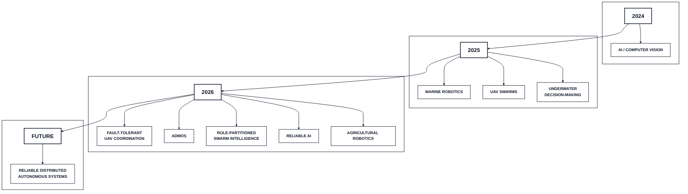
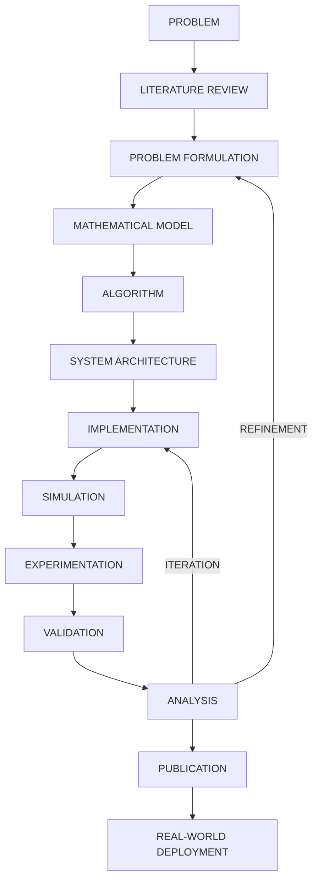

# Mohamed Hijazy Shazin Hassan

<p align="center">
  
</p>

<p align="center">

<a href="https://github.com/ShazinHijazy">

</a>

<a href="https://www.linkedin.com/in/shazin-hijazy/">

</a>

<a href="https://scholar.google.com/citations?user=gjZ9LDQAAAAJ&hl=en">

</a>

<a href="https://www.researchgate.net/profile/Mohamed-Hijazy-Hassan">

</a>

<a href="https://andhrauniversity.academia.edu/MohamedHijazyShazinHassan">

</a>

<a href="https://orcid.org/0009-0009-9256-7824">

</a>

</p>

<p align="center">
  <strong>Robotics & AI Researcher</strong><br>
  Autonomous Systems · Multi-Agent Robotics · Swarm Intelligence · Resilient Autonomy
</p>

---

# About Me

I am a Computer Science and Engineering graduate from **Andhra University, India**, working at the intersection of **robotics, autonomous systems, artificial intelligence, multi-agent coordination, and resilient robotic autonomy**.

My research is driven by a fundamental question:

> **How can autonomous robotic systems perceive, decide, coordinate, adapt, and continue operating reliably when the real world is uncertain, dynamic, communication-constrained, or partially degraded?**

My work has gradually evolved from robotic software development and autonomous navigation toward research in **decentralized coordination, swarm intelligence, fault-tolerant autonomy, uncertainty-aware decision-making, and real-world robotic deployment**.

I have worked across multiple robotic domains, including:

- Autonomous aerial systems
- UAV swarms
- Multi-agent robotic systems
- Autonomous surface vehicles
- Autonomous underwater robots
- Agricultural robotics
- Robot perception
- Computer vision
- Machine learning
- Distributed decision-making

A common thread connects these areas:

**Reliable autonomy in imperfect environments.**

I am particularly interested in systems that do not depend excessively on centralized control and that can continue functioning when communication, sensing, energy availability, or individual robotic agents become unreliable.

---

# Research Identity

### Primary Research Area

**Autonomous Systems and Multi-Agent Robotics**

### Core Research Themes

- Swarm Robotics
- Multi-Agent Systems
- Decentralized Coordination
- Distributed Robotic Intelligence
- Resilient Autonomous Systems
- Fault-Tolerant Robotics
- Communication-Aware Autonomy
- Autonomous Navigation
- Intelligent Robotic Decision-Making
- Uncertainty-Aware Robotics
- Sensor Fusion
- Robot Perception
- Simulation-Driven Validation

### Application Domains

- UAV Swarms
- Autonomous Aerial Vehicles
- Autonomous Surface Vehicles
- Autonomous Underwater Vehicles
- Marine Robotics
- Agricultural Robotics
- Precision Agriculture
- Generalizable Robot Manipulation

---

# My Research in One Picture

# Areas of Research

<p align="center">
  
</p>

---

# Research Philosophy

I do not view autonomy simply as the ability of a robot to complete a predefined task.

For me, meaningful autonomy also requires understanding what happens when:

* communication becomes unreliable,
* an agent fails,
* sensors become uncertain,
* energy becomes limited,
* environmental conditions change,
* localization becomes degraded,
* multiple agents disagree,
* or a learned model encounters conditions outside its training distribution.

This has led my research toward **resilience, decentralization, adaptability, uncertainty, and practical validation**.

My long-term goal is to contribute to robotic systems that can move from controlled demonstrations toward dependable operation in real environments.

---

## Research Timeline


```mermaid
flowchart TD

    subgraph Y2024[" "]
        direction TB
        Y24["2024"]
        R24["AI / COMPUTER VISION"]
        Y24 --> R24
    end

    subgraph Y2025[" "]
        direction TB
        Y25["2025"]
        R25A["MARINE ROBOTICS"]
        R25B["UAV SWARMS"]
        R25C["UNDERWATER<br/> DECISION-MAKING"]

        Y25 --> R25A
        Y25 --> R25B
        Y25 --> R25C
    end

    subgraph Y2026[" "]
        direction TB
        Y26["2026"]
        R26A["FAULT-TOLERANT<br/> UAV COORDINATION"]
        R26B["ADMOS"]
        R26C["ROLE-PARTITIONED<br/> SWARM INTELLIGENCE"]
        R26D["RELIABLE AI"]
        R26E["AGRICULTURAL ROBOTICS"]

        Y26 --> R26A
        Y26 --> R26B
        Y26 --> R26C
        Y26 --> R26D
        Y26 --> R26E
    end

    subgraph YF[" "]
        direction TB
        YFUT["FUTURE"]
        RF["RELIABLE DISTRIBUTED<br/> AUTONOMOUS SYSTEMS"]

        YFUT --> RF
    end

    Y24 --> Y25
    Y25 --> Y26
    Y26 --> YFUT

    classDef year fill:#FFFFFF,stroke:#0F172A,color:#0F172A,stroke-width:2.5px,font-size:22px,font-weight:700;
    classDef research fill:#FFFFFF,stroke:#0F172A,color:#0F172A,stroke-width:1.5px,font-size:16px,font-weight:600;

    class Y24,Y25,Y26,YFUT year;
    class R24,R25A,R25B,R25C,R26A,R26B,R26C,R26D,R26E,RF research;

    style Y2024 fill:#FFFFFF,stroke:#0F172A,stroke-width:1.5px;
    style Y2025 fill:#FFFFFF,stroke:#0F172A,stroke-width:1.5px;
    style Y2026 fill:#FFFFFF,stroke:#0F172A,stroke-width:1.5px;
    style YF fill:#FFFFFF,stroke:#0F172A,stroke-width:1.5px;

    linkStyle default stroke:#0F172A,stroke-width:1.5px;
```

---

# Research Portfolio

## 01. Fault-Tolerant Decentralized UAV Swarm Coordination

### Bachelor's Thesis

**A Fault-Tolerant Decentralized Coordination Framework for UAV Swarms using Relative Suitability Elective Consensus and SITL Validation**

<p align="center">
  
</p>

My bachelor's thesis investigates decentralized coordination and autonomous leadership in UAV swarms.

The framework explores a **Relative Suitability Value (RSV)** based leader-election mechanism in which individual UAVs evaluate local operational conditions such as:

* Residual energy
* Neighbour connectivity
* Formation positioning
* Operational suitability

The objective is to enable the swarm to dynamically determine a suitable leader while reducing dependence on a centralized command structure.

### Technical Stack

**Robotics & Autonomy**


**Simulation & Communication**


-37474F?style=flat-square)

**Programming**


### Research Problems

* Decentralized leader election
* Node failure
* Autonomous failover
* Communication-aware coordination
* Distributed decision-making
* Swarm resilience
* Multi-agent autonomy

The thesis represents the foundation of my current research direction in **fault-tolerant distributed robotic systems**.

---

# 02. ADMOS

## Adaptive Dual-Mode Operational Swarm for Resilient Asset Defense under Communication Jamming

<p align="center">
<a href="https://www.researchsquare.com/article/rs-9957095/v1">
</a>
&nbsp;&nbsp

<a href="https://doi.org/10.21203/rs.3.rs-9957095/v1">

</a>
</p>
  
ADMOS investigates how cooperative UAV swarms can continue operating when communication between agents becomes degraded or unavailable.

<p align="center">
  
</p>

The research explores an adaptive architecture combining:

### Distributed State Estimation

**Covariance Intersection (CI)** is used to maintain consistent state estimation when correlations between information sources are unknown.

### Dual-Mode Operation

Agents can operate in:

* Cooperative mode
* Autonomous mode

A hybrid supervisor manages the transition between the two modes using hysteresis and minimum dwell time.

### Safety-Critical Control

A Higher-Order Control Barrier Function based safety filter is integrated into the architecture and solved as a quadratic program.

### Research Objective

Rather than assuming that communication will always remain available, ADMOS investigates a more resilient principle:

> **When coordination becomes unreliable, autonomous agents should degrade gracefully rather than fail catastrophically.**

The manuscript has been developed around simulation-based evaluation of UAV swarm resilience under communication degradation and jamming conditions.

---

# 03. Role-Partitioned Swarm Intelligence

## Resilient UAV Coordination in Contested Electromagnetic Environments

This research investigates whether assigning specialised functional roles to UAVs can improve swarm organisation and resilience.

The proposed architecture divides UAV agents into operational roles:

<p align="center">
  
</p>

The work explores:

* Role-partitioned swarm intelligence
* Distributed coordination
* Communication-aware behaviour
* Covariance Intersection
* High-Order Control Barrier Functions
* Safety filtering
* Swarm scalability
* Communication degradation

The research is being evaluated through simulation-driven analysis.

---

# 04. Autonomous Marine Robotics

## Autonomous Surface Vehicle Catamaran

During my research internship at the **Indian Institute of Technology Kharagpur**, I worked on an Autonomous Surface Vehicle based on a catamaran platform.

The project brought together hardware, perception, localization, navigation, telemetry, and control within a ROS 2 based architecture.

### Platform


### Software


### Research and Engineering Areas

* Autonomous waypoint navigation
* Localization
* Mapping
* Sensor fusion
* Obstacle avoidance
* Telemetry
* Navigation planning
* Hardware-software integration
* Autonomous marine systems

The experience strengthened my interest in the transition from simulation-based autonomy toward real robotic deployment.

---

# 05. Autonomous Underwater Robotics

## Arbitration Layer for Decision-Making in Autonomous Underwater Robots

This research investigates lightweight decision-making for autonomous underwater robots operating under uncertainty and resource constraints.

The proposed arbitration layer evaluates candidate actions using multiple operational factors, including:

* Task priority
* Sensor confidence
* Mission objectives
* Energy constraints
* Environmental uncertainty

The objective is to provide a lightweight and deterministic decision layer capable of supporting real-time action selection on resource-constrained autonomous underwater platforms.

### Research Themes

* Autonomous underwater robotics
* Decision-making under uncertainty
* Resource-constrained autonomy
* Sensor confidence
* Action arbitration
* Real-time robotics
* Marine autonomy

The work was presented at the **8th International Conference on Ship and Offshore Technology (ICSOT 2025)** and accepted for publication in the Springer conference proceedings.

---

# 06. Agricultural Robotics

## Autonomous Ground Vehicle for Precision Pruning and Intelligent Orchard Operations

My agricultural robotics research explores the development of an **Autonomous Ground Vehicle (AGV) for precision pruning**.

The central research problem is different from conventional agricultural navigation.

A robot may be able to navigate an orchard reliably, but pruning requires the system to understand the structure of the plant and make an informed intervention.

The research therefore explores the integration of:

* Autonomous ground navigation
* 3D perception
* RGB-D sensing
* LiDAR
* Point cloud processing
* Plant structure understanding
* Topological representations
* Occlusion-aware perception
* Manipulation
* Force feedback
* Intelligent pruning decisions

The research investigates the gap between:

**Autonomous navigation**

and

**Autonomous physical intervention.**

A major challenge is developing perception and decision-making approaches that generalise across different tree species, growth stages, occlusions, and real-world orchard conditions.

---

# 07. Reliable AI and Calibration under Distribution Shift

## Embedding-Level Calibration under Distribution Shift in Visual Recognition

Another research direction explores the reliability of confidence estimates produced by visual recognition systems when deployment data differs from training data.

The research investigates the limitations of conventional score-level calibration under distribution shift.

The work introduces concepts including:

* Calibration Witness
* Embedding-level calibration
* Distribution shift
* Score-level non-identifiability
* Witness Field
* Propagation Algebra

The broader question is:

> **Can an AI system know when its confidence is no longer trustworthy?**

This research connects directly with my interest in trustworthy autonomy because robotic systems depend heavily on the reliability of perception models when operating outside controlled environments.

---

# 08. Calibration Witness and Propagation Algebra

## The Calibration Witness and Its Propagation Algebra

This research develops a theoretical framework for understanding calibration failure when representation-level information is lost or collapsed into indistinguishable score regions.

The work investigates:

* Calibration error
* Representation-level information
* Distribution shift
* Score-level limitations
* Embedding-level structure
* Layer-wise epistemic information
* Calibration reliability

The research has applications across areas including:

* Computer vision
* Autonomous systems
* Biometrics
* Medical imaging
* Machine learning reliability

The central motivation is closely aligned with my broader interest in **reliable AI for systems that must make decisions under uncertainty**.

---

# 09. Few-Shot Language-Agnostic Keyword Spotting

## FSLAKWS

### A Few-Shot Language Agnostic Keyword Spotting System for Audio Files

I have also worked on applied machine learning research involving multilingual speech and few-shot keyword spotting.

The work investigates a language-agnostic keyword spotting pipeline capable of operating with limited examples of newly introduced keywords.

The research combines:

* Self-supervised speech representations
* Few-shot learning
* Multilingual speech processing
* Keyword spotting
* Detection operators
* Audio embeddings
* Statistical calibration

This work originated in the context of **Smart India Hackathon 2024** and expanded my experience into speech AI and representation learning.

---

# 10. Computer Vision

## Deep Learning-Based Image Profiling and Similarity Detection

During my software project management internship, I contributed to the development of a facial image profiling and similarity detection system.

The system combined:

* Image preprocessing
* Facial feature extraction
* Facial embeddings
* Euclidean distance analysis
* DBSCAN clustering
* OpenCV
* NumPy
* Pandas
* Python

The system was designed to cluster images based on facial similarity and retrieve images containing the same individual across individual and group photographs.

The project reported **95.71% accuracy under normal lighting conditions**, while also identifying low-light performance as an important limitation.

This project gave me practical exposure to the relationship between machine learning models, data quality, preprocessing, clustering, and real-world deployment constraints.

---

# 11. Generalizable Robot Manipulation

## Differentiable Neural Radiance Fields and Physics-Guided Diffusion

I have also explored a research direction focused on **generalizable robot manipulation in human-centric and unstructured environments**.

The proposed framework combines:

* Differentiable Neural Radiance Fields
* Physics-guided diffusion models
* Differentiable simulation
* Synthetic data generation
* Robot manipulation
* Sim-to-real transfer
* Physical consistency
* Policy refinement

The central motivation is to address three recurring challenges in robot learning:

1. Sim-to-real transfer
2. Scarcity of real-world interaction data
3. Lack of physical understanding in learned policies

The proposed concept uses a closed-loop data generation and policy refinement pipeline to create physically consistent training experiences.

---

# Research Themes

<p align="center">
  <strong>My research portfolio can be grouped into the following interconnected themes.</strong>
</p>

<table align="center">
  <thead>
    <tr>
      <th align="center">Research Theme</th>
      <th align="center">Areas</th>
    </tr>
  </thead>
  <tbody>
    <tr>
      <td align="center">Autonomous Systems</td>
      <td align="center">UAVs, USVs, UUVs, AGVs</td>
    </tr>
    <tr>
      <td align="center">Multi-Agent Robotics</td>
      <td align="center">Swarms, distributed coordination</td>
    </tr>
    <tr>
      <td align="center">Resilient Autonomy</td>
      <td align="center">Fault tolerance, graceful degradation</td>
    </tr>
    <tr>
      <td align="center">Decision-Making</td>
      <td align="center">Arbitration, distributed decisions</td>
    </tr>
    <tr>
      <td align="center">Navigation</td>
      <td align="center">Localization, mapping, path planning</td>
    </tr>
    <tr>
      <td align="center">Perception</td>
      <td align="center">LiDAR, vision, sensor fusion</td>
    </tr>
    <tr>
      <td align="center">Reliable AI</td>
      <td align="center">Calibration, distribution shift</td>
    </tr>
    <tr>
      <td align="center">Machine Learning</td>
      <td align="center">Deep learning, few-shot learning</td>
    </tr>
    <tr>
      <td align="center">Robot Learning</td>
      <td align="center">Simulation, synthetic data, manipulation</td>
    </tr>
    <tr>
      <td align="center">Agricultural Robotics</td>
      <td align="center">Precision pruning, intelligent orchards</td>
    </tr>
    <tr>
      <td align="center">Marine Robotics</td>
      <td align="center">Surface and underwater autonomy</td>
    </tr>
    <tr>
      <td align="center">Simulation</td>
      <td align="center">Gazebo, SITL, physics-based validation</td>
    </tr>
  </tbody>
</table>

---

# Research Lifecycle

I am interested in the complete research lifecycle:


```mermaid
flowchart TD
    A["PROBLEM"] --> B["LITERATURE REVIEW"]
    B --> C["PROBLEM FORMULATION"]
    C --> D["MATHEMATICAL MODEL"]
    D --> E["ALGORITHM"]
    E --> F["SYSTEM ARCHITECTURE"]
    F --> G["IMPLEMENTATION"]
    G --> H["SIMULATION"]
    H --> I["EXPERIMENTATION"]
    I --> J["VALIDATION"]
    J --> K["ANALYSIS"]
    K -->|REFINEMENT| C
    K -->|ITERATION| G
    K --> L["PUBLICATION"]
    L --> M["REAL-WORLD DEPLOYMENT"]
```
    
My goal is to progressively connect theoretical research with practical robotic systems.

---

# Publications and Research Outputs

## Conference / Published Research

### Arbitration Layer for Decision-Making in Autonomous Underwater Robots

**Mohamed Hijazy Shazin Hassan, Neeraj S. M., Giri Rajasekhar Gunnu**

Presented at:

**8th International Conference on Ship and Offshore Technology (ICSOT 2025)**

Accepted for publication in Springer conference proceedings.

Research area:

`Autonomous Underwater Robotics · Decision-Making · Marine Robotics · Uncertainty-Aware Autonomy`

---

# Manuscripts and Ongoing Research

### ADMOS

**Adaptive Dual-Mode Operational Swarm for Resilient Asset Defense under Communication Jamming**

Research areas:

`UAV Swarms · Resilient Coordination · Communication-Aware Autonomy · Multi-Agent Control`

---

### Role-Partitioned Swarm Intelligence

**Role-Partitioned Swarm Intelligence for Resilient UAV Coordination in Contested Electromagnetic Environments**

Research areas:

`Swarm Intelligence · Distributed Coordination · Role Partitioning · Resilient Robotics`

---

### Embedding-Level Calibration

**Embedding Level Calibration under Distribution Shift in Visual Recognition**

Research areas:

`Reliable AI · Calibration · Distribution Shift · Computer Vision`

---

### The Calibration Witness and Its Propagation Algebra

Research areas:

`Machine Learning Theory · Calibration · Representation Learning · Reliable AI`

---

# Research Publication Status

| Work                                                                  | Type                          | Status                                        |
| --------------------------------------------------------------------- | ----------------------------- | --------------------------------------------- |
| Arbitration Layer for Decision-Making in Autonomous Underwater Robots | Conference Research           | Presented / Accepted for Springer Proceedings |
| ADMOS                                                                 | Research Manuscript           | Ongoing / Pre-Print                          |
| Role-Partitioned Swarm Intelligence                                   | Research Manuscript           | Ongoing / Manuscript                          |
| Embedding Level Calibration under Distribution Shift                  | Research Manuscript           | Ongoing / Pre-Print                         |
| The Calibration Witness and Its Propagation Algebra                   | Research Work                 | Research Output/ Pre-Print                               |
| FSLAKWS                                                               | Research Project / Manuscript | Research Work                                 |
| Autonomous Catamaran                                                  | Robotics Project              | Completed Project Work                        |
| UAV Swarm Coordination Thesis                                         | Bachelor's Thesis             | Completed                                     |
| Precision Pruning AGV                                                 | Research Direction            | Ongoing Research                              |
| Generalizable Robot Manipulation                                      | Research Proposal             | Ongoing Research                             |

---

# Technical Skills

### Robotics, Autonomy & Simulation

**Frameworks & Tools**

<p>
  
  
  
  
  
  
  
  
  
</p>

**Capabilities**

<p>
  
  
  
</p>

---

### Programming & Systems

<p>
  
  
  
  
  
  
  
</p>

---

### Artificial Intelligence & Machine Learning

<p>
  
  
  
  
  
  
  
  
  
  
  
  
</p>

---

### Development & Engineering Tools

**Development & Infrastructure**

<p>
  
  
  
  
  
</p>

**Data, Computer Vision & Machine Learning**

<p>
  
  
  
  
</p>

**Applications & Data Infrastructure**

<p>
  
  
</p>

---
# Robotics Platforms

My practical robotics experience spans multiple platforms:

```text
                     ROBOTIC SYSTEMS
                           │
        ┌──────────────────┼──────────────────┐
        │                  │                  │
        ▼                  ▼                  ▼
      AERIAL             MARINE          GROUND
        │                  │                  │
        ▼                  ▼                  ▼
      UAVs              USVs              AGVs
      Swarms           Catamaran        Agriculture
        │                  │              Pruning
        ▼                  ▼
    PX4 / ROS2         ROS2 / Nav2
        │                  │
        └──────────┬───────┘
                   │
                   ▼
             DISTRIBUTED
               AUTONOMY
```

---

# Selected Technical Projects

## Autonomous Catamaran

ROS 2 based autonomous surface vehicle platform integrating:

* GNSS
* IMU
* LiDAR
* Ultrasonic sensors
* Telemetry
* Thrusters
* Navigation
* Localization
* Obstacle avoidance

---

## N-SWARM

Decentralized autonomous drone swarm framework exploring:

* Multi-UAV coordination
* Autonomous asset protection
* Distributed decision-making
* Swarm behaviour

---

## Adaptive Mobile Barrier Coverage

Research and implementation involving decentralized mobile sensor networks for adaptive probabilistic barrier coverage of time-varying stochastic target trajectories.

---

## Deep Learning Image Profiling

Facial similarity detection and image clustering using deep learning based embeddings and DBSCAN.

---

## FSLAKWS

Few-shot language-agnostic keyword spotting for multilingual audio.

---

# From Simulation to Reality

A recurring component of my research is **simulation-driven validation**.

I use simulation not as an endpoint, but as a controlled environment for studying algorithms before physical deployment.

```text
     THEORY
       │
       ▼
   ALGORITHM
       │
       ▼
  SOFTWARE MODEL
       │
       ▼
   SIMULATION
       │
       ▼
   SITL / Gazebo
       │
       ▼
   PERFORMANCE
   EVALUATION
       │
       ▼
   HARDWARE
   INTEGRATION
       │
       ▼
 REAL-WORLD ROBOT
```

This approach is particularly important for multi-agent systems where large-scale physical experimentation can be expensive and difficult to reproduce.

---

# Academic Background

## Andhra University

**Bachelor of Technology in Computer Science and Engineering**

Department of Computer Science and Systems Engineering

Visakhapatnam, India

**CGPA: 8.80 / 10**

Research-oriented coursework and project work included:

* Artificial Intelligence
* Machine Learning
* Embedded Systems
* Computer Networks
* Operating Systems
* Cloud Computing

My undergraduate research developed primarily around:

* Swarm Robotics
* Autonomous Systems
* Multi-Agent Coordination
* Marine Robotics
* Autonomous Navigation
* Intelligent Control
* Sensor Fusion

---

# Research Experience

## Indian Institute of Technology Kharagpur

### Autonomous Systems / Marine Robotics

Research internship involving Autonomous Surface Vehicle development.

Focus:

`ROS 2 · Autonomous Navigation · Sensor Fusion · Localization · Mapping · Nav2 · SLAM · Gazebo`

---

## Independent Research

I continue to explore research problems in:

* Autonomous systems
* Multi-agent robotics
* UAV swarms
* Resilient autonomy
* Marine robotics
* Agricultural robotics
* Reliable AI
* Intelligent robotic decision-making

My research workflow includes:

* Literature review
* Problem formulation
* Mathematical modelling
* Algorithm design
* Simulation
* Software implementation
* Experimental validation
* Technical writing
* Research publication

---

# Research Direction

My long-term research interests are centered around **reliable and distributed autonomous systems**.

I am particularly interested in systems that can:

### Perceive

Understand their environment through multiple sensors and learned representations.

### Reason

Evaluate uncertainty, operational constraints, mission objectives, and available resources.

### Coordinate

Collaborate with other autonomous agents without relying entirely on centralized control.

### Adapt

Change behaviour when the environment, communication conditions, or system state changes.

### Recover

Continue operating after partial failures, degraded sensing, or loss of communication.

### Act

Translate decisions into safe and effective physical actions.

---

# Future Research Interests

I am interested in pursuing deeper research in:

* Multi-Agent Systems
* Swarm Intelligence
* Distributed Robotics
* Decentralized Control
* Resilient Autonomy
* Fault-Tolerant Robotics
* Autonomous Navigation
* Sensor Fusion
* Robot Perception
* Reliable AI
* Safe Learning-Enabled Robotics
* Marine Robotics
* UAV Systems
* Agricultural Robotics
* Human-Robot Collaboration
* Simulation-to-Real Transfer
* Physical Intelligence

---

# The Bigger Research Question

Across different robotic domains, my research repeatedly returns to one central problem:

> **How can autonomous systems remain useful, safe, and coordinated when their assumptions about the world stop being true?**

For UAV swarms, this may mean communication failure.

For marine robots, it may mean uncertain localization or limited sensing.

For agricultural robots, it may mean occluded and changing plant structures.

For AI systems, it may mean distribution shift.

For manipulation systems, it may mean the physical world differs from the training environment.

These are different manifestations of the same underlying challenge:

## Building autonomy that remains reliable under uncertainty.

---

# Research Network

I believe research progresses through collaboration.

I am interested in working with:

* Robotics laboratories
* AI research groups
* Universities
* Autonomous systems researchers
* Multi-agent systems researchers
* Marine robotics researchers
* Agricultural robotics researchers
* Machine learning researchers
* Open-source robotics communities
* Interdisciplinary engineering teams

Especially collaborations that combine:

**Theory + Algorithms + Simulation + Hardware + Real-World Validation**

---

# Beyond Engineering

Research is only one part of my work.

I have also been involved in:

* Technology communication
* Student-led innovation
* Entrepreneurship
* Technical communities
* Youth organisations
* Academic events
* Research communication
* Community building

I am the host of **CrossRoads with Shazin Hijazy**, a platform focused on conversations with people from different academic, professional, entrepreneurial, and social backgrounds.

These experiences have strengthened my interest in communicating technical ideas clearly and building communities around technology and research.

---

# Open Source and Research

I use GitHub as more than a code repository.

For me, GitHub is a research workspace for:

* Reproducible experiments
* Robotics software
* Simulation environments
* Algorithm implementations
* Research prototypes
* Documentation
* Experimental results
* Open technical discussion

Where appropriate, I aim to make research implementations understandable, reproducible, and useful to other researchers and engineers.

---

# Selected Repository Areas

My GitHub repositories currently include work related to:

* UAV swarm systems
* Autonomous catamaran systems
* Adaptive mobile barrier coverage
* Final-year research
* Maritime technology
* Autonomous robotics
* Research prototypes

---

# Research Profiles

## Google Scholar

My Google Scholar profile provides the academic publication and citation record associated with my research work.

**Google Scholar:**
[https://scholar.google.com/citations?user=gjZ9LDQAAAAJ&hl=en](https://scholar.google.com/citations?user=gjZ9LDQAAAAJ&hl=en)

---

## ResearchGate

ResearchGate contains my research publications, manuscripts, and research-related work.

**ResearchGate:**
[https://www.researchgate.net/profile/Mohamed-Hijazy-Hassan](https://www.researchgate.net/profile/Mohamed-Hijazy-Hassan)

---

## Academia.edu

My Academia profile contains selected papers and research uploads, including work on resilient UAV swarms, autonomous underwater decision-making, and calibration under distribution shift.

**Academia.edu:**
[https://andhrauniversity.academia.edu/MohamedHijazyShazinHassan](https://andhrauniversity.academia.edu/MohamedHijazyShazinHassan)

---

## ORCID

**ORCID:**
[https://orcid.org/0009-0009-9256-7824](https://orcid.org/0009-0009-9256-7824)

---

## LinkedIn

**LinkedIn:**
[https://www.linkedin.com/in/shazin-hijazy/](https://www.linkedin.com/in/shazin-hijazy/)

---

# Connect

If you are working on research related to autonomous systems, multi-agent robotics, swarm intelligence, resilient autonomy, marine robotics, agricultural robotics, or reliable AI, I would be happy to connect.

**Email:**
[shazhijazy@gmail.com](mailto:shazhijazy@gmail.com)

**GitHub:**
[https://github.com/ShazinHijazy](https://github.com/ShazinHijazy)

---

# Research Motto

<p align="center">

### "Building autonomous systems that can operate when the real world does not behave as expected."

</p>

---

<p align="center">
  <sub>© Mohamed Hijazy Shazin Hassan · Robotics · Autonomous Systems · Artificial Intelligence · Multi-Agent Robotics</sub>
</p>
